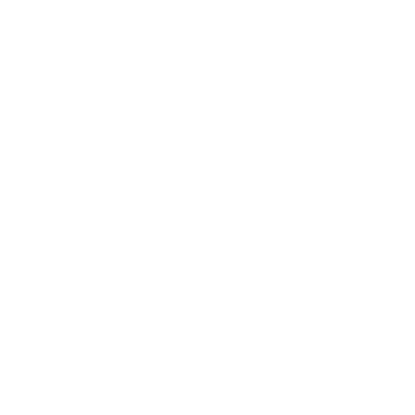

  <picture>
    
  </picture>
  <h1 align="center">Raycast × GitHub Models</h1>
  
Fork of the original Raycast Ollama extension, adapted to use GitHub Models only.

Use GitHub Models for chat, prompts, and tools directly from Raycast. This project is a fork of the Raycast Ollama extension to credit the original work, with the runtime migrated from local Ollama to GitHub Models APIs.

Notes
- Provider: GitHub Models only (no provider dropdown).
- Images: supported via vision-capable models.
- Tools: MCP (Model Context Protocol) tools supported with compatible models.

Requirements
- A GitHub account.
- A GitHub personal access token (PAT).
- Network access to https://models.github.ai.

Generate a GitHub token
1) Sign in to GitHub.
2) Go to Settings → Developer settings → Personal access tokens.
3) Generate a new token (classic) and copy it.
   - In most cases, no special scopes are required to call GitHub Models. If your org enforces policies, use the minimal scopes allowed.
4) Open Raycast → Extensions → this extension’s Preferences → paste the token into “GitHub Token”.
5) Optionally pick a Default Model (defaults to openai/gpt-4.1). You can change it later from the Models Catalog.

How to Use

Command: Models Catalog (GitHub)
- Browse the GitHub Models catalog (name, summary, capabilities).
- Sync models from GitHub.
- Set any model as the Default Model (applies to new chats and updates ongoing chats when appropriate).

Command: Chat with GitHub Models
- Non‑streaming chat using GitHub chat/completions.
- Attach context and content:
  - CMD+S — Selection: add selected text or clipboard.
  - CMD+B — Browser Selection Tab: add the active browser tab content (requires Raycast Browser Extension).
  - CMD+I — Image From Clipboard: attach PNG/JPEG; a vision‑capable model is required.
  - CMD+F — File: attach file contents (experimental).
- Images are previewed above answers; the extension auto‑selects a vision model when needed.
- MCP tools toggle: enable/disable tools use for the current chat (when the selected model supports tool‑calling). An indicator appears in the UI when enabled.
- Default model handling: respected for new chats, empty chats, and ongoing chats (when no images are present).

Command: Quick Prompts
- Casual / Friendly / Professional styles.
- Shorter / Longer.
- Improve Writing / Fix Spelling & Grammar.
- Translate.
- Tweet.
- Explain Code.
- Browser Summarize.
- Image Describe / Image to Text.

Command: Create Custom Commands
- Create reusable prompts using Raycast Prompt Explorer syntax.
- Supported tags:
  - {selection}
  - {browser-tab} (format: markdown/html/text)
  - {image}

Command: Manage MCP Server
- Add, edit, and remove MCP servers used as tools in chat.
- Reachability indicator: green when reachable, gray when not, yellow while checking.
- Server detail view includes a formatted list of available tools (names in bold, arguments and types when available).

Preferences
- GitHub Token: required to call GitHub Models.
- Default Model: preselected in forms and used across chats (default: openai/gpt-4.1).
- Chat Memory: number of prior messages to include as context.

Privacy & Networking
- All inferences are sent to GitHub Models at https://models.github.ai.
- Images are sent as data URLs when attached.

Credits
- This project is a fork of the original Raycast Ollama extension. All credit to the original authors for the foundation and UI patterns.

Roadmap / Ideas
- Streaming responses.
- Multi‑turn tool loops and richer tool output rendering.
- Additional model metadata and limits display.
