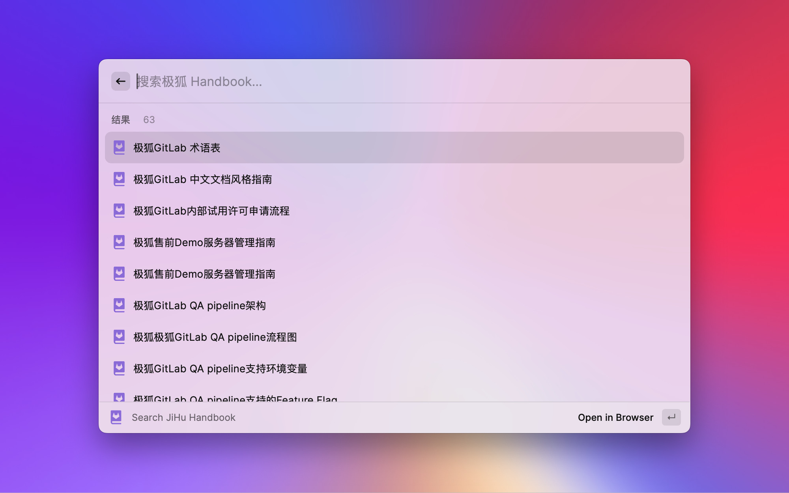

  

  <h1>
    GitLab Chinese Docs
  </h1>

Raycast extension to earch Chinese documents & Handbook.

  

    
    
    
    
  

## Features

- Search GitLab Chinese documents
- Search JiHu Handbook

## Screenshots

### Search GitLab Chinese Docs

### Search JiHu Handbook

