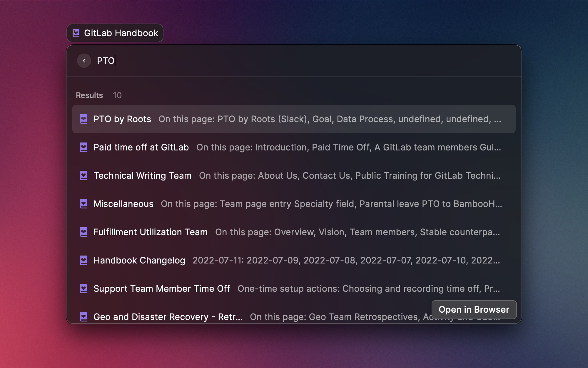
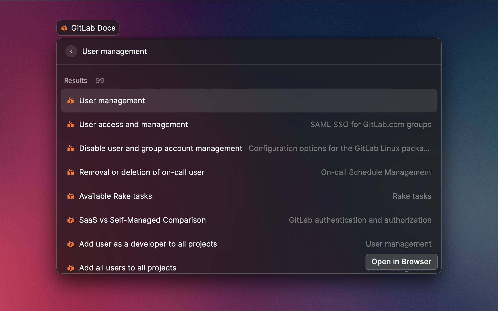
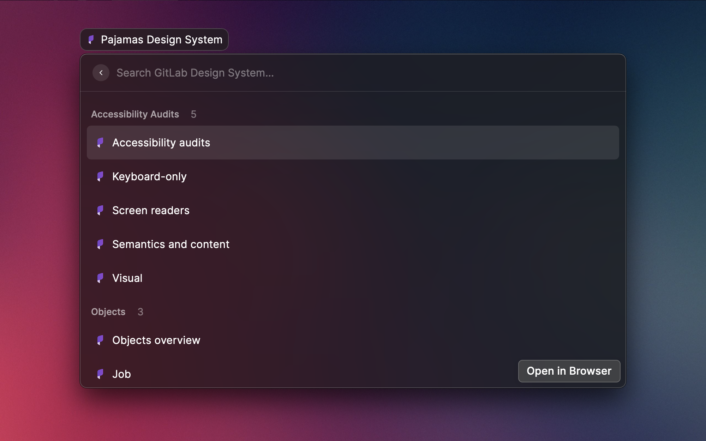

  

  <h1>
    GitLab Docs
  </h1>

Raycast extension to search GitLab Docs, Handbook & Pajamas Design System.

  

    
    
    
    
  

## Features

- Search GitLab Handbook
- Search GitLab Docs
- Search Pajamas Design System

## Screenshots

### Search GitLab Handbook

### Search GitLab Docs

### Search in Pajamas Design System

