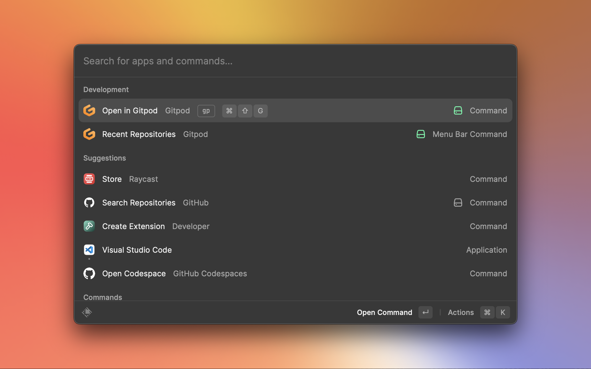
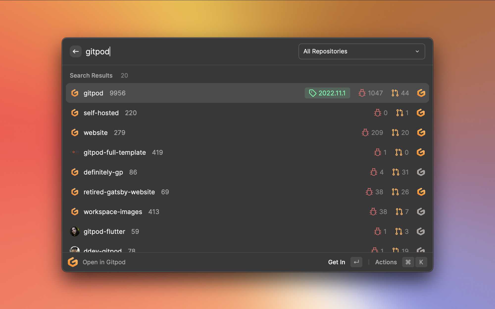
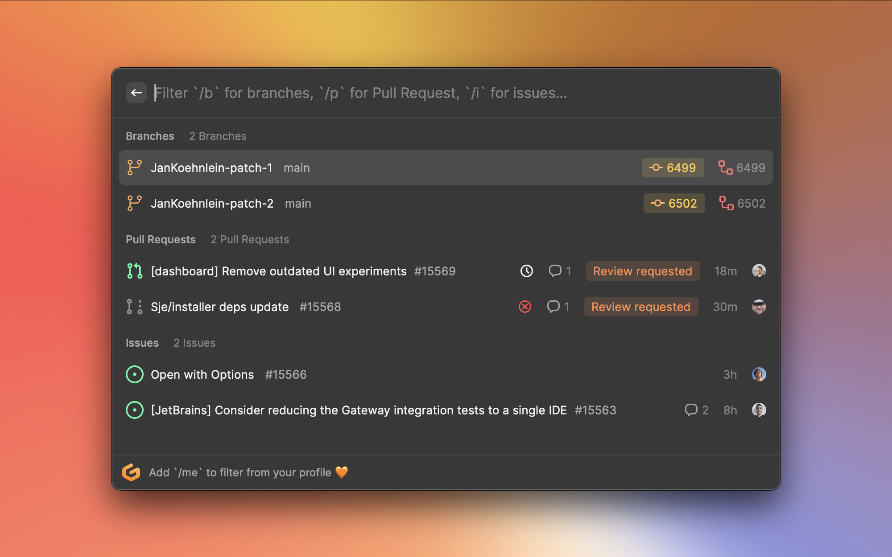
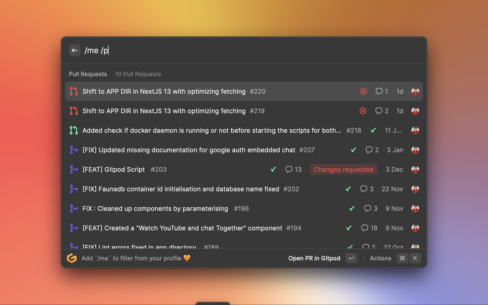

# Raycast Extension for Gitpod 

A _BLAZINGLY FAST_ way to work with Gitpod 🍊

### Installation

1. Install Raycast to get started if you haven't 😉
2. Navigate to the Raycast Store to Download the `Gitpod` extension
3. While generating the GitHub Access Token, make sure to give the `user`, `admin` & `repo` access rights, else it may result in some weird behaviours.

### Currently Supported Features

1. "Open in Gitpod" -> Experience the power of Gitpod Contexts!
   1. Find the repository from Github (you can even see if the repo is Gitpodified...it glows up ✨)
   
      
   2. You can now see and find all the branches, PRs and Issues which you can directly open in Gitpod with a single Keypress!
   
      
   
   You can filter and search further using the following tags
      - `/b` for branch
      - `/p` for PRs 
      - `/i` for Issues
      - `/me` for anything and everything related to 
         - eg. `/me /p` would refer to your Pull Requests in a particular repository!

   

   3. Open using "CMD + Enter" to open the selected Branch, PR or Issue directly on Gitpod

2. "Recent Repositories" -> Faster Access of Recent Workspaces from menubar
   
3. By default you can see the latest visited Repository to start with! 

### WIP

- [ ] Manage All Workspaces within Gitpod 
- [ ] Teams and Projects Support
- [ ] Manage Prebuilds withing Raycast
- [ ] Add support for GitLab and Bitbucker
- [ ] Default ide support
- [ ] And much more....