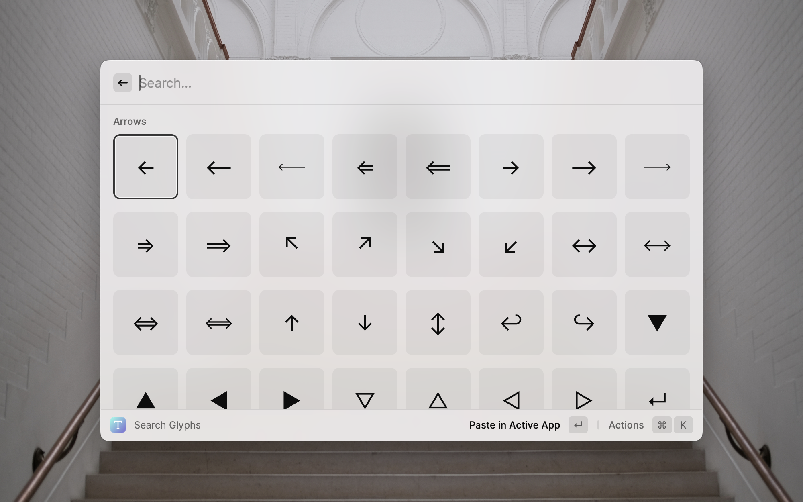

# Glyph Search

Opinionated glyph picker that allows you to paste pretty arrows (←→), special keys (⌃⌘⇧⌫) and other cool stuff (❖◇♡♥★☆) without opening [Character Viewer](https://support.apple.com/guide/mac-help/use-emoji-and-symbols-on-mac-mchlp1560/mac)

## Why was this extension created?

Character Viewer on macOS isn't that great (for example, it doesn't work in some apps like VS Code and Figma, which is a big deal for me), so whenever I needed a pretty arrow, `&middot` or a <kbd>⌘</kbd>, I just copied it from the [Inter homepage](https://rsms.me/inter/?ref=raycast-glyphs#charset). This extension is basically the charset section of that page, but reorganized a little so that it is quicker to find pretty arrows

## Why are some characters included, and some not?

This extension uses the [Inter character set](https://rsms.me/inter/?ref=raycast-glyphs#charset). The goal of this extension is not to replace the Character Viewer altogether, but to provide a faster alternative for frequently used characters that probably did not make it onto your keyboard

## Acknowledgements

This extension uses glyphs from [Inter](https://rsms.me/inter/?ref=raycast-glyphs). Thanks to Rasmus Andersson (and everyone who contributed to Inter) for making such a wonderful font (btw, also huge thanks for making the [Glyphs](https://github.com/rsms/inter/blob/master/docs/glyphs/index.html) page with downloadable character SVGs, you saved me a lot of time while making this extension 😁)