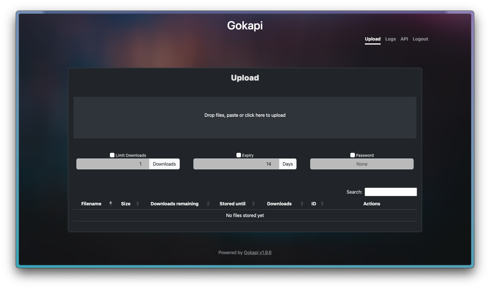
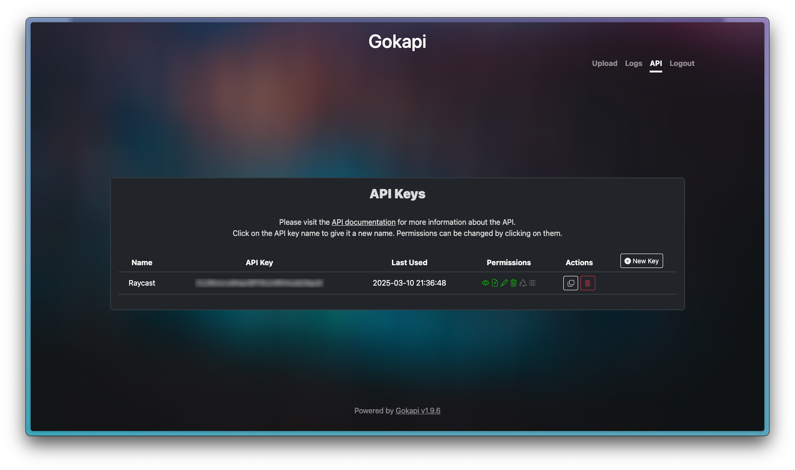

# Gokapi

This Raycast extension allows you to manage your Gokapi server directly from Raycast. Use it to upload files, list existing files, copy download and hotlink URLs, and delete files with ease.

## Features

- **Upload Files**: Select a file from Finder and upload it to your Gokapi server.
- **List Files**: View all files hosted on your server including details like file size, MIME type, and expiration.
- **Quick Actions**: Copy download URLs, delete files, and quickly toggle file details.

## Setup

1. **Install a Gokapi Server**:  
   If you haven't already, install a Gokapi server on your machine. You can find the installation instructions on the [Gokapi GitHub page](https://github.com/Forceu/Gokapi).

1. **Configure Preferences**:  
   Set your Gokapi server URL and API key in the extension preferences. You can generate an API key in your Gokapi server's admin panel.

## Gokapi server web interface

### Admin Panel

### API Key Setup

## Disclaimer

This project is not affiliated, associated, endorsed by, or in any way officially connected with Gokapi. Gokapi can be found on [GitHub](https://github.com/Forceu/Gokapi). All issues or feature requests related to [this extension](https://www.raycast.com/pascalburkhard/gokapi) should be filed using the appropriate button on the [store page](https://www.raycast.com/pascalburkhard/gokapi).
