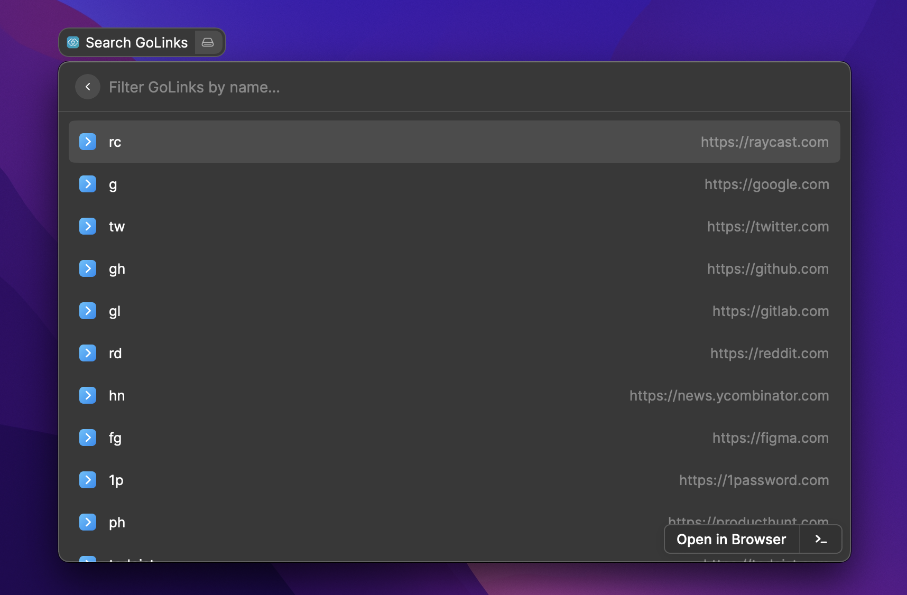
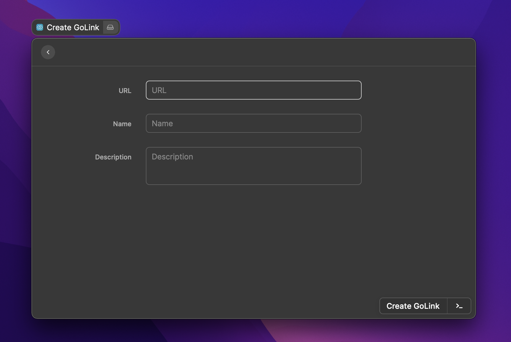

# Raycast Extension: GoLinks

A [Raycast Extension](https://developers.raycast.com) for [GoLinks](https://www.golinks.io).

https://user-images.githubusercontent.com/21333876/141518995-a408d0f3-c4cf-418f-abbc-4cd555fa40c8.mov

## Getting Started

To get started with this extension, you need to create a GoLinks token and then add it to the preferences to access the GoLinks API.

To create an access token, sign in to your GoLinks account and go to the “Developers” tab in the "Settings" page. In the “API Tokens” panel, click on “Manage” and then click the “Create token” button.

See the [GoLinks document](https://docs.golinks.io/#19f87188-f2fb-4b75-bf69-83f0c0ca5029) for more information.

## Commands

### Search golinks

Lets you search golinks and then open a selected golink.

### Create golink

Lets you create a new golink.

## License

This software is released under the MIT LICENSE.
