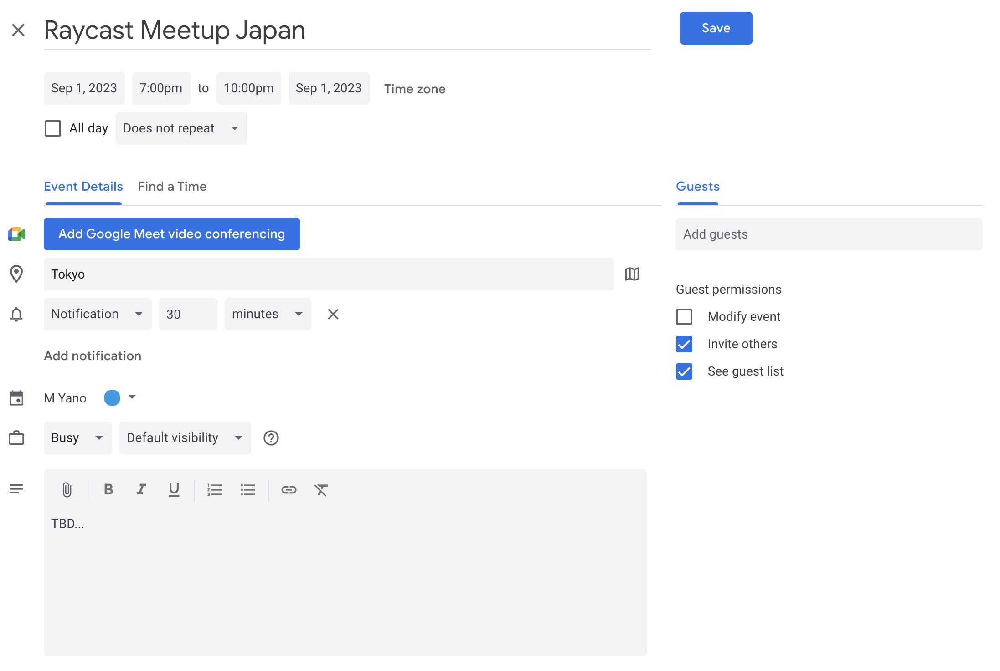

# Google Calender

Search and Create a event-link for anyone to subscribe!

## Create Event Link Feature
Create a event-link for anyone to subscribe to their Google Calender.
1. create event link like below.

1. after `cmd` + `enter`, you can see below which you can share anyone.
every one registrate the event to thier Google Calender.

## Roadmap
1. Create Event Link Feature(implemented)
2. Search list of events feature
3. Creat and edit events feature
