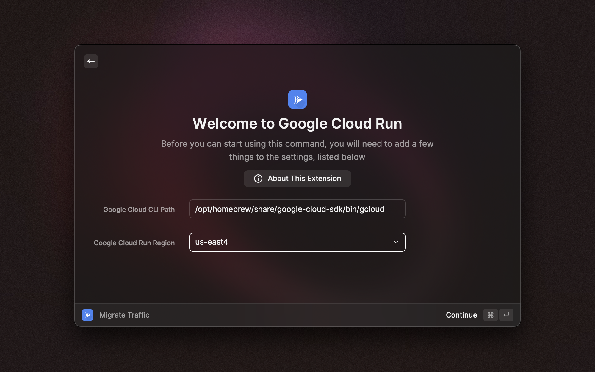
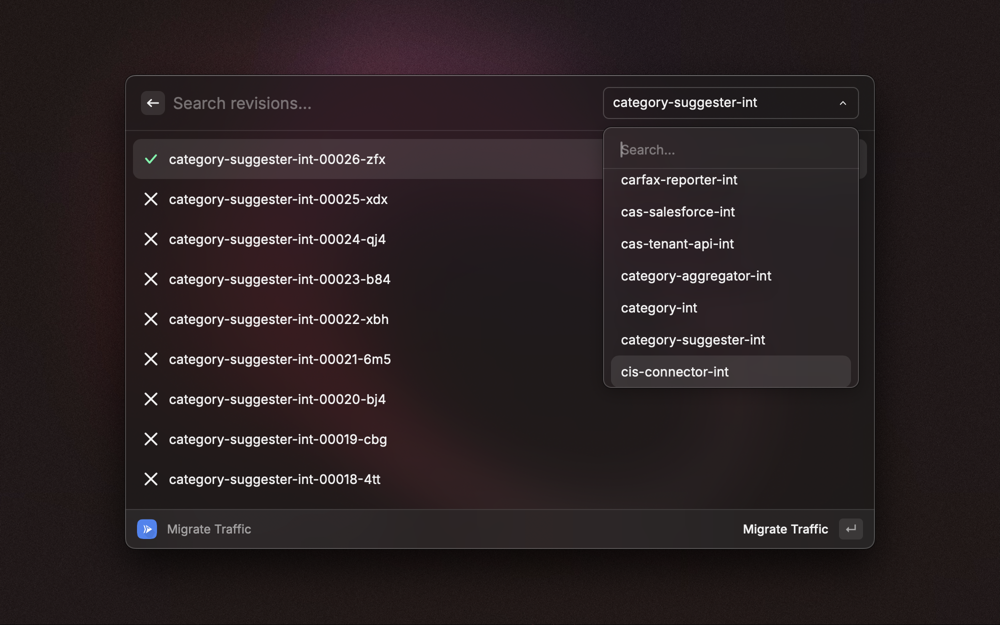
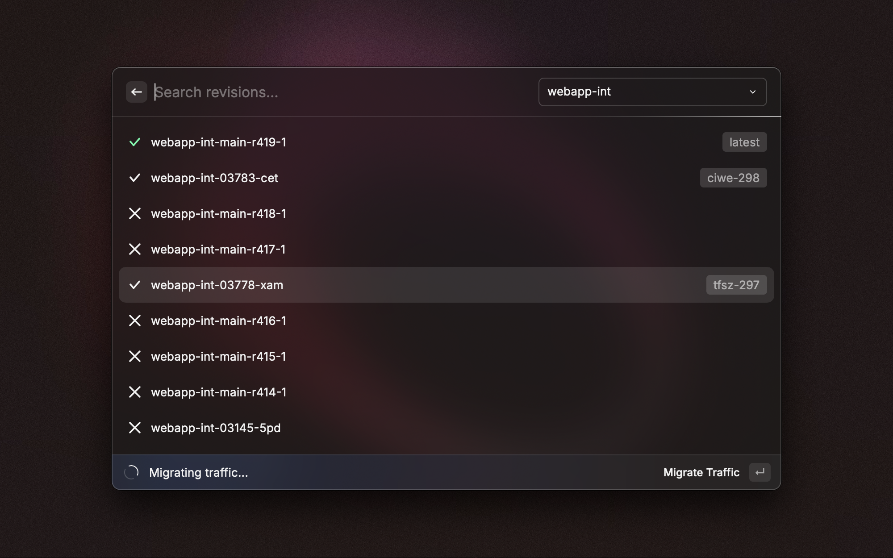

# 🚀 Google Cloud Run - Raycast

This Raycast extension allows you to manage Google Cloud Run services directly from your Raycast dashboard. With this extension, you can easily migrate traffic for your Cloud Run services to specific revisions, streamlining your deployment workflows.


## 📋 Prerequisites
Before configuring this extension, ensure you have the Google Cloud CLI installed and configured. Use the following command to authenticate your Google Cloud account:
```sh
gcloud auth application-default login
```

## ⚙️ Configuration
To set up the extension, provide the following configuration fields:

- **Google Cloud CLI Path**: The path to your gcloud CLI installation. Enter this as plain text.
- **Google Cloud Run Region**: The region where your Google Cloud Run services are hosted.


## 🛠️ Supported Commands
This extension supports the following command:

- **Migrate Traffic**: Migrate traffic for any of your Google Cloud Run services to a specific revision.



## 📞 Contact
If you run into any issues or have questions about using this extension, feel free to check out the Google Cloud documentation or reach out to me directly.
- [GitHub](https://github.com/BhavyaMuni)
- [Twitter](https://twitter.com/muni_bhavya)
- [LinkedIn](https://linkedin.com/in/bhavya-muni)
