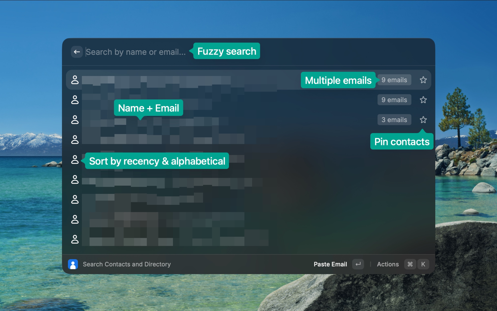

# Google Directory Search for Raycast

Search your Google Contacts **and your organization's directory** from Raycast, then **paste an email or name straight into the app you're using**. Built for speed: contacts are cached on disk and only the _changes_ are pulled on each refresh, so the list opens instantly.

## What it does

- **Search Contacts and Directory** — fuzzy search across names **and** email addresses, spanning both your personal contacts and everyone in your Google Workspace directory (domain user profiles).
  - `↵` **Paste Email** (primary email) into the frontmost app
  - `⌘C` **Copy Email**
  - **Paste / Copy Name** (first + last)
  - Contacts with several addresses expose a **Paste `<email>`** action for each
  - `⌘R` **Refresh Contacts** (force a full re-sync)
  - `⌘⇧L` **Re-authenticate with Google** (clears the stored token so the next launch re-runs consent — use this after the directory scope is added)
- **Most-recently-used first** — contacts you've recently pasted or copied float to the top; the rest stay alphabetical. Usage is tracked locally and updates the order the moment you act on a contact.



## How the cache works

On launch the command renders the contacts saved from last time (instant, zero network). It then asks Google's [People API](https://developers.google.com/people) for changes only, using a **sync token**:

1. First run: fetch the full list (`people/me/connections`, paged at 1000) and store a `nextSyncToken`.
2. Later runs: send the token back — Google returns just the contacts that were added, edited, or deleted since then, which are merged into the cache.
3. If the token ever expires, the extension transparently falls back to a full re-sync.

Your **organization directory** is synced the same way via `people:listDirectoryPeople` (domain profiles), with its own independent sync token. Directory profiles already known by email are deduplicated against your personal contacts. If your Workspace has directory sharing disabled — or you're on a personal Google account — directory sync simply yields nothing and your personal contacts still work.

Contacts, the directory, the sync tokens, and per-contact usage timestamps all live in Raycast's `LocalStorage`. `⌘R` discards the tokens to force a clean full refresh.

## One-time setup: Google OAuth Client ID

Google requires you to use **your own** OAuth client for the Contacts scope, so the extension asks for a Client ID the first time you run it. It takes ~5 minutes.

This OAuth client is **yours and yours alone**: you are the developer *and* the only user. Left in **Testing** mode (see below), only the Google accounts you explicitly list as test users can sign in — nobody else can use it, and none of your data is shared. No Google verification or publishing is needed for personal use.

### 1. Create/pick a project and enable the API

1. Open the [Google Cloud Console](https://console.cloud.google.com/) and create (or select) a project.
2. **APIs & Services → Library** → search **People API** → **Enable**. _(The directory features use the same People API; nothing else to enable.)_

### 2. Configure the consent screen (Google Auth Platform)

3. **Branding** — set the **App name** (e.g. "Raycast Google Directory Search"), your **user support email**, and a **developer contact email**. Save.
4. **Audience** —
   - **User type: External**.
   - Leave it in **Testing** (do _not_ publish).
   - Under **Test users**, **add the Google account whose contacts you want** (e.g. your own address). ⚠️ This is the most-missed step: in Testing mode, an account that isn't listed here gets **"Access blocked"** when it tries to sign in.
5. **Data Access → Add or remove scopes** — add both **read-only** scopes:
   - `https://www.googleapis.com/auth/contacts.readonly`
   - `https://www.googleapis.com/auth/directory.readonly`

   _(You can skip this and let the consent flow request them on first login, but adding them here makes the consent screen explicit.)_

### 3. Create the OAuth client (this is the critical part)

6. **Clients → Create client**:
   - **Application type: iOS** — *not* "Web application". Raycast uses a PKCE flow with **no client secret**, which is exactly what a public/installed client like a Raycast extension needs. A Web client would demand a secret and a registered HTTPS redirect URL and will not work.
   - **Bundle ID:** must be **exactly `com.raycast`**.
   - **Create**, then **copy the Client ID** (it ends in `.apps.googleusercontent.com`). There is no client secret to copy.

### 4. Plug it into Raycast

7. Run **Search Contacts and Directory** in Raycast and paste the Client ID when prompted (or set it under the extension's **preferences**). Sign in with Google on first use and grant the requested permissions.

> Scopes requested: `https://www.googleapis.com/auth/contacts.readonly` and `https://www.googleapis.com/auth/directory.readonly` — both **read-only**. The extension never modifies your contacts or directory.

### Troubleshooting

If Google shows an **"Access blocked"** page, click **error details** for the error code and match it below:

| Error | Cause | Fix |
| --- | --- | --- |
| **`401: invalid_client`** ("The OAuth client was not found") | The Client ID Raycast sent doesn't exist in Google's records — almost always a wrong/partial paste, leading/trailing whitespace, the wrong value (client *secret* or project ID), or the wrong project. | Re-copy the Client ID from **Clients**, clear the Raycast preference, and paste it back cleanly. Confirm it ends in `.apps.googleusercontent.com`. A brand-new client can also take a few minutes to propagate — wait ~5 min and retry. |
| **`400: redirect_uri_mismatch`** | The iOS client's **Bundle ID** is not exactly `com.raycast`, so the `com.raycast:/oauth` redirect Raycast sends isn't allowed. | Set the Bundle ID to exactly **`com.raycast`** (or create a new iOS client with that Bundle ID and use its Client ID). See step 6. |
| **`Access blocked`** with no specific code, mentioning the app isn't verified / your account can't access it | Your Google account isn't in the **Test users** list while the app is in Testing mode. | Add the account under **Audience → Test users** (step 4). |
| **`403 ACCESS_TOKEN_SCOPE_INSUFFICIENT`** (after the directory scope was added) | Raycast cached an older token issued before the new scope existed. | In **Search Contacts and Directory**, run **Re-authenticate with Google** (`⌘⇧L`), then reopen the command to grant the new permission. |

## Development

```bash
npm install
npm run dev      # launches the command in Raycast (requires the Raycast app)
npm run build    # ray build
npm run lint
```

The command lives in `src/search-contacts.tsx`; all the People API / cache logic is in `src/contacts.ts`.

## Privacy

Everything runs locally between your machine, Raycast, and Google. Contacts are cached only in Raycast's local storage; nothing is sent to any third party.
