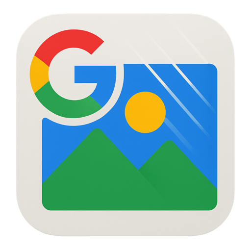
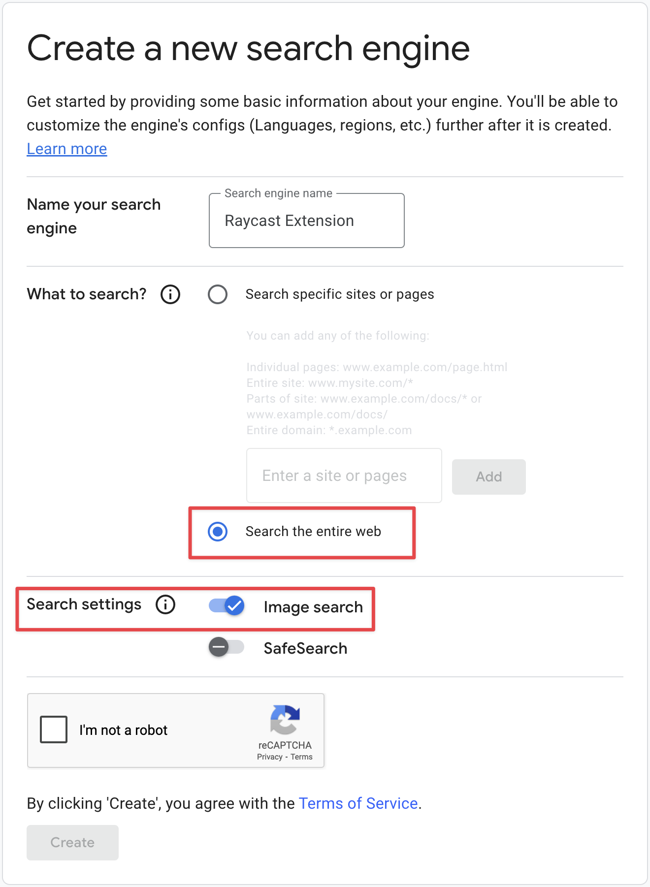

<h1 align="center"> 
Google Image Search
</h1>

This Raycast extension uses the Google Custom Search API to quickly search for images and display them in a grid view. From there, you can open the original source or copy the image URL.

## Setup

### Prerequisites
- Google API Key
- Custom Search Engine ID

1. **How to Get a Custom Google Search API Key**
   - Visit the [Google Cloud Console](https://console.cloud.google.com/)
   - Create a new project or use an existing one
   - Open the left side menu and select APIs & services.
   - On the left, choose **Credentials**
   - Click Create credentials and then select API key
   - Copy the API key and input it in the raycast preferences for this extension

> "Custom Search JSON API provides 100 search queries per day for free. If you need more, you may sign up for billing in the API Console. Additional requests cost $5 per 1000 queries, up to 10k queries per day."

2. **How to Get a Search Engine ID (cx)**
   - Go to [Google Programmable Search Engine](https://programmablesearchengine.google.com/controlpanel/create)
   - Create a new search engine
   - Set it to search the entire web
   - Enable "Image search" option
   - Get your Search Engine ID (cx)

<!--  -->

Now configure your API Key and Search Engine ID in the extension preferences.

----
### Installation for development

1. Clone this repository or download it to your local machine
2. Open a terminal and navigate to the project directory
3. Run `npm install` to install dependencies
4. Run `npm run dev` to start the extension in development mode
5. Configure your API Key and Search Engine ID in the extension preferences