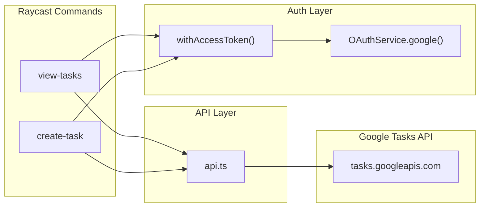

# Google Tasks Raycast Extension — Plan

> Build a Raycast extension that connects to Google Tasks via OAuth, allowing the user to view task lists, create new tasks, and toggle tasks as complete.

## Prerequisite: Google Cloud OAuth Client ID

Before the extension can work, you need a Google Cloud OAuth client ID. One-time setup:

1. Go to [Google Cloud Console > Credentials](https://console.developers.google.com/apis/credentials)
2. Create a project (or use an existing one)
3. Enable the **Google Tasks API** (under "Enabled APIs & services" > "Enable APIs and Services")
4. Configure the **OAuth consent screen** (External, add your email as test user)
5. Create an **OAuth Client ID**: choose **iOS** as app type, set Bundle ID to `com.raycast`
6. Copy the generated Client ID — this will be entered as a Raycast preference when the extension first runs

## Architecture

The extension uses the modern `@raycast/utils` OAuth utilities (`OAuthService.google` + `withAccessToken`) for cleaner auth handling, and `node-fetch` for API calls.



## File Structure

```
google-tasks/
  package.json          # Manifest: commands, preferences (clientId), deps
  tsconfig.json
  assets/
    google-tasks.png    # Extension icon
    google-logo.png     # OAuth provider icon
  src/
    oauth.ts            # OAuthService.google() setup
    api.ts              # All Google Tasks API calls
    types.ts            # Task, TaskList, TaskForm interfaces
    view-tasks.tsx      # "View Tasks" command (main list view)
    create-task.tsx     # "Create Task" command (form)
```

## UI Screens

### Screen 1: Task Lists (entry point of "View Tasks" command)

A Raycast `List` showing all your Google Task lists. Selecting one drills into the tasks.

```
┌─────────────────────────────────────────────────┐
│  🔍  Search task lists...                       │
├─────────────────────────────────────────────────┤
│                                                 │
│  📋  My Tasks                              ›    │
│                                                 │
│  📋  Work                                  ›    │
│                                                 │
│  📋  Shopping                              ›    │
│                                                 │
│                                                 │
│                                                 │
│                                                 │
├─────────────────────────────────────────────────┤
│  ⏎ View Tasks                                   │
└─────────────────────────────────────────────────┘
```

- Each row is a `List.Item` with the list title
- `Action`: press Enter to push the task list view (Screen 2)
- Backed by `GET /tasks/v1/users/@me/lists`

### Screen 2: Tasks in a List (after selecting a list)

A Raycast `List` showing tasks within the chosen list, with a filter dropdown.

```
┌─────────────────────────────────────────────────┐
│  🔍  Filter tasks...            [▾ Open      ]  │
├─────────────────────────────────────────────────┤
│                                                 │
│  🔴 Review pull requests        Due: May 12     │
│                                                 │
│  ○  Prepare quarterly report    Due: May 20     │
│                                                 │
│  ○  Update project docs         Due: May 25     │
│                                                 │
│  ○  Schedule team standup                       │
│                                                 │
│  ✅ Send weekly update          Completed       │
│                                                 │
├─────────────────────────────────────────────────┤
│  ⏎ Toggle Complete   ⌘K Open Actions            │
└─────────────────────────────────────────────────┘
```

- **Icons**: `○` gray circle = open, `🔴` red circle = overdue, `✅` green check = completed
- **Filter dropdown** (top-right): Open / Completed / All
- Tasks sorted: overdue first, then by due date, then no-date; completed sorted by completion date
- Subtitle shows due date or "Completed"
- Backed by `GET /tasks/v1/lists/{id}/tasks`

### Screen 3: Action Panel (press ⌘K on a task)

```
┌─────────────────────────────────────────────────┐
│                                                 │
│  (dimmed task list behind)                      │
│                                                 │
│  ┌───────────────────────────────────────────┐  │
│  │  ✓  Complete Task                     ⏎   │  │
│  │  ✏️  Edit Task                        ⌘E  │  │
│  │  ➕  Create New Task                  ⌘N  │  │
│  │  🗑  Delete Task                      ⌘⌫  │  │
│  └───────────────────────────────────────────┘  │
│                                                 │
└─────────────────────────────────────────────────┘
```

- **Complete Task** (primary action, Enter): toggles status between `completed` / `needsAction`
- **Edit Task** (⌘E): pushes an edit form pre-filled with current values
- **Create New Task** (⌘N): pushes a blank create form for this list
- **Delete Task** (⌘⌫): deletes with confirmation toast
- After any action, the list refreshes automatically

### Screen 4: Create Task Form (standalone command or via ⌘N)

The Due Date field accepts natural language input in 6 languages (English, French, German, Spanish, Portuguese, Italian). It has three visual states:

**State 1 — Empty (field untouched)**

```
┌─────────────────────────────────────────────────┐
│  Create Task                                    │
├─────────────────────────────────────────────────┤
│                                                 │
│  Title *                                        │
│  ┌───────────────────────────────────────────┐  │
│  │ Write blog post                           │  │
│  └───────────────────────────────────────────┘  │
│                                                 │
│  Notes                                          │
│  ┌───────────────────────────────────────────┐  │
│  │ Draft the introduction and outline...     │  │
│  └───────────────────────────────────────────┘  │
│                                                 │
│  Due Date                                       │
│  ┌───────────────────────────────────────────┐  │
│  │  e.g. "tomorrow", "next monday", "demain" │  │  ← placeholder
│  └───────────────────────────────────────────┘  │
│                                                 │
│  Task List                                      │
│  ┌───────────────────────────────────────────┐  │
│  │ ▾  My Tasks                               │  │
│  └───────────────────────────────────────────┘  │
│                                                 │
├─────────────────────────────────────────────────┤
│  ⌘⏎ Create Task                                 │
└─────────────────────────────────────────────────┘
```

**State 2 — Recognized (date parsed successfully)**

```
│  Due Date                                       │
│  ┌───────────────────────────────────────────┐  │
│  │ next monday                               │  │  ← user typed
│  └───────────────────────────────────────────┘  │
│  Recognized: Monday, May 25, 2026               │  ← Form.Description
```

**State 3 — Unrecognized (input cannot be parsed)**

```
│  Due Date                                       │
│  ┌───────────────────────────────────────────┐  │
│  │ foobar                                    │  │  ← user typed
│  └───────────────────────────────────────────┘  │
│  Date not recognized                            │  ← error prop (red)
```

- **Title**: `Form.TextField` (required)
- **Notes**: `Form.TextArea` (optional)
- **Due Date**: `Form.TextField` with natural language parsing via `chrono-node` (EN, FR, DE, ES, PT, IT); live feedback via `error` prop and `Form.Description`
- **Task List**: `Form.Dropdown` populated from `fetchTaskLists()`
- On submit: `POST /tasks/v1/lists/{listId}/tasks`, then success toast + `popToRoot()`
- Edit Task pre-populates the field with the existing due date as readable text so the recognized state appears immediately on open

### Toast Notifications

After mutations, the user sees standard Raycast toasts:

- "Task completed" (green check style)
- "Task created" (green check style)
- "Task deleted" (neutral style)
- Error toasts with red styling if API calls fail

## Commands

### 1. View Tasks (`view-tasks.tsx`)

- Screens 1 + 2 + 3 above
- First level: list of task lists fetched from `GET /tasks/v1/users/@me/lists`
- Drill into a list to see its tasks from `GET /tasks/v1/lists/{id}/tasks`
- Each task shows: title, due date (if any), status icon (circle = open, checkmark = complete, red circle = overdue)
- **Filter dropdown**: Open / Completed / All
- **Actions per task**:
  - Toggle Complete/Incomplete (`PATCH` with `status: "completed"` or `"needsAction"`)
  - Delete task (`DELETE`)
  - Edit task (push a form)
  - Create new task in this list (push a form)
- After any mutation, the list auto-refreshes

### 2. Create Task (`create-task.tsx`)

- Screen 4 above
- A `Form` command accessible directly from Raycast root search
- Fields: Title (required), Notes (optional), Due Date (optional DatePicker), Task List (Dropdown, fetched from API)
- On submit: `POST /tasks/v1/lists/{listId}/tasks` then show success toast and pop back

## Key Implementation Details

### OAuth (`src/oauth.ts`)

Use the built-in `OAuthService.google()` from `@raycast/utils`:

```typescript
import { OAuthService } from "@raycast/utils";
import { getPreferenceValues } from "@raycast/api";

const { clientId } = getPreferenceValues<{ clientId: string }>();

export const google = OAuthService.google({
  clientId,
  scope: "https://www.googleapis.com/auth/tasks",
});
```

Each command wraps its component with `withAccessToken(google)(Component)`.

### API Layer (`src/api.ts`)

Uses `getAccessToken()` from `@raycast/utils` to get the current token. All functions are async and use `node-fetch`:

- `fetchTaskLists()` — GET `/tasks/v1/users/@me/lists`
- `fetchTasks(listId, showCompleted)` — GET `/tasks/v1/lists/{listId}/tasks`
- `createTask(listId, task)` — POST `/tasks/v1/lists/{listId}/tasks`
- `toggleTask(listId, task)` — PATCH status to `completed` or `needsAction`
- `deleteTask(listId, taskId)` — DELETE `/tasks/v1/lists/{listId}/tasks/{taskId}`
- `editTask(listId, task)` — PATCH title/notes/due

### Dependencies (`package.json`)

```json
{
  "dependencies": {
    "@raycast/api": "^1.103.4",
    "@raycast/utils": "^2.2.1",
    "chrono-node": "^2.9.1"
  }
}
```

Preferences: a single `clientId` field (type `password`, required).

Two commands registered:
- `view-tasks` (mode: `view`) — main entry point
- `create-task` (mode: `view`) — quick create from root search

## How to Run, Debug, and Test

### Initial Setup (one-time)

```bash
cd google-tasks
npm install
```

Before running, you need a Google OAuth Client ID configured (see "Prerequisite" section above). You'll be prompted to enter it the first time you open the extension in Raycast.

### Running in Development Mode

```bash
npm run dev
```

This starts the Raycast development server:
- The extension appears **at the top of Raycast root search** for quick access
- **Hot reload**: any file save automatically rebuilds and reloads the extension in Raycast
- **Error overlays**: unhandled exceptions show full stack traces in Raycast with a "Jump to Error" action
- **Console output**: all `console.log` / `console.error` calls print to this terminal

To open the extension: activate Raycast (default: `⌥ Space`), type "View Tasks" or "Create Task".

To stop dev mode: `Ctrl+C` in the terminal.

### Debugging

**Option 1: Console logging (quick)**

Add `console.log(...)` anywhere in the code. Output appears in the terminal running `npm run dev`. Useful for inspecting API responses, state values, etc.

**Option 2: VS Code / Cursor Debugger (breakpoints)**

1. Start the extension with `npm run dev` (keep the terminal running)
2. In VS Code/Cursor, run the command: `Raycast: Attach Debugger`
3. Set breakpoints in any `.ts` / `.tsx` file
4. Trigger the command in Raycast — execution pauses at breakpoints
5. Inspect variables, step through code, evaluate expressions in the Debug Console

**Option 3: React Developer Tools (inspect component tree)**

```bash
npm install --save-dev react-devtools@6.1.1
```

Then with `npm run dev` running:
1. Open your command in Raycast
2. Press `⌘ ⌥ D` to launch React DevTools
3. Inspect component props and state live

### Linting and Type Checking

```bash
npm run lint
npm run fix-lint
npx tsc --noEmit
```

### Building for Production

```bash
npm run build
```

### Testing the OAuth Flow

1. Run `npm run dev`
2. Open "View Tasks" in Raycast
3. First time: you'll see "Connect your Google account..." overlay
4. Click "Connect" — browser opens Google consent page
5. Grant access — browser redirects back to Raycast
6. Extension loads with your task lists

**If OAuth fails**, check:
- The Client ID is correct (Preferences > Extensions > Google Tasks)
- The Google Cloud project has the Tasks API enabled
- The OAuth app type is "iOS" with Bundle ID `com.raycast`
- Your email is listed as a test user (if the OAuth app isn't published)

### Common Issues and Troubleshooting

- **"Invalid client_id"**: Double-check the Client ID in extension preferences.
- **"Access blocked: This app's request is invalid"**: The redirect URI doesn't match. Ensure the OAuth app type is iOS with Bundle ID `com.raycast`.
- **"Request had insufficient authentication scopes"**: Re-authenticate (logout then re-connect).
- **Extension not appearing in Raycast**: Make sure `npm run dev` is running. Check the terminal for build errors.
- **Stale data after mutation**: Check the terminal for API errors. The refresh happens by re-fetching the list after each mutation.
- **Hot reload not working**: Don't save files during an active OAuth redirect — this resets the OAuth state.

## Improvements Over the Existing Extension

The [existing extension](https://github.com/raycast/extensions/tree/main/extensions/google-tasks) has several issues our version addresses:

| Area | Existing Extension | Our Version |
|---|---|---|
| **OAuth** | Manual `OAuth.PKCEClient` with hand-rolled authorize/refresh/fetchTokens (~80 lines) | `OAuthService.google()` + `withAccessToken` wrapper (~5 lines) |
| **Auth in components** | Each component re-calls `google.authorize()` in its own `useEffect` | `withAccessToken` handles it once per command |
| **Complete task UX** | Toggle is a secondary action in the action panel | Toggle is the **primary action** (Enter key) |
| **Error handling** | On API error, `setState({ tasks: [] })` wipes the displayed list | Errors show toast, previous task list is preserved |
| **Edit form validation** | No validation (can submit empty title) | `useForm` with `FormValidation.Required` on title |
| **Due date on edit** | Raw string instead of Date, no DatePicker | Natural language text field pre-populated with readable date, backed by `chrono-node` |
| **File structure** | 9 files across `api/`, `components/` subdirs | 5 files, flat `src/` |

## Testing Plan

### Phase 1: Static Checks (automated)

- [ ] `npm run build` — TypeScript compiles with no errors
- [ ] `npm run lint` — Raycast ESLint config passes
- [ ] No `any` types in API layer

### Phase 2: OAuth Flow (manual)

- [ ] **T-AUTH-1**: First launch shows OAuth overlay, completes successfully
- [ ] **T-AUTH-2**: Token persistence across Raycast restarts
- [ ] **T-AUTH-3**: Silent token refresh after expiry
- [ ] **T-AUTH-4**: Logout and re-authentication
- [ ] **T-AUTH-5**: Invalid client ID shows clear error

### Phase 3: View Tasks Command (manual)

- [ ] **T-LIST-1**: All task lists displayed correctly
- [ ] **T-LIST-2**: Empty state for no task lists
- [ ] **T-LIST-3**: Drill into a list shows tasks
- [ ] **T-TASK-1**: Correct titles, due dates, and status icons
- [ ] **T-TASK-2**: Overdue tasks show red circle icon
- [ ] **T-TASK-3**: Filter "Open" hides completed tasks
- [ ] **T-TASK-4**: Filter "Completed" shows only completed tasks
- [ ] **T-TASK-5**: Filter "All" shows both
- [ ] **T-TASK-6**: Correct sort order
- [ ] **T-TASK-7**: Search bar filters by title
- [ ] **T-TASK-8**: Empty list shows empty view with "Create Task" action
- [ ] **T-TASK-9**: 50+ tasks load and scroll correctly

### Phase 4: Task Mutations (manual)

- [ ] **T-COMPLETE-1**: Complete a task, verified on tasks.google.com
- [ ] **T-COMPLETE-2**: Uncomplete a task, verified on tasks.google.com
- [ ] **T-COMPLETE-3**: Complete an overdue task
- [ ] **T-CREATE-1**: Create from root search
- [ ] **T-CREATE-2**: Create from within list (⌘N), pre-selects current list
- [ ] **T-CREATE-3**: Create with only title (no notes/date)
- [ ] **T-CREATE-4**: Validation rejects empty title
- [ ] **T-EDIT-1**: Edit task, pre-fills current values
- [ ] **T-EDIT-2**: Clear due date on edit
- [ ] **T-DELETE-1**: Delete task, confirmed on tasks.google.com
- [ ] **T-REFRESH**: List refreshes after any mutation

### Phase 5: Edge Cases and Error Handling

- [ ] **T-ERR-1**: Network offline shows error toast, preserves data
- [ ] **T-ERR-2**: API error shows toast, doesn't wipe list
- [ ] **T-ERR-3**: Transparent token refresh during mutation
- [ ] **T-ERR-4**: Special characters in task title
- [ ] **T-ERR-5**: Very long title (500 chars)
- [ ] **T-ERR-6**: Due date serialization (no off-by-one day errors)

### Phase 6: Comparison Against Existing Extension

- [ ] **T-CMP-1**: Same task lists appear
- [ ] **T-CMP-2**: Same tasks appear
- [ ] **T-CMP-3**: Create in ours, visible in theirs
- [ ] **T-CMP-4**: Complete in ours, reflected in theirs
- [ ] **T-CMP-5**: Toggle is primary action (Enter key)
