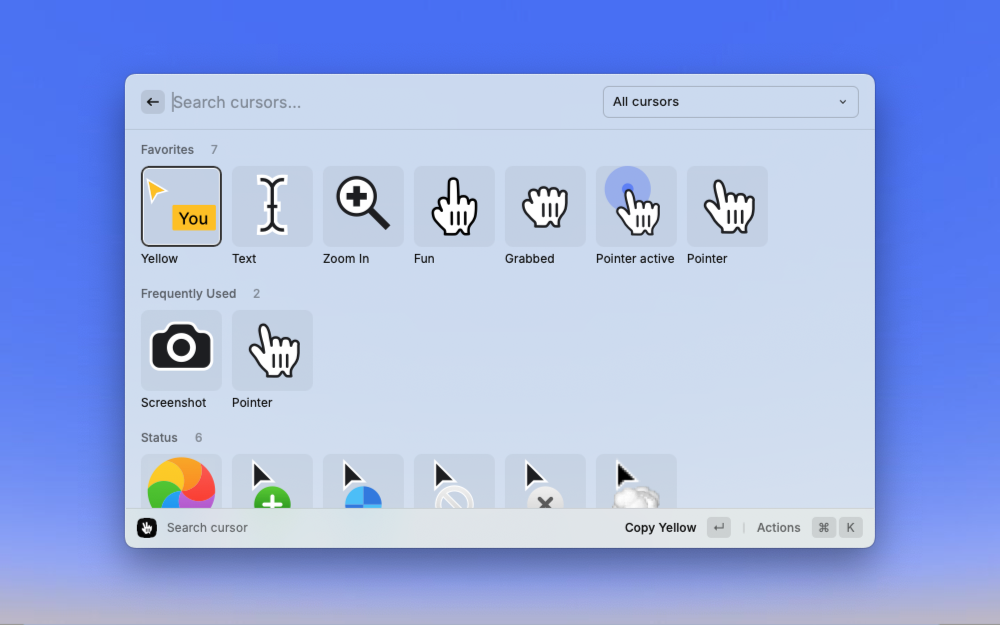

# Grab a Cursor

Browse, search, and copy SVG cursors directly from Raycast. Perfect for designers, developers, and content creators who need quick access to cursor assets.

## Features

- 🔍 **Smart Search**: Find cursors by name
- ⭐️ **Favorites**: Favorite your most-used cursors for instant access
- 📊 **Usage Tracking**: Automatically tracks and surfaces your frequently used cursors
- 🎯 **Quick Copy**: Copy SVG cursors to clipboard

## Getting Started

### Prerequisites

- [Raycast](https://raycast.com/) version 1.60.1 or higher
- macOS 12 or higher

### Installation

1. Open Raycast
2. Search for "Grab a Cursor"
3. Click Install

## Usage

### Basic Operations

1. Open Raycast (default: ⌘ + Space)
2. Type "cursor" or "Grab a Cursor"
3. Press ↵ to browse cursors

### Keyboard Shortcuts

- `↵` - Copy cursor to clipboard
- `⌘` + `F` - Toggle favorite status
- `⌘` + `K` - Open actions menu
- `⌘` + `.` - Open preferences

### Tips & Tricks

- Use the section filter to quickly switch between All, Favorites, and Frequently Used cursors
- Frequently used cursors are automatically tracked and sorted by usage
- Reset your usage history anytime through the actions menu

## Customization

### Display Size Preference

Choose your preferred grid display size:

- **Small**: More cursors per view, compact layout
- **Medium**: Balanced size and detail
- **Large**: Larger previews, fewer items per row

## Troubleshooting

If you encounter issues:

1. Ensure you have the latest version of Raycast installed
2. Check if your cursor directory is accessible
3. Try resetting the extension preferences

## Support

Found a bug or have a feature request? Please [open an issue](https://github.com/yourusername/grab-a-cursor/issues) on GitHub.

## Contributing

Contributions are welcome! Please read our [Contributing Guidelines](CONTRIBUTING.md) for details.

## License

This project is licensed under the MIT License - see the [LICENSE](LICENSE) file for details.
