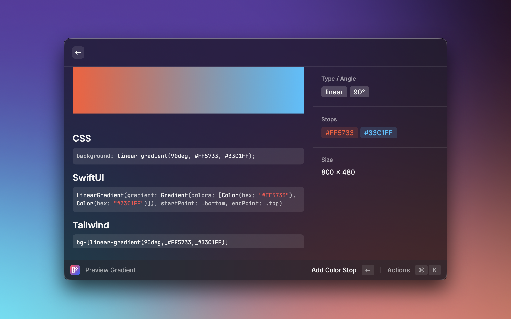

<a name="readme-top"></a>

<div align="center">
    
  <h3 align="center">Gradient Generator</h3>
  <p align="center">
    A Raycast extension to create, preview, randomize, save and export gradients, using them in your next project.
    <br />
    <a href="./ROADMAP.md"><strong>Explore the roadmap »</strong></a>
    <br />
  </p>
</div>

<details>
  <summary>Table of Contents</summary>

- [About The Project](#about-the-project)
  - [Features](#features)
  - [Built With](#built-with)
- [Getting Started](#getting-started)
  - [Prerequisites](#prerequisites)
  - [Install](#install)
  - [Usage](#usage)
- [Back Matter](#back-matter)
  - [Roadmap](#roadmap)
  - [Contributing](#contributing)
  - [License](#license)

</details>

## About The Project
<div align="center">
    
  </div>

**Gradient Generator** is a minimalist, local-first Raycast extension for crafting gradients. Create a gradient, preview it in a large panel, copy ready-to-use snippets (CSS, SwiftUI, Tailwind arbitrary value), generate random gradients, and save your favorites locally.

### Features

- Create linear, radial, or conic gradients (with angle for linear)
- Large preview and gradient metadata
- Copy snippets: CSS, SwiftUI, Tailwind arbitrary value
- Random gradient generator (2–3 stops)
- Saved gradients list with quick preview and delete
- Local storage only (no network calls)

### Built With

- TypeScript + React
- `@raycast/api`, `@raycast/utils`

## Getting started

### Prerequisites

- macOS with Raycast installed

### Install

#### From Raycast Store (production):
Install via [Raycast Store](https://www.raycast.com/smcnab1/gradient-generator)

#### From source (development):

```bash
npm install
npm run dev
```

Build locally:

```bash
npm run build
```

### Commands

- Create Gradient: form to define type, colors, and angle; pushes to Preview
- Preview Gradient: detail view with large preview, metadata, and copy actions (CSS, SwiftUI, Tailwind)
- Random Gradient: generates a random 2–3 stop gradient and shows Preview
- Saved Gradients: list of saved gradients with color tags; open Preview; delete

## Back Matter

### Roadmap

See [ROADMAP.md](./ROADMAP.md) for planned work and MVP scope.

### Contributing

Contributions welcome. Please open an issue to discuss changes first.

1. Fork the project
2. Create a feature branch (`git checkout -b feature/my-change`)
3. Commit your changes (`git commit -m 'feat: ...'`)
4. Push to your branch (`git push origin feature/my-change`)
5. Open a Pull Request

### License

MIT — see [LICENSE](./LICENSE) for details.