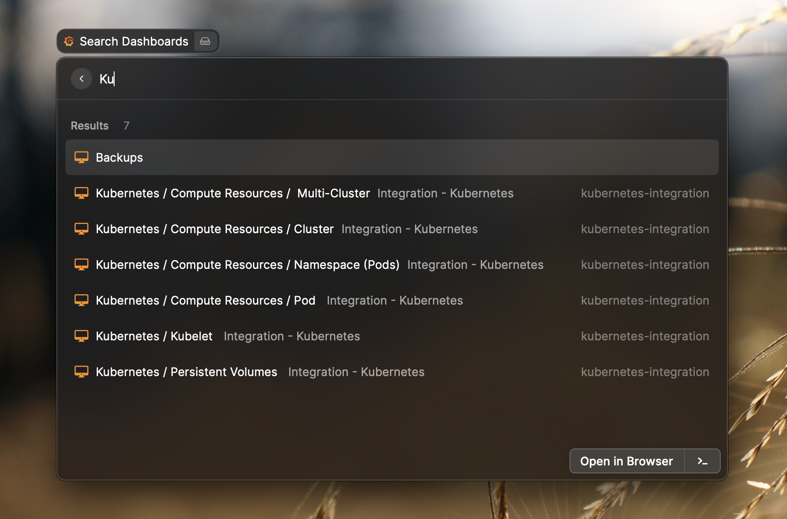
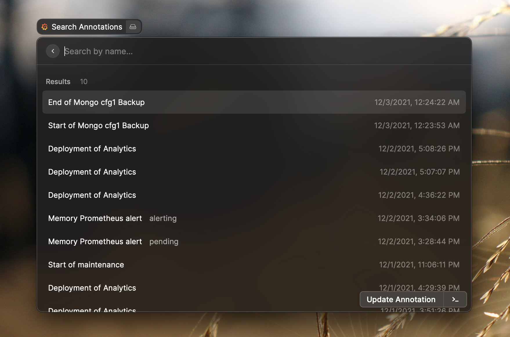
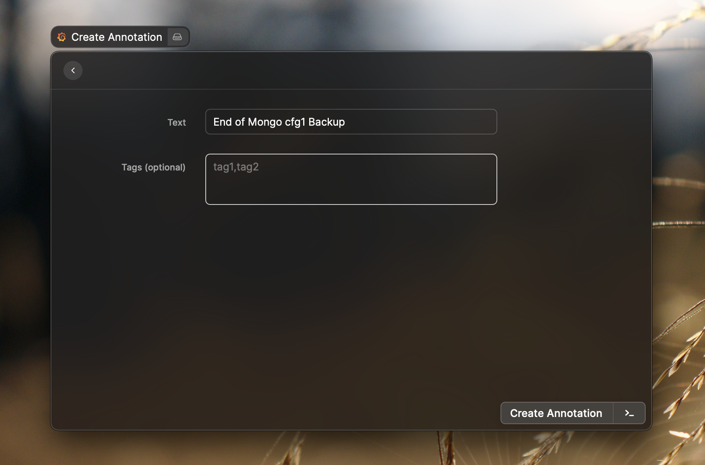
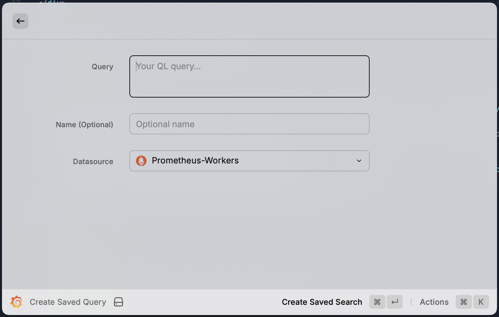
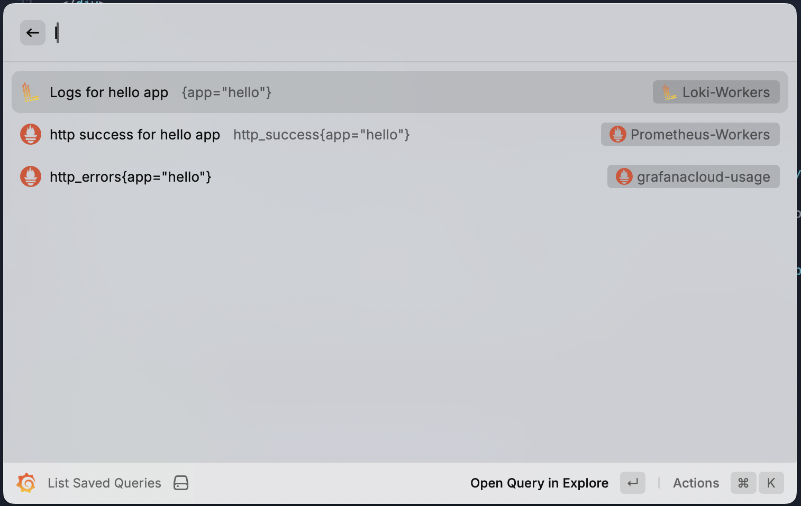

  

  <h1>
    Grafana
  </h1>

Raycast extension to search dashboards, go to the explore view, create saved queries and list them, create, search and modify annotations, and more to come.

  

    
    
    
  

## Features

- Quick access & search to your dashboards
- Search, create, update & delete an annotation
- Go to the Explore grafana page
- List, create & open saved queries

## Getting started

- Go to to your Grafana instance (cloud or self-hosted) e.g. `https://<organization>.grafana.net/org/apikeys`
- Click on `Add API key`
- Give your key a name e.g. `Raycast`, select the viewer role (recommended), and set an expiration date (recommended
- Store in a secure location the given access token
- Start a grafana command and fill the required fields
  - Root API Url: is the URL of your grafana instance. If you use Grafana Cloud, it is like `https://<organization>.grafana.net`
  - API-key with your access token previsouly generated.

Now you should be able to manage your Grafana Dashboards with Raycast 🚀.

## Showcases

### List Dahsboards

### List Annotations

### Create Annotation

### Create saved query

Create a query you often need on Grafana explore via this Raycast extension, to send use it with the "List saved queries" command

### List saved queries

Open saved queries directly in your grafana Explore page

---

_Extension built & tested for Grafana Cloud v10_
