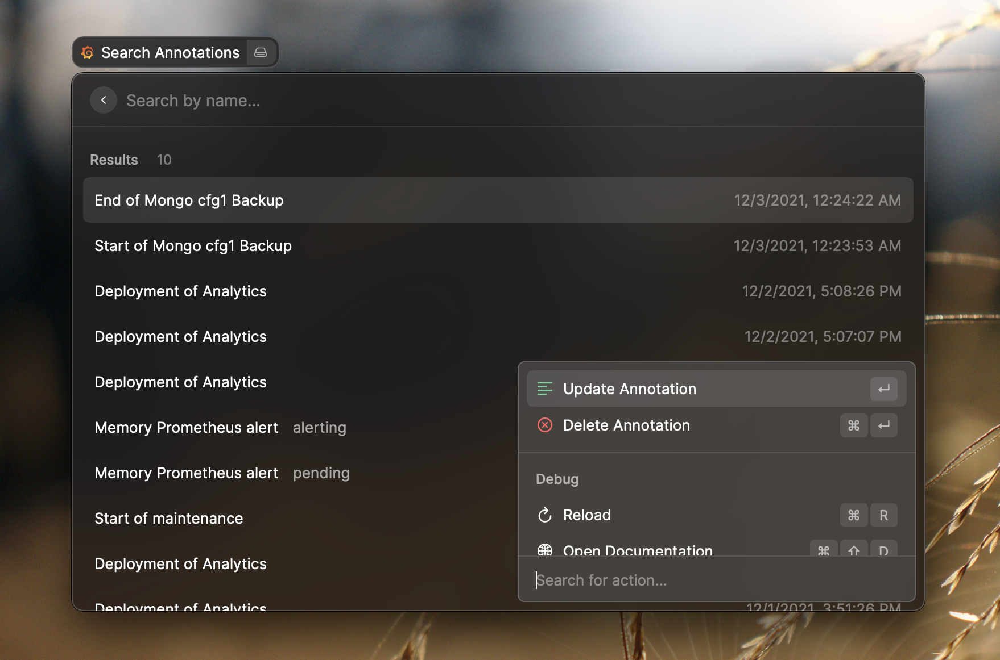

  

  <h1>
    Grafana
  </h1>

Raycast extension to search dashboards, go to the explore view, create, search and modify annotations, and more to come.

  

    
    
    
  

## Features

- Quick access & search to your dashboards
- Search, create, update & delete an annotation

## Getting started

- Go to to your Grafana instance (cloud or self-hosted) e.g. `https://<organization>.grafana.net/org/apikeys`
- Click on `Add API key`
- Give your key a name e.g. `Raycast`, select the viewer role (recommended), and set an expiration date (recommended
- Store in a secure location the given access token
- Start a grafana command and fill the required fields
  - Root API Url: is the URL of your grafana instance. If you use Grafana Cloud, it is like `https://<organization>.grafana.net`
  - API-key with your access token previsouly generated.

Now you should be able to manage your Grafana Dashboards with Raycast 🚀.

## Showcases

### List Dahsboards

### List Annotations

### Create Annotation

---

_Extension built & tested for Grafana Cloud v8_
