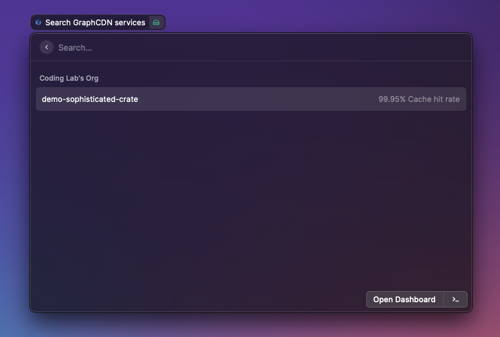

# GraphCDN

_List your [GraphCDN](https://graphcdn.io) services and inspect their configuration_

## Create an access token

- Go to your [GraphCDN settings](https://graphcdn.io/dashboard/settings)
- Generate a new token called `Raycast`
- Copy the generated token into the Raycast preferences

