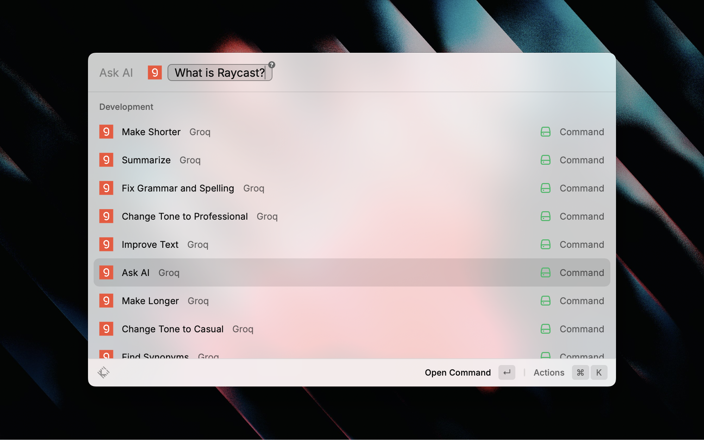
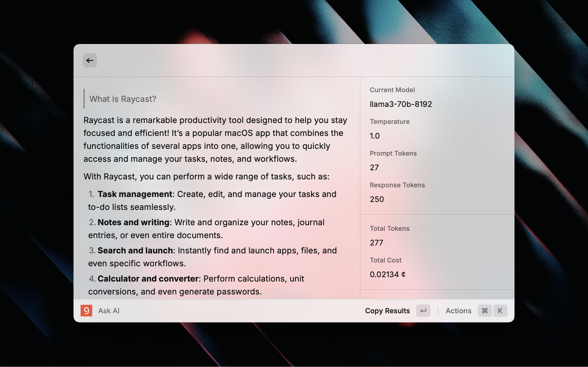

<h1 align="center">Groq</h1>

<h3 align="center">
Interact with Groq's API right from your command bar
</h3>

Groq's API offers a wide range of AI models, such as Mistral, Google and Meta's Llama models, with insanely fast speed (Llama3 70B with over 250 t/s).
With this powerful extension, you can boost your productivity using advanced AI models without having to leave your Raycast interface.

### Get Instant Answers

## Getting an API Key

1. Go to [Groq API](https://console.groq.com/keys)
2. Generate an API key and copy your key
3. Input your key on the Extension's setup page

You're all good to go!

## Disabled Commands

The extension features several disabled commands that can be enabled in the settings:

- Change Tone to Casual
- Change Tone to Professional
- Coding Assustant
- Custom Action
- Find Synonyms
- Task Generator
- Translate Text