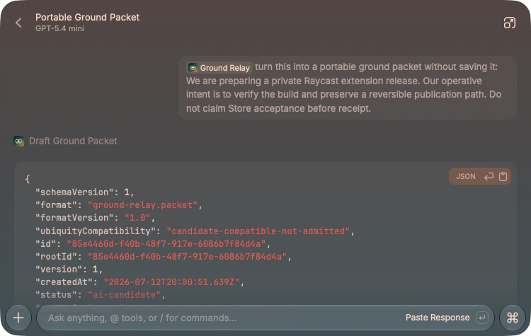
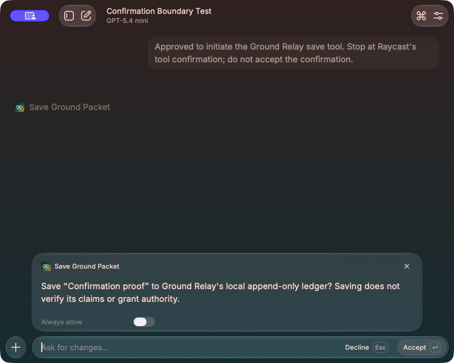

# Ground Relay for Raycast

Ground Relay carries the ground your work stands on—situation, operative intent, explicit refusals, constraints, authority, evidence, uncertainty, next movement, and correction history—across AI tools and human handoffs.

It is an ecosystem utility first. It does not require Ubiquity, hide context in a hosted memory service, or claim that generated text is verified. Its open packet format preserves an optional, provenance-aware path into deeper Ubiquity workflows later.

## What ships

- **Create Ground Packet** — captures selected text first, then clipboard content, then manual entry; saves a local packet.
- **Browse Ground Packets** — searches packets, appends corrections, and copies portable Markdown or JSON.
- **Draft Ground Packet** — AI tool that creates a non-persistent candidate.
- **Find Context Gap** — AI tool that returns one material missing question without scoring the carrier.
- **Save Ground Packet** — AI tool that writes locally only after explicit Raycast confirmation.
- **Correction lineage** — a correction appends a new version linked to the record it supersedes.





## Portability contract

Every JSON export declares:

```json
{
  "format": "ground-relay.packet",
  "formatVersion": "1.0",
  "ubiquityCompatibility": "candidate-compatible-not-admitted",
  "authorityStatus": "advisory-no-authority-grant"
}
```

Compatibility is intentionally narrow. A packet may later be inspected by a Ubiquity importer, but it is not onboarding, admission, doctrine, verification, or an authority grant.

Markdown and JSON remain usable with Raycast AI, MCP clients, AI Skills, ChatGPT, Claude, Codex, or human collaborators.

The open contract is defined by [`schemas/ground-relay.packet.schema.json`](schemas/ground-relay.packet.schema.json). The bounded future mapping is documented in [`docs/ubiquity-portability.md`](docs/ubiquity-portability.md).

## Install locally

Requirements: Raycast, Node.js 22.22.2 or newer, and npm.

```bash
npm install
npm run dev
```

The public Store manifest is configured for the verified Raycast author `breyden_taylor` with `access` set to `public`. The separately published private organization copy remains under `prmptd`.

## Input syntax

Evidence uses one item per line:

```text
claim || source reference || observed-at
```

Only source-linked evidence is marked receipt-bearing. Uncertainty uses:

```text
[solid] directly supported statement
[inferential] reasoned from supported evidence
[unknown] unresolved statement
```

## Privacy and authority

- Packets stay in Raycast's extension-local support directory unless copied elsewhere.
- The extension does not silently read files, chats, accounts, or browser history.
- Selected text or clipboard content is captured only when the user opens or reloads the create command.
- AI drafts remain advisory and unverified.
- AI persistence uses Raycast's human confirmation boundary.
- No project file, MCP server, skill, `AGENTS.md`, `TELOS.md`, canonical source, or external service is mutated.

## Development

```bash
npm run typecheck
npm test
npm run lint
npm run build
npx ray evals
```

The included eval suite covers all three AI routes: non-persistent drafting, one-question context-gap selection, and explicitly requested local save. Mock outputs prevent eval runs from mutating the local ledger.

See [SECURITY.md](SECURITY.md) for the bounded upstream development-dependency advisory.
