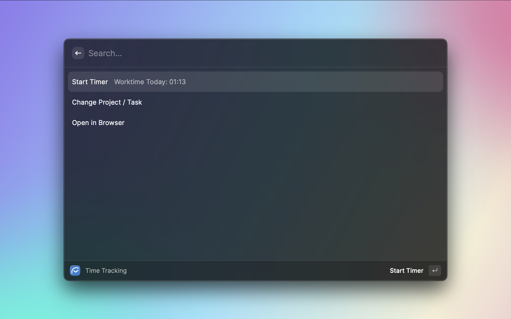

# Hakuna - Time Tracking
A command center for time tracking using [Hakuna](https://hakuna.ch/).

Get your API token here: https://{yoursubdomain}.hakuna.ch/token

Source repo: https://github.com/Sparclex/hakuna-raycast

To run the dev build, you can:

1. Clone the repo
2. Navigate to the directory then run `npm i && npm run build`
3. In Raycast, add the repo via "Add script directory" option on the Extensions tab (look for the +)
4. Open an issue here if you get stuck and I'll try to help.

## Features
- Start time tracking
- Stop time tracking
- Restart time tracking (extends last time entry if stopped within less than 1 minute)
- Open your hakuna site in browser
- Change project and task for which the time tracking should apply to

## FAQ
- Get an API token here: https://{yoursubdomain}.hakuna.ch/token
- What's Raycast? https://www.raycast.com/
- Dev instructions here: https://developers.raycast.com/basics/create-your-first-extension
