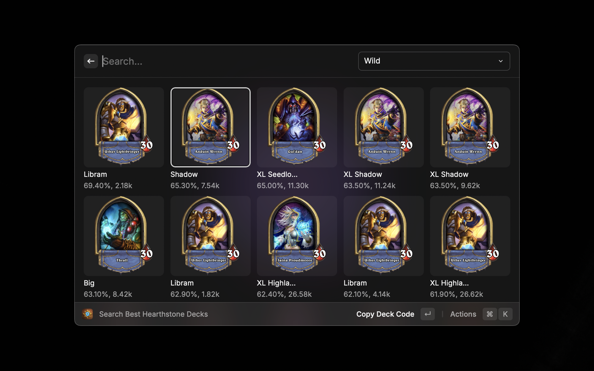
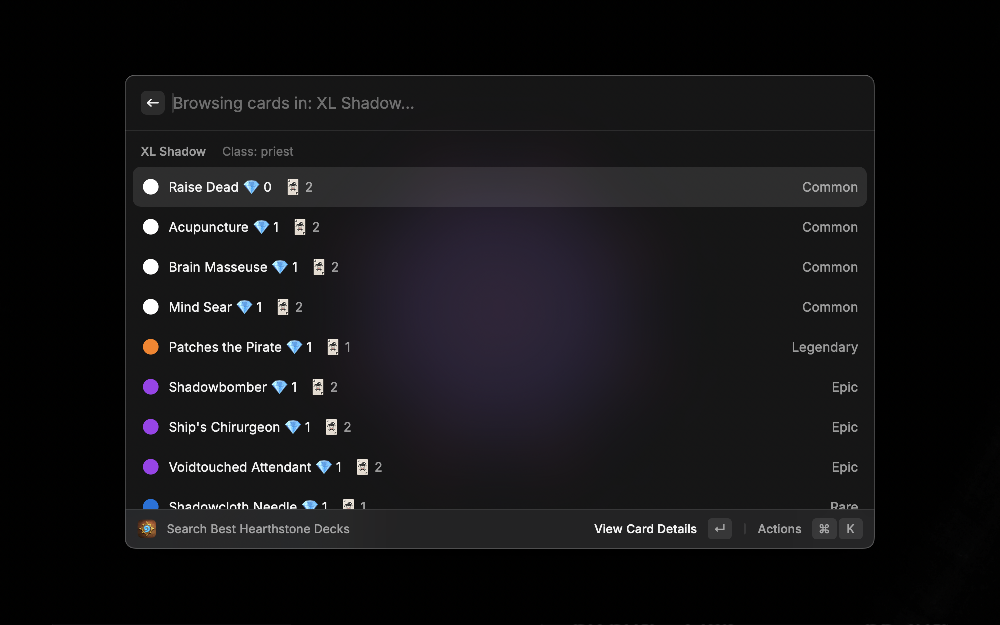

# # Hearthstone

⚡ Quickly find top Hearthstone decks and manage card collections directly from Raycast

## Features

### 🃏 **Competitive Deck Search**
- **Wild/Standard Decks**: Find top meta decks for both Wild and Standard formats
- **Class Filtering**: Search decks by class (Druid, Warrior, Rogue, Priest, etc.)
- **Winrate Display**: See deck winrates at a glance
- **Dust Cost**: View deck crafting costs in your preferred currency

### 🚀 **Quick Actions**
- **Deck Code Copy**: Instant copy-to-clipboard for deck codes `(Enter)`
- **Detailed Preview**
- **Full card list with mana costs**
- **High-resolution card images**
- **Deck performance statistics**
- **Quick Navigation**: One-click access to [HSGuru.com](https://www.hsguru.com) for full analysis `(⌘+Enter)`

## Installation
1. **Raycast Store** (Recommended):

2. **Manual Build**:
`npm install && npm run dev`

## Usage

### Basic Commands
| Command      | Shortcut  | Description         |
|--------------|-----------|---------------------|
| `Copy Decks` | `Enter`   | Copy Top Wild Decks |
| `View Decks` | `⌘ Enter` | View Deck In HSGuru |

### Workflow Example
1. Open Raycast and type `hs`
2. Select format:  
   `Wild` → See top 25 wild decks  
   `Standard` → View current meta decks
3. Filter by class using `⌘F`
4. Press `⏎` to:
   - Copy deck code `(Enter)`
   - View detailed card list `(Enter)`
   - Open in HSGuru.com `(⌘ Enter)`

---

**Disclaimer**: Not affiliated with Blizzard Entertainment. Card data © respective rights holders.  
**License**: MIT © 2024 Raffe Yang