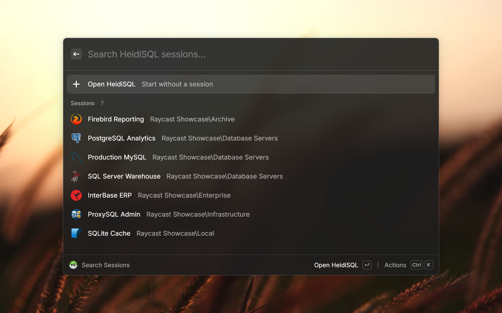

# HeidiSQL Sessions

Search and launch your [HeidiSQL](https://www.heidisql.com/) sessions straight from Raycast on Windows and macOS.

> [!NOTE]
> This extension is a Raycast port of **[Flow.Launcher.Plugin.Heidi](https://github.com/lostping/Flow.Launcher.Plugin.Heidi)** by **[LostPing](https://github.com/lostping)**. All the original ideas — the registry/portable session discovery and the `-d` launch trick — come from that plugin. Go give the original a ⭐. See [Credits](#credits) below.

## Features

- **Search Sessions** — lists all of your saved HeidiSQL connection profiles and filters as you type.
- Folder structure is preserved: the session's folder path is shown as a subtitle and is searchable.
- Each session uses its database engine's recognizable icon, derived from HeidiSQL's saved connection type.
- Selecting a session launches HeidiSQL with `-d "<session>"`.
- Optional **Open HeidiSQL** entry to start the app without a session.
- Works on both **Windows** and **macOS** (the native Lazarus build).

## Configuration

By default the extension **auto-detects** HeidiSQL.

**Windows**, looking in this order:

1. Directories on your `PATH`
2. Scoop (`~/scoop/apps/heidisql/current/heidisql.exe`, including a global Scoop install)
3. The actual install location, read from the uninstall entry in the Windows registry and, failing that, the HeidiSQL Start Menu shortcut

**macOS**, looking for the `heidisql.app` bundle in:

1. `/Applications`
2. `~/Applications`

You only need to set the path manually if HeidiSQL lives somewhere else.

Open the command preferences to adjust:

| Preference              | Description                                                                                                                                                                                                             |
| ----------------------- | ----------------------------------------------------------------------------------------------------------------------------------------------------------------------------------------------------------------------- |
| **HeidiSQL Executable** | Optional. Path to `heidisql.exe` (Windows) or `heidisql.app` (macOS). Leave empty to auto-detect. A configured path always overrides it.                                                                                |
| **Session Source**      | _Windows only._ Portable mode is auto-detected when `portable_settings.txt` sits next to the executable. Enable **Force portable mode** only to read from that file when auto-detection cannot. Has no effect on macOS. |
| **Open HeidiSQL entry** | When enabled, always show an entry that opens HeidiSQL without a session.                                                                                                                                               |

### Where sessions come from

- **Windows — Registry mode (default):** sessions are read recursively from `HKEY_CURRENT_USER\Software\HeidiSQL\Servers`. Any key that has a `Host` value is treated as a session.
- **Windows — Portable mode (auto-detected or forced):** sessions are parsed from `portable_settings.txt` located in the same folder as the executable. Portable mode is used automatically when that file exists; use **Force portable mode** in preferences only when auto-detection cannot find it.
- **macOS:** sessions are read from `~/.config/heidisql/settings.json`. The `Servers` object is walked recursively and any entry that has a `Host` value is treated as a session, so folder structure is preserved just like on Windows.

## Requirements

- Windows or macOS
- HeidiSQL installed (on macOS, the native 12.x+ `.app`; on Windows, an installed or portable copy)

## Credits

Full credit and a heartfelt thank-you to **[LostPing](https://github.com/lostping)**, the author of the original **[Flow.Launcher.Plugin.Heidi](https://github.com/lostping/Flow.Launcher.Plugin.Heidi)** for [Flow Launcher](https://www.flowlauncher.com/). This Raycast extension is a faithful port of that plugin — the session-discovery logic (recursive registry walk and portable settings parsing) and the HeidiSQL `-d` launch behavior are all their design. If this extension is useful to you, please head over to the original project and give it a ⭐.

- Original plugin: https://github.com/lostping/Flow.Launcher.Plugin.Heidi
- Original author: [@lostping](https://github.com/lostping)
- License: MIT (same as the original)

HeidiSQL itself is a wonderful open-source tool by Ansgar Becker and contributors — https://www.heidisql.com/.

### Database icon credits

MySQL, Microsoft SQL Server, PostgreSQL, SQLite, and Firebird artwork comes from
[Devicon](https://github.com/devicons/devicon) under the MIT License. The InterBase
artwork comes from [Simple Icons](https://github.com/simple-icons/simple-icons)
under CC0 1.0. The ProxySQL connection icon is original artwork created for this
extension because ProxySQL does not publish a reusable logo license.

All product names and logos are trademarks of their respective owners. Their use
does not imply endorsement of or affiliation with this extension, Raycast, or HeidiSQL.
