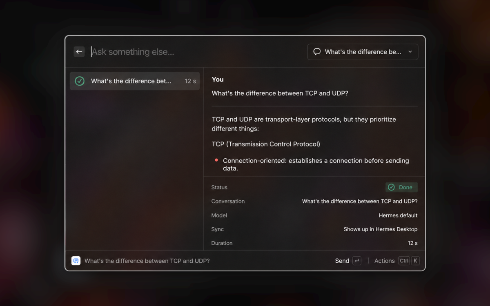
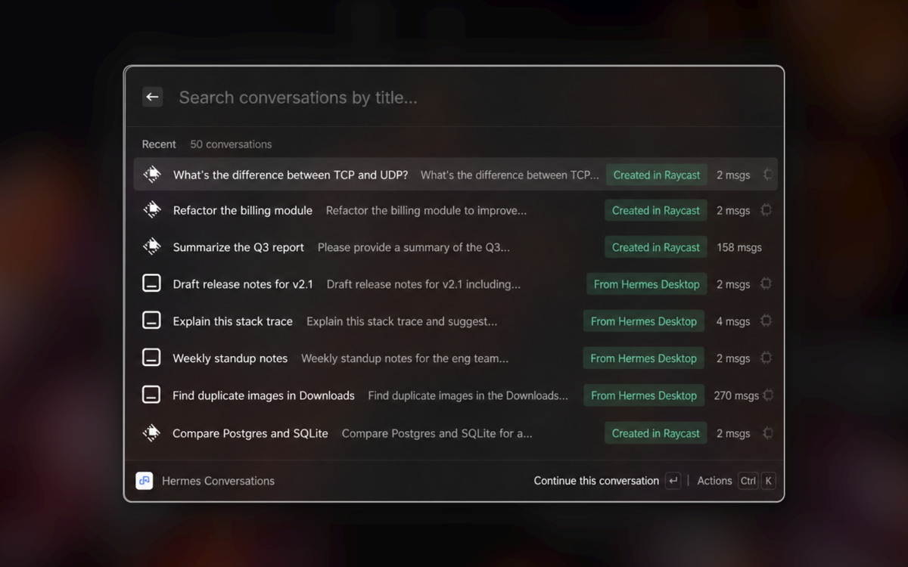
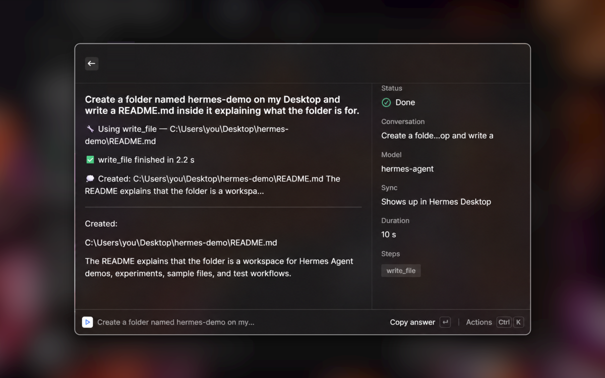
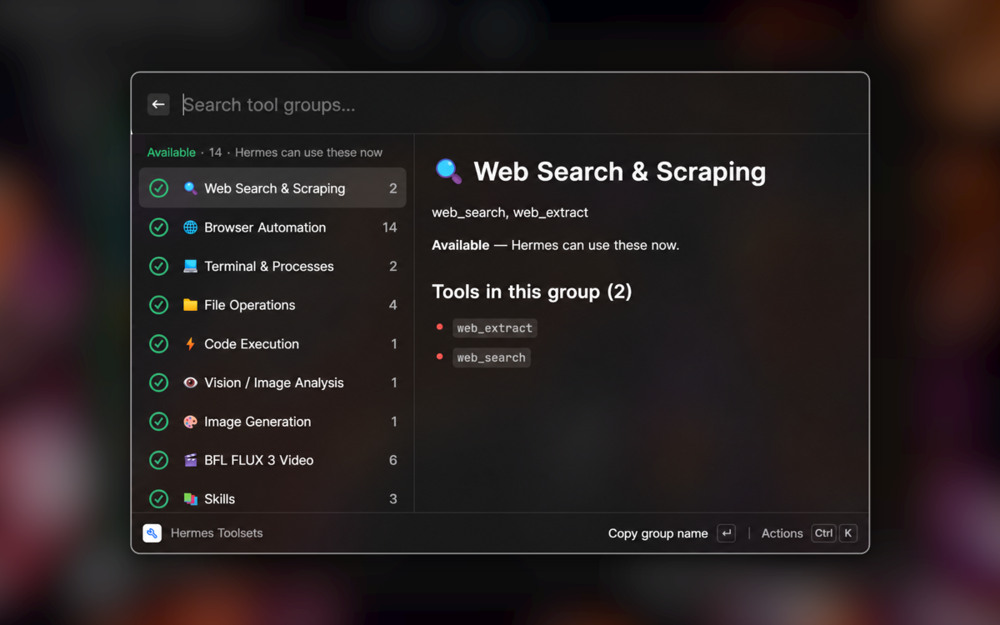
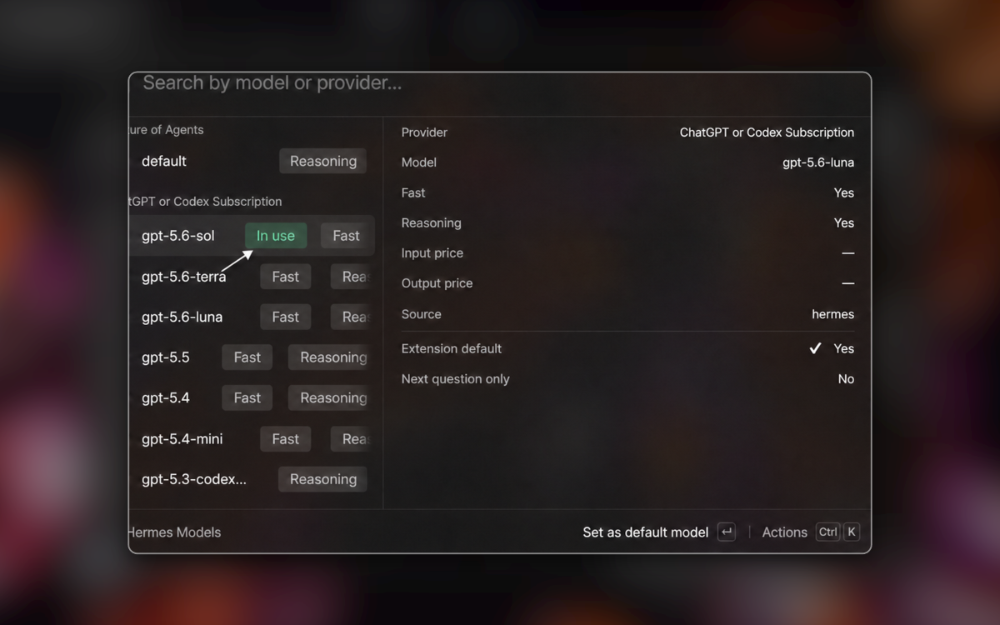
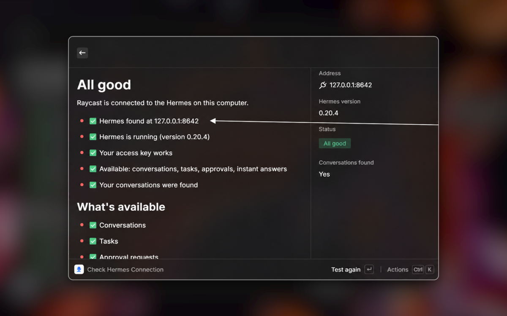

# Hermes para Raycast

[](https://github.com/savio22/hermes-raycast/actions/workflows/ci.yml)

Converse com o **Hermes Agent** que já roda no seu computador — sem abrir outro
aplicativo, sem sair do que você estava fazendo. Um atalho, uma pergunta, a resposta
aparece ali mesmo.

> Esta é a versão em português deste documento. O [README.md](README.md) em inglês tem o mesmo
> conteúdo, para quem chega pelo GitHub.
>
> **A interface da extensão é em inglês.** Era em português até a versão descrita no
> [CHANGELOG.md](CHANGELOG.md). O Raycast não localiza extensão: os títulos dos comandos, as
> descrições que a Store mostra e todo texto de tela são string fixa no pacote, então um idioma
> tem que vencer, e o inglês é o que alcança mais gente. Os documentos em `docs/` continuam em
> português, porque são para quem mexe no código, não para quem usa.

- **Sistemas:** macOS e Windows (`"platforms": ["macOS", "Windows"]` no manifesto), com a mesma
  base de código. Veja [Os dois sistemas](#os-dois-sistemas).
- **Fala com:** só `127.0.0.1` — o Hermes API Server da sua própria máquina. Nada sai daqui.



<details>
<summary><b>Mais cinco telas</b></summary>

**Conversas do Hermes** — seu histórico, incluindo as conversas que começaram no Hermes Desktop.



**Executar tarefa no Hermes** — as etapas do agente conforme acontecem, e depois o resultado.



**Ferramentas do Hermes** — os grupos de ferramentas, e quais estão prontos para usar agora.



**Modelos do Hermes** — troque de modelo sem sair do Raycast.



**Verificar conexão com Hermes** — o que a extensão encontrou, em português claro.



</details>

## A ideia principal: é a MESMA conversa do Hermes Desktop

Esta não é uma segunda caixa de chat que vive à parte. Tudo que você pergunta aqui é
gravado no mesmo lugar onde o Hermes Desktop guarda as conversas dele.

Na prática:

- Você pergunta algo pelo Raycast enquanto trabalha. Depois abre o Hermes Desktop e a
  conversa está lá, entre as recentes, com a pergunta e a resposta completas.
- O contrário também vale: as conversas que você começou no Hermes Desktop aparecem em
  **Hermes Conversations** e podem ser continuadas daqui.
- Qualquer conversa tem a ação **Open in Hermes Desktop**, que foca exatamente aquela
  conversa no aplicativo.

E a promessa que sustenta isso no dia a dia: **fechar a janela do Raycast não cancela
nada**. Se você fizer uma pergunta longa e a janela sumir, a tarefa continua rodando no
Hermes. Ela reaparece em **Hermes Tasks**, com a resposta pronta. Só a ação
**Stop** cancela de verdade.

## Os dois sistemas

A extensão roda o mesmo código no macOS e no Windows. O que muda é pouco, e mora em três lugares:

| | Windows | macOS |
| --- | --- | --- |
| Pasta padrão do Hermes | `%LOCALAPPDATA%\hermes` | `~/.hermes` |
| Modificador dos atalhos | `Ctrl` / `Alt` | `Cmd` / `Opt` |
| Nomes na configuração manual | File Explorer, Notepad | Finder, TextEdit |

A ordem da descoberta é a mesma nos dois e não muda: `HERMES_HOME` do ambiente → `hermes_home`
dentro do `gateway.pid` → a pasta padrão do sistema. Uma instalação fora do lugar continua sendo
encontrada sozinha, sem mexer em preferência nenhuma.

> **O que ainda não foi testado à mão:** os portões automatizados (316 testes, tipos, lint e build
> de release) cobrem os dois caminhos de código, mas esta versão só foi exercitada de verdade **no
> Windows 11**. Falta a primeira passada num Mac: o teclado, o link `hermes://` abrindo o Hermes
> Desktop e a tela de configuração manual com Finder e TextEdit.

## Instalação e configuração (sem terminal)

1. Instale a extensão no Raycast.
2. Deixe o **Hermes** ligado neste computador (o Hermes API Server precisa estar no ar).
3. Abra o Raycast e execute qualquer comando do Hermes — por exemplo
   **Ask Hermes**.

Na primeira vez a extensão mostra a tela de boas-vindas — e ela já chega sabendo: procura o
Hermes deste computador, descobre a porta certa e diz na primeira linha o que encontrou
("Found Hermes 0.20.4 here, at 127.0.0.1:8642") ou que ele está desligado. Aí é um Enter em
**Detect the Setup Automatically**: a extensão lê a chave de acesso local, testa a
conexão e guarda a chave em segurança. Acabou — você já pode perguntar.

Esse Enter é de propósito. A chave do Hermes é um segredo que está num arquivo seu, e a
extensão não lê arquivo seu procurando segredo sem você mandar. Descobrir a **porta** é
diferente e acontece sozinho, sempre.

Se a detecção automática não achar nada, use o comando **Configure Hermes**. Ele explica,
passo a passo, onde fica o arquivo de configuração do Hermes, abre a pasta
para você e permite colar a chave manualmente. O mesmo comando serve para consertar a
configuração depois — por exemplo se a chave do Hermes for trocada.

As instruções dessa tela citam os programas do sistema em que você está: File Explorer e
Notepad no Windows, Finder e TextEdit no macOS.

Para conferir se está tudo funcionando a qualquer momento, use
**Check Hermes Connection**.

### Sobre a chave

A chave do Hermes é local: ela nunca sai do seu computador e nunca é enviada para nenhum
servidor externo. A extensão fala apenas com `127.0.0.1`, ou seja, com o Hermes que roda
na sua própria máquina. Nos detalhes técnicos e nas mensagens de erro a chave aparece
sempre censurada.

## Os comandos

| Comando | Para quê |
| --- | --- |
| **Ask Hermes** | Pergunta rápida com resposta na hora. Dá para continuar a conversa, ramificar, renomear, copiar e abrir no Hermes Desktop. |
| **Hermes Conversations** | Lista, busca e continua suas conversas — inclusive as que nasceram no Hermes Desktop. Permite renomear, fixar e arquivar. |
| **Run a Task in Hermes** | Para pedidos mais longos: mostra cada etapa até o resultado final, com aprovações quando o Hermes pede permissão. |
| **Hermes Tasks** | O painel do que está em andamento: acompanhar, responder aprovações, parar, e reabrir resultados recentes. |
| **Hermes Models** | Vê os modelos disponíveis no seu Hermes e escolhe qual a extensão usa por padrão. |
| **Hermes Skills** | Mostra quais skills estão habilitadas no seu Hermes e o que cada uma faz. |
| **Hermes Tools** | Mostra os grupos de ferramentas do seu Hermes e quais estão prontos para usar. |
| **Hermes Automations** | Acompanha as automações do Hermes; pausa, retoma ou roda uma delas na hora. |
| **Ask About Selection** | Pergunta sobre o texto que você selecionou ou copiou, sem sair do que estava fazendo. A pergunta padrão pede a explicação em inglês. |
| **Summarize Clipboard** | Resume em tópicos, em inglês, o texto que você acabou de copiar. |
| **Fix Clipboard Text** | Corrige ortografia, gramática e pontuação do texto copiado, sem comentários. Preserva o idioma original: texto em português sai corrigido em português. |
| **Translate Clipboard** | Traduz o texto copiado entre inglês e português, ou para o idioma que você pedir. No empate, traduz para inglês. |
| **Paste Latest Answer** | Cola a resposta mais recente do Hermes no aplicativo em que você está. |
| **Check Hermes Connection** | Diagnóstico: o Hermes está ligado? A chave funciona? Qual endereço está sendo usado? |
| **Configure Hermes** | Conectar ou reconectar a extensão ao Hermes, com detecção automática ou configuração manual. |

Tudo é acessível pelo teclado. Nenhuma ação existe apenas como atalho: `Ctrl+K` (`Cmd+K` no
macOS) abre a lista completa de ações de cada tela.

### Atualização da lista de conversas

Enquanto **Hermes Conversations** está aberta, o polling de 4 segundos revalida somente a
primeira página. As páginas antigas que você já carregou permanecem na lista; use a ação
**Refresh the List** (ou uma atualização manual) para revalidar também essa parte da lista.

## Limitações conhecidas

Vale ser honesto sobre o que está fora desta versão:

- **A interface é só em inglês.** Todo texto de tela é string fixa em inglês. Como o Raycast não
  localiza extensão, não existe camada de i18n — e criar uma não ajudaria, porque a Store mostra
  o único conjunto de strings que o pacote publica.
- **Automações, habilidades e conjuntos de ferramentas já têm telas.** A disponibilidade
  depende do que o Hermes expõe: uma resposta HTTP `501` deixa **Hermes Automations** como
  indisponível, sem esconder o comando nem fingir que a lista está vazia.
- **`jobs_admin` está desligado neste servidor Hermes** (`GET /v1/capabilities` responde
  `"jobs_admin": false`, verificado na versão 0.20.4). Isso não esconde a tela: o comando
  consulta a rota real e mostra a indisponibilidade somente quando o servidor responde `501`.
- **Ramificar uma conversa não sincroniza como o resto.** Ao usar **Branch the Conversation**, o Hermes
  cria a conversa filha com origem `api_server`, e ela **não aparece na lista principal do
  Hermes Desktop** (a conversa original continua aparecendo normalmente). A extensão avisa
  isso na hora.
- **O modelo padrão escolhido em Hermes Models vale só para a extensão.** O Hermes
  Desktop continua com o modelo dele.
- **Quem configura os provedores de modelo é o Hermes Desktop.** Se nenhum provedor estiver
  autenticado, a extensão explica o problema mas não resolve por você.
- **Só Hermes local.** A extensão fala exclusivamente com `127.0.0.1` e não tem modo remoto.
- **O suporte a macOS está implementado, mas ainda não foi validado num Mac.** Os caminhos de
  código estão cobertos por teste e o manifesto declara os dois sistemas, mas ninguém rodou a
  extensão de ponta a ponta no macOS ainda. O link `hermes://` e o teclado são os dois pontos com
  mais chance de precisar de ajuste.
- **Ações dependentes do Hermes real ainda precisam de validação manual em cada máquina.**
  Os testes automatizados cobrem contratos, segurança, fila, persistência e parsing; o
  os fluxos de teclado e os cenários de streaming/aprovação continuam sendo feitos à mão.
- **Voz, memória de longo prazo e recursos de sessão** expostos pelo Hermes não têm
  interface aqui.
- **A extensão ainda não está publicada na Raycast Store.** Até lá, a instalação depende de
  alguém rodar a etapa de desenvolvedor abaixo uma vez nesta máquina.

Se algo der errado, a extensão sempre mostra uma mensagem em inglês explicando o que
aconteceu e o que fazer, com **Copy Technical Details** para quando você precisar pedir
ajuda.

## Para desenvolvedores

Requisitos: Node.js 24+ e o Raycast instalado (macOS ou Windows). O Node 24 não é preferência: os
testes são `.ts` rodados pelo `node --test` com remoção nativa de tipos, e versões anteriores
falham com um erro de sintaxe que não parece erro de versão.

```bash
npm install       # instala as dependências
npm run dev       # desenvolve usando o alvo release (obrigatório no Windows, inofensivo no macOS)
npm run build     # compila os 15 pontos de entrada
npm run lint      # ESLint + Prettier + validação do manifesto
```

Testes (Node.js nativo, sem framework externo — os tipos são removidos pelo próprio Node):

```bash
node --test "tests/**/*.test.ts"
```

O conjunto atual tem 316 testes determinísticos, incluindo a resolução da pasta padrão do Hermes
no macOS e no Windows (`tests/platform.test.ts` e o bloco de descoberta em
`tests/discovery.test.ts`). Esses testes **injetam** a plataforma em vez de ler `process.platform`,
então os casos do macOS passam rodando no Windows e vice-versa. A checagem de tipos é feita com
`npm run typecheck`; o build e o lint são portões separados da publicação.

Verificação de tipos:

```bash
npx tsc --noEmit -p tsconfig.json
npx tsc --noEmit -p tests/tsconfig.json
```

### Organização

- `src/lib/` — as regras: descoberta do servidor (`discovery`), cliente HTTP e rotas
  (`hermes-api`), leitura de eventos SSE (`hermes-events`), catálogo de erros (`errors`),
  rótulos de estado (`status`), preferências (`preferences`), armazenamento local
  (`storage`), os textos que mudam com o sistema (`platform`) e tipos (`types`).
- `src/hooks/` e `src/components/` — a lógica de acompanhamento de execuções e as telas
  compartilhadas (aprovações, progresso, primeiro uso).
- `src/<nome>.tsx` — um arquivo por comando declarado em `package.json`.
- `docs/` — os documentos que mandam no projeto, nesta ordem de prioridade:
  `DECISOES-VERIFICADAS.md` (decisões provadas contra o Hermes real) →
  `UX-SPEC.md` (telas, textos, atalhos) →
  `ARCHITECTURE.md` (contratos dos módulos, catálogo de erros, armadilhas) →
  `docs/research/` (a pesquisa da API que sustenta tudo).

Duas regras que não são detalhe. **Nunca** coloque `cmd` no bloco Windows de um atalho (lá ele é
ignorado silenciosamente): os atalhos customizados são declarados como
`perPlatform(Windows, macOS)` em `src/components/shortcuts.ts`, e `Keyboard.Shortcut.Common.*` tem
preferência sempre que existe equivalente semântico, porque o Raycast já traduz esses por sistema.
E **nunca** chame o endpoint de parada de uma execução na limpeza de um `useEffect` — desmontar a
tela cancela apenas o leitor local, e a tarefa continua viva no Hermes.

## Contribuir

Relatos de bug e pull requests são bem-vindos. Comece pelo [CONTRIBUTING.md](CONTRIBUTING.md):
ele lista os portões que uma mudança precisa passar e as convenções que este código realmente
segue.

Problemas de segurança: [SECURITY.md](SECURITY.md). Para onde o projeto vai:
[ROADMAP.md](ROADMAP.md). O que mudou: [CHANGELOG.md](CHANGELOG.md).

## Licença

[MIT](LICENSE) © Savio Aglio (Chacal)
