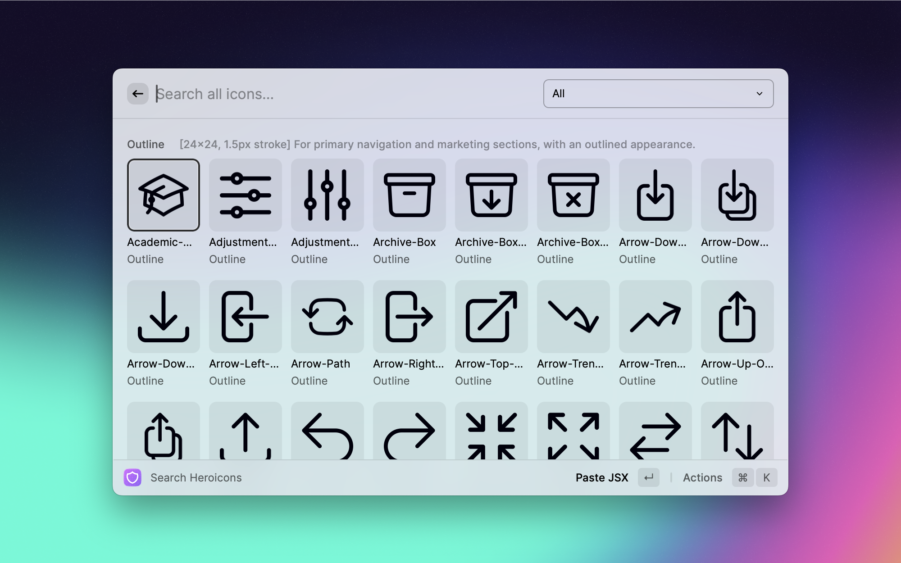
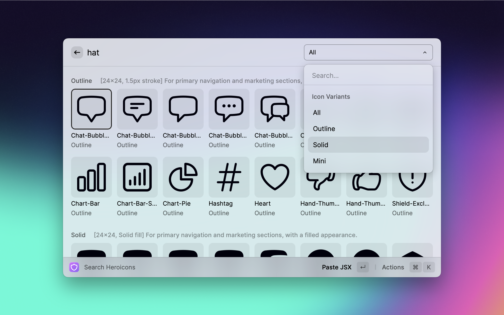
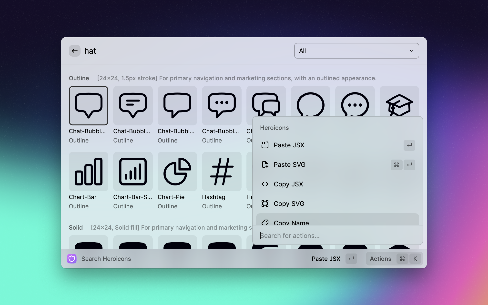

<h1 align="center">Heroicons</h1>

    Raycast extension to search and preview icons

## Showcase

### Search all icons

### Alternative search terms for icons

### Filter variants

### Helpful Actions

## Features

- All icons at your fingertips
- Search by keywords
- Filter by variants (outline, solid, mini)
- Copy or paste: SVG, JSX, icon name or even import declaration for React/Vue components

---

MIT-licensed icons by [@steveschoger](https://twitter.com/steveschoger).

Unaffiliated with Tailwind Labs and Raycast.

Extension by [@torben_haack](https://twitter.com/torben_haack).

