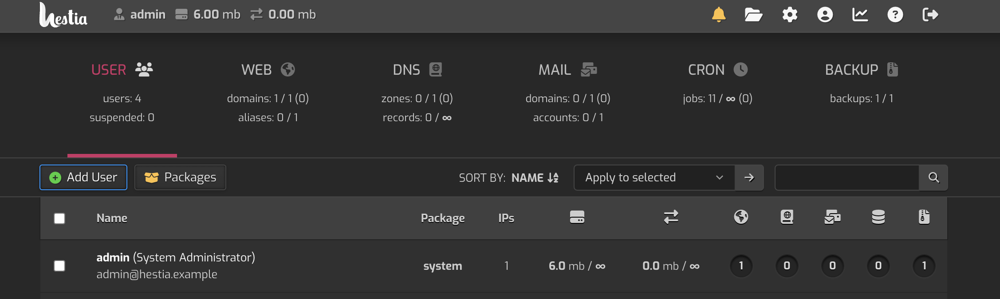
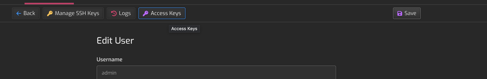
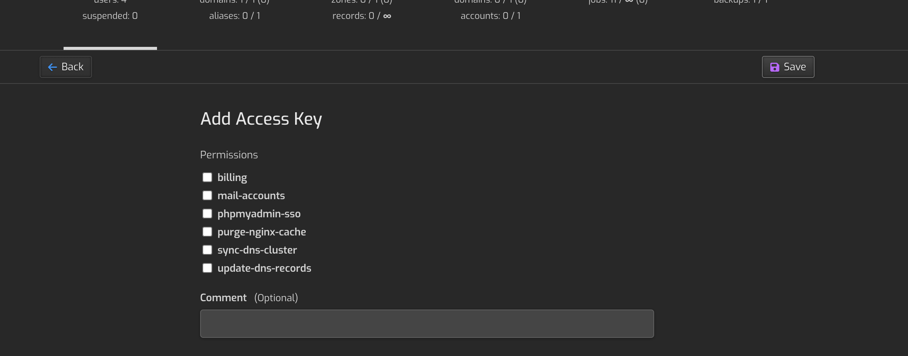

    

# Hestia Control Panel [Admin] Raycast Extension

This is a Raycast extension for [Hestia Control Panel](https://hestiacp.com/) Admin level accounts. With this extension you can manage Users, Domains, Mail Domains, Databases, Cron Jobs and more (see the last section for table of what is included).

## 🚀 Getting Started

1. **Install extension**: Click the `Install Extension` button in the top right of [this page](https://www.raycast.com/xmok/hestiacp-admin) OR `install` via Raycast Store

2. **Enter your HestiaCP Details**: The first time you use the extension, you'll need to enter the following in Preferences OR at first prompt:

    a. The URL of your HestiaCP instance (w/ Port) (e.g. https://demo.hestiacp.com:8083)

    b. HestiaCP Admin Username (this is almost always `admin`)

    c. Hestia CP API Access Key
    
    d. Hestia CP API Secert Key

Before using API you need to enable API and whitelist the IPs you will be using.
- `navigate` to "Server Configuration" (HESTIA-URL:PORT/edit/server/)
- `toggle` "System"
    - Change `Enable API access`
    - Enter IP addresses in `Allowed IP addresses for API` (TIP: if you want to allow access from ANY IP, remove all IPs and type in "`allow-all`")

To get API Keys:

1. METHOD 1 (recommended)
    - `ssh` into your HestiaCP instance
    - use HestiaCP CLI to run `v-add-access-key admin '*' Raycast` (AS ADMIN) (this will grant all API permissions and add a comment as 'Raycast')
    - finally, `copy` the Access Keys (they will be output on the terminal)
    
2. METHOD 2 (this method is not recommended as it does not grant all API permissions athough you could use Method 2 to generate the key and then use CLI from METHOD 1 to grant all permissions)
    - `navigate` to "Users" and `click` the user 
    - `click` on "Access Keys" 
    - `click` on "Add Access Key"
    - `enter` details and `Save` 

## 🗒️ NOTE

If you get a *self-signed certificate* error, you need to fix the SSL of your instance (https://hestiacp.com/docs/server-administration/ssl-certificates.html).

## ○ Commands/Endpoints

Hestia Commands Progress

| cmd | included | commments |
|-----|----------|-----------|
| v-acknowledge-user-notification | ✅ | - |
| v-add-access-key | ❌ | - |
| v-add-backup-host | ❌ | - |
| v-add-cron-hestia-autoupdate | ❌ | - |
| v-add-cron-job | ✅ | - |
| v-add-cron-letsencrypt-job | ❌ | - |
| v-add-cron-reports | ❌ | - |
| v-add-cron-restart-job | ❌ | - |
| v-add-database | ✅ | - |
| v-add-database-host | ❌ | - |
| v-add-database-temp-user | ❌ | - |
| v-add-dns-domain | ❌ | - |
| v-add-dns-on-web-alias | ❌ | - |
| v-add-dns-record | ❌ | - |
| v-add-domain | ❌ | - |
| v-add-fastcgi-cache | ❌ | - |
| v-add-firewall-ban | ❌ | - |
| v-add-firewall-chain | ❌ | - |
| v-add-firewall-ipset | ❌ | - |
| v-add-firewall-rule | ❌ | - |
| v-add-fs-archive | ❌ | - |
| v-add-fs-directory | ❌ | - |
| v-add-fs-file | ❌ | - |
| v-add-letsencrypt-domain | ❌ | - |
| v-add-letsencrypt-host | ❌ | - |
| v-add-letsencrypt-user | ❌ | - |
| v-add-mail-account | ❌ | - |
| v-add-mail-account-alias | ❌ | - |
| v-add-mail-account-autoreply | ❌ | - |
| v-add-mail-account-forward | ❌ | - |
| v-add-mail-account-fwd-only | ❌ | - |
| v-add-mail-domain | ✅ | - |
| v-add-mail-domain-antispam | ❌ | - |
| v-add-mail-domain-antivirus | ❌ | - |
| v-add-mail-domain-catchall | ❌ | - |
| v-add-mail-domain-dkim | ❌ | - |
| v-add-mail-domain-reject | ❌ | - |
| v-add-mail-domain-smtp-relay | ❌ | - |
| v-add-mail-domain-ssl | ❌ | - |
| v-add-mail-domain-webmail | ❌ | - |
| v-add-remote-dns-domain | ❌ | - |
| v-add-remote-dns-host | ❌ | - |
| v-add-remote-dns-record | ❌ | - |
| v-add-sys-api-ip | ❌ | - |
| v-add-sys-dependencies | ❌ | - |
| v-add-sys-filemanager | ❌ | - |
| v-add-sys-firewall | ❌ | - |
| v-add-sys-ip | ❌ | - |
| v-add-sys-pma-sso | ❌ | - |
| v-add-sys-quota | ❌ | - |
| v-add-sys-roundcube | ❌ | - |
| v-add-sys-sftp-jail | ❌ | - |
| v-add-sys-smtp | ❌ | - |
| v-add-sys-smtp-relay | ❌ | - |
| v-add-sys-snappymail | ❌ | - |
| v-add-sys-web-terminal | ❌ | - |
| v-add-user | ✅ | - |
| v-add-user-2fa | ❌ | - |
| v-add-user-composer | ❌ | - |
| v-add-user-notification | ❌ | - |
| v-add-user-package | ❌ | - |
| v-add-user-sftp-jail | ❌ | - |
| v-add-user-sftp-key | ❌ | - |
| v-add-user-ssh-key | ❌ | - |
| v-add-user-wp-cli | ❌ | - |
| v-add-web-domain | ✅ | - |
| v-add-web-domain-alias | ❌ | - |
| v-add-web-domain-allow-users | ❌ | - |
| v-add-web-domain-backend | ❌ | - |
| v-add-web-domain-ftp | ❌ | - |
| v-add-web-domain-httpauth | ❌ | - |
| v-add-web-domain-proxy | ❌ | - |
| v-add-web-domain-redirect | ❌ | - |
| v-add-web-domain-ssl | ❌ | - |
| v-add-web-domain-ssl-force | ❌ | - |
| v-add-web-domain-ssl-hsts | ❌ | - |
| v-add-web-domain-ssl-preset | ❌ | - |
| v-add-web-domain-stats | ❌ | - |
| v-add-web-domain-stats-user | ❌ | - |
| v-add-web-php | ❌ | - |
| v-backup-user | ❌ | - |
| v-backup-users | ❌ | - |
| v-change-cron-job | ❌ | - |
| v-change-database-host-password | ❌ | - |
| v-change-database-owner | ❌ | - |
| v-change-database-password | ❌ | - |
| v-change-database-user | ❌ | - |
| v-change-dns-domain-dnssec | ❌ | - |
| v-change-dns-domain-exp | ❌ | - |
| v-change-dns-domain-ip | ❌ | - |
| v-change-dns-domain-soa | ❌ | - |
| v-change-dns-domain-tpl | ❌ | - |
| v-change-dns-domain-ttl | ❌ | - |
| v-change-dns-record | ❌ | - |
| v-change-dns-record-id | ❌ | - |
| v-change-domain-owner | ❌ | - |
| v-change-firewall-rule | ❌ | - |
| v-change-fs-file-permission | ❌ | - |
| v-change-mail-account-password | ❌ | - |
| v-change-mail-account-quota | ❌ | - |
| v-change-mail-account-rate-limit | ❌ | - |
| v-change-mail-domain-catchall | ❌ | - |
| v-change-mail-domain-rate-limit | ❌ | - |
| v-change-mail-domain-sslcert | ❌ | - |
| v-change-remote-dns-domain-exp | ❌ | - |
| v-change-remote-dns-domain-soa | ❌ | - |
| v-change-remote-dns-domain-ttl | ❌ | - |
| v-change-sys-api | ❌ | - |
| v-change-sys-config-value | ❌ | - |
| v-change-sys-db-alias | ❌ | - |
| v-change-sys-demo-mode | ❌ | - |
| v-change-sys-hestia-ssl | ❌ | - |
| v-change-sys-hostname | ❌ | - |
| v-change-sys-ip-name | ❌ | - |
| v-change-sys-ip-nat | ❌ | - |
| v-change-sys-ip-owner | ❌ | - |
| v-change-sys-ip-status | ❌ | - |
| v-change-sys-language | ❌ | - |
| v-change-sys-php | ❌ | - |
| v-change-sys-port | ❌ | - |
| v-change-sys-release | ❌ | - |
| v-change-sys-service-config | ❌ | - |
| v-change-sys-timezone | ❌ | - |
| v-change-sys-web-terminal-port | ❌ | - |
| v-change-sys-webmail | ❌ | - |
| v-change-user-config-value | ❌ | - |
| v-change-user-contact | ❌ | - |
| v-change-user-language | ❌ | - |
| v-change-user-name | ❌ | - |
| v-change-user-ns | ❌ | - |
| v-change-user-package | ❌ | - |
| v-change-user-password | ❌ | - |
| v-change-user-php-cli | ❌ | - |
| v-change-user-rkey | ❌ | - |
| v-change-user-role | ❌ | - |
| v-change-user-shell | ❌ | - |
| v-change-user-sort-order | ❌ | - |
| v-change-user-template | ❌ | - |
| v-change-user-theme | ❌ | - |
| v-change-web-domain-backend-tpl | ❌ | - |
| v-change-web-domain-dirlist | ❌ | - |
| v-change-web-domain-docroot | ❌ | - |
| v-change-web-domain-ftp-password | ❌ | - |
| v-change-web-domain-ftp-path | ❌ | - |
| v-change-web-domain-httpauth | ❌ | - |
| v-change-web-domain-ip | ❌ | - |
| v-change-web-domain-name | ❌ | - |
| v-change-web-domain-proxy-tpl | ❌ | - |
| v-change-web-domain-sslcert | ❌ | - |
| v-change-web-domain-sslhome | ❌ | - |
| v-change-web-domain-stats | ❌ | - |
| v-change-web-domain-tpl | ❌ | - |
| v-check-access-key | ❌ | - |
| v-check-api-key | ❌ | - |
| v-check-fs-permission | ❌ | - |
| v-check-mail-account-hash | ❌ | - |
| v-check-user-2fa | ❌ | - |
| v-check-user-hash | ❌ | - |
| v-check-user-password | ❌ | - |
| v-copy-fs-directory | ❌ | - |
| v-copy-fs-file | ❌ | - |
| v-copy-user-package | ❌ | - |
| v-delete-access-key | ❌ | - |
| v-delete-backup-host | ❌ | - |
| v-delete-cron-hestia-autoupdate | ❌ | - |
| v-delete-cron-job | ❌ | - |
| v-delete-cron-reports | ❌ | - |
| v-delete-cron-restart-job | ❌ | - |
| v-delete-database | ❌ | - |
| v-delete-database-host | ❌ | - |
| v-delete-database-temp-user | ❌ | - |
| v-delete-databases | ❌ | - |
| v-delete-dns-domain | ❌ | - |
| v-delete-dns-domains | ❌ | - |
| v-delete-dns-domains-src | ❌ | - |
| v-delete-dns-on-web-alias | ❌ | - |
| v-delete-dns-record | ❌ | - |
| v-delete-domain | ❌ | - |
| v-delete-fastcgi-cache | ❌ | - |
| v-delete-firewall-ban | ❌ | - |
| v-delete-firewall-chain | ❌ | - |
| v-delete-firewall-ipset | ❌ | - |
| v-delete-firewall-rule | ❌ | - |
| v-delete-fs-directory | ❌ | - |
| v-delete-fs-file | ❌ | - |
| v-delete-letsencrypt-domain | ❌ | - |
| v-delete-mail-account | ❌ | - |
| v-delete-mail-account-alias | ❌ | - |
| v-delete-mail-account-autoreply | ❌ | - |
| v-delete-mail-account-forward | ❌ | - |
| v-delete-mail-account-fwd-only | ❌ | - |
| v-delete-mail-domain | ❌ | - |
| v-delete-mail-domain-antispam | ❌ | - |
| v-delete-mail-domain-antivirus | ❌ | - |
| v-delete-mail-domain-catchall | ❌ | - |
| v-delete-mail-domain-dkim | ❌ | - |
| v-delete-mail-domain-reject | ❌ | - |
| v-delete-mail-domain-smtp-relay | ❌ | - |
| v-delete-mail-domain-ssl | ❌ | - |
| v-delete-mail-domain-webmail | ❌ | - |
| v-delete-mail-domains | ❌ | - |
| v-delete-remote-dns-domain | ❌ | - |
| v-delete-remote-dns-domains | ❌ | - |
| v-delete-remote-dns-host | ❌ | - |
| v-delete-remote-dns-record | ❌ | - |
| v-delete-sys-api-ip | ❌ | - |
| v-delete-sys-filemanager | ❌ | - |
| v-delete-sys-firewall | ❌ | - |
| v-delete-sys-ip | ❌ | - |
| v-delete-sys-mail-queue | ❌ | - |
| v-delete-sys-pma-sso | ❌ | - |
| v-delete-sys-quota | ❌ | - |
| v-delete-sys-sftp-jail | ❌ | - |
| v-delete-sys-smtp | ❌ | - |
| v-delete-sys-smtp-relay | ❌ | - |
| v-delete-sys-web-terminal | ❌ | - |
| v-delete-user | ❌ | - |
| v-delete-user-2fa | ❌ | - |
| v-delete-user-auth-log | ❌ | - |
| v-delete-user-backup | ❌ | - |
| v-delete-user-backup-exclusions | ❌ | - |
| v-delete-user-ips | ❌ | - |
| v-delete-user-log | ❌ | - |
| v-delete-user-notification | ❌ | - |
| v-delete-user-package | ❌ | - |
| v-delete-user-sftp-jail | ❌ | - |
| v-delete-user-ssh-key | ❌ | - |
| v-delete-user-stats | ❌ | - |
| ❌ v-delete-web-domain | ❌ | - |
| v-delete-web-domain-alias | ❌ | - |
| v-delete-web-domain-allow-users | ❌ | - |
| v-delete-web-domain-backend | ❌ | - |
| v-delete-web-domain-ftp | ❌ | - |
| v-delete-web-domain-httpauth | ❌ | - |
| v-delete-web-domain-proxy | ❌ | - |
| v-delete-web-domain-redirect | ❌ | - |
| v-delete-web-domain-ssl | ❌ | - |
| v-delete-web-domain-ssl-force | ❌ | - |
| v-delete-web-domain-ssl-hsts | ❌ | - |
| v-delete-web-domain-stats | ❌ | - |
| v-delete-web-domain-stats-user | ❌ | - |
| v-delete-web-domains | ❌ | - |
| v-delete-web-php | ❌ | - |
| v-download-backup | ❌ | - |
| v-dump-database | ❌ | - |
| v-dump-site | ❌ | - |
| v-export-rrd | ❌ | - |
| v-extract-fs-archive | ❌ | - |
| v-generate-api-key | ❌ | - |
| v-generate-debug-report | ❌ | - |
| v-generate-password-hash | ❌ | - |
| v-generate-ssl-cert | ❌ | - |
| v-get-dns-domain-value | ❌ | - |
| v-get-fs-file-type | ❌ | - |
| v-get-mail-account-value | ❌ | - |
| v-get-mail-domain-value | ❌ | - |
| v-get-sys-timezone | ❌ | - |
| v-get-sys-timezones | ❌ | - |
| v-get-user-salt | ❌ | - |
| v-get-user-value | ❌ | - |
| v-import-cpanel | ❌ | - |
| v-insert-dns-domain | ❌ | - |
| v-insert-dns-record | ❌ | - |
| v-insert-dns-records | ❌ | - |
| v-list-access-key | ❌ | - |
| v-list-access-keys | ❌ | - |
| v-list-api | ❌ | - |
| v-list-apis | ❌ | - |
| v-list-backup-host | ❌ | - |
| v-list-cron-job | ❌ | - |
| v-list-cron-jobs | ✅ | - |
| v-list-database | ❌ | - |
| v-list-database-host | ❌ | - |
| v-list-database-hosts | ❌ | - |
| v-list-database-types | ❌ | - |
| v-list-databases | ✅ | - |
| v-list-default-php | ❌ | - |
| v-list-dns-domain | ❌ | - |
| v-list-dns-domains | ❌ | - |
| v-list-dns-records | ❌ | - |
| v-list-dns-template | ❌ | - |
| v-list-dns-templates | ❌ | - |
| v-list-dnssec-public-key | ❌ | - |
| v-list-firewall | ❌ | - |
| v-list-firewall-ban | ❌ | - |
| v-list-firewall-ipset | ❌ | - |
| v-list-firewall-rule | ❌ | - |
| v-list-fs-directory | ❌ | - |
| v-list-letsencrypt-user | ❌ | - |
| v-list-mail-account | ❌ | - |
| v-list-mail-account-autoreply | ❌ | - |
| v-list-mail-accounts | ❌ | - |
| v-list-mail-domain | ❌ | - |
| v-list-mail-domain-dkim | ❌ | - |
| v-list-mail-domain-dkim-dns | ❌ | - |
| v-list-mail-domain-ssl | ❌ | - |
| v-list-mail-domains | ✅ | - |
| v-list-remote-dns-hosts | ❌ | - |
| v-list-sys-clamd-config | ❌ | - |
| v-list-sys-config | ❌ | - |
| v-list-sys-cpu-status | ❌ | - |
| v-list-sys-db-status | ❌ | - |
| v-list-sys-disk-status | ❌ | - |
| v-list-sys-dns-status | ❌ | - |
| v-list-sys-dovecot-config | ❌ | - |
| v-list-sys-hestia-autoupdate | ❌ | - |
| v-list-sys-hestia-ssl | ❌ | - |
| v-list-sys-hestia-updates | ❌ | - |
| v-list-sys-info | ❌ | - |
| v-list-sys-interfaces | ❌ | - |
| v-list-sys-ip | ❌ | - |
| v-list-sys-ips | ❌ | - |
| v-list-sys-languages | ❌ | - |
| v-list-sys-mail-status | ❌ | - |
| v-list-sys-memory-status | ❌ | - |
| v-list-sys-mysql-config | ❌ | - |
| v-list-sys-network-status | ❌ | - |
| v-list-sys-nginx-config | ❌ | - |
| v-list-sys-pgsql-config | ❌ | - |
| v-list-sys-php | ❌ | - |
| v-list-sys-php-config | ❌ | - |
| v-list-sys-proftpd-config | ❌ | - |
| v-list-sys-rrd | ❌ | - |
| v-list-sys-services | ❌ | - |
| v-list-sys-shells | ❌ | - |
| v-list-sys-spamd-config | ❌ | - |
| v-list-sys-sshd-port | ❌ | - |
| v-list-sys-themes | ❌ | - |
| v-list-sys-users | ❌ | - |
| v-list-sys-vsftpd-config | ❌ | - |
| v-list-sys-web-status | ❌ | - |
| v-list-sys-webmail | ❌ | - |
| v-list-user | ❌ | - |
| v-list-user-auth-log | ✅ | - |
| v-list-user-backup | ❌ | - |
| v-list-user-backup-exclusions | ❌ | - |
| v-list-user-backups | ✅ | - |
| v-list-user-ips | ✅ | - |
| v-list-user-log | ✅ | - |
| v-list-user-notifications | ✅ | - |
| v-list-user-ns | ❌ | - |
| v-list-user-package | ❌ | - |
| v-list-user-packages | ✅ | used when adding user |
| v-list-user-ssh-key | ❌ | - |
| v-list-user-stats | ✅ | - |
| v-list-users | ✅ | - |
| v-list-users-stats | ✅ | - |
| v-list-web-domain | ❌ | - |
| v-list-web-domain-accesslog | ✅ | - |
| v-list-web-domain-errorlog | ✅ | - |
| v-list-web-domain-ssl | ✅ | - |
| v-list-web-domains | ✅ | - |
| v-list-web-stats | ❌ | - |
| v-list-web-templates | ❌ | - |
| v-list-web-templates-backend | ❌ | - |
| v-list-web-templates-proxy | ❌ | - |
| v-log-action | ❌ | - |
| v-log-user-login | ❌ | - |
| v-log-user-logout | ❌ | - |
| v-move-fs-directory | ❌ | - |
| v-move-fs-file | ❌ | - |
| v-open-fs-config | ❌ | - |
| v-open-fs-file | ❌ | - |
| v-purge-nginx-cache | ❌ | - |
| v-rebuild-all | ❌ | - |
| v-rebuild-cron-jobs | ❌ | - |
| v-rebuild-database | ❌ | - |
| v-rebuild-databases | ❌ | - |
| v-rebuild-dns-domain | ❌ | - |
| v-rebuild-dns-domains | ❌ | - |
| v-rebuild-mail-domain | ❌ | - |
| v-rebuild-mail-domains | ❌ | - |
| v-rebuild-user | ❌ | - |
| v-rebuild-users | ❌ | - |
| v-rebuild-web-domain | ❌ | - |
| v-rebuild-web-domains | ❌ | - |
| v-refresh-sys-theme | ❌ | - |
| v-rename-user-package | ❌ | - |
| v-repair-sys-config | ❌ | - |
| v-restart-cron | ❌ | - |
| v-restart-dns | ❌ | - |
| v-restart-ftp | ❌ | - |
| v-restart-mail | ❌ | - |
| v-restart-proxy | ❌ | - |
| v-restart-service | ❌ | - |
| v-restart-system | ❌ | - |
| v-restart-web | ❌ | - |
| v-restart-web-backend | ❌ | - |
| v-restore-cron-job | ❌ | - |
| v-restore-database | ❌ | - |
| v-restore-dns-domain | ❌ | - |
| v-restore-mail-domain | ❌ | - |
| v-restore-user | ❌ | - |
| v-restore-web-domain | ❌ | - |
| v-revoke-api-key | ❌ | - |
| v-run-cli-cmd | ❌ | - |
| v-schedule-letsencrypt-domain | ❌ | - |
| v-schedule-user-backup | ❌ | - |
| v-schedule-user-backup-download | ❌ | - |
| v-schedule-user-restore | ❌ | - |
| v-search-command | ❌ | - |
| v-search-domain-owner | ❌ | - |
| v-search-fs-object | ❌ | - |
| v-search-object | ❌ | - |
| v-search-user-object | ❌ | - |
| v-start-service | ❌ | - |
| v-stop-firewall | ❌ | - |
| v-stop-service | ❌ | - |
| v-suspend-cron-job | ❌ | - |
| v-suspend-cron-jobs | ❌ | - |
| v-suspend-database | ❌ | - |
| v-suspend-database-host | ❌ | - |
| v-suspend-databases | ❌ | - |
| v-suspend-dns-domain | ❌ | - |
| v-suspend-dns-domains | ❌ | - |
| v-suspend-dns-record | ❌ | - |
| v-suspend-domain | ❌ | - |
| v-suspend-firewall-rule | ❌ | - |
| v-suspend-mail-account | ❌ | - |
| v-suspend-mail-accounts | ❌ | - |
| v-suspend-mail-domain | ❌ | - |
| v-suspend-mail-domains | ❌ | - |
| v-suspend-remote-dns-host | ❌ | - |
| v-suspend-user | ❌ | - |
| v-suspend-web-domain | ❌ | - |
| v-suspend-web-domains | ❌ | - |
| v-sync-dns-cluster | ❌ | - |
| v-unsuspend-cron-job | ❌ | - |
| v-unsuspend-cron-jobs | ❌ | - |
| v-unsuspend-database | ❌ | - |
| v-unsuspend-database-host | ❌ | - |
| v-unsuspend-databases | ❌ | - |
| v-unsuspend-dns-domain | ❌ | - |
| v-unsuspend-dns-domains | ❌ | - |
| v-unsuspend-dns-record | ❌ | - |
| v-unsuspend-domain | ❌ | - |
| v-unsuspend-firewall-rule | ❌ | - |
| v-unsuspend-mail-account | ❌ | - |
| v-unsuspend-mail-accounts | ❌ | - |
| v-unsuspend-mail-domain | ❌ | - |
| v-unsuspend-mail-domains | ❌ | - |
| v-unsuspend-remote-dns-host | ❌ | - |
| v-unsuspend-user | ❌ | - |
| ❌ v-unsuspend-web-domain | ❌ | - |
| ❌ v-unsuspend-web-domains | ❌ | - |
| v-update-database-disk | ❌ | - |
| v-update-databases-disk | ❌ | - |
| v-update-dns-templates | ❌ | - |
| v-update-firewall | ❌ | - |
| v-update-firewall-ipset | ❌ | - |
| v-update-host-certificate | ❌ | - |
| v-update-letsencrypt-ssl | ❌ | - |
| v-update-mail-domain-disk | ❌ | - |
| v-update-mail-domain-ssl | ❌ | - |
| v-update-mail-domains-disk | ❌ | - |
| v-update-mail-templates | ❌ | - |
| v-update-sys-defaults | ❌ | - |
| v-update-sys-hestia | ❌ | - |
| v-update-sys-hestia-all | ❌ | - |
| v-update-sys-hestia-git | ❌ | - |
| v-update-sys-ip | ❌ | - |
| v-update-sys-ip-counters | ❌ | - |
| v-update-sys-queue | ❌ | - |
| v-update-sys-rrd | ❌ | - |
| v-update-sys-rrd-apache2 | ❌ | - |
| v-update-sys-rrd-ftp | ❌ | - |
| v-update-sys-rrd-httpd | ❌ | - |
| v-update-sys-rrd-la | ❌ | - |
| v-update-sys-rrd-mail | ❌ | - |
| v-update-sys-rrd-mem | ❌ | - |
| v-update-sys-rrd-mysql | ❌ | - |
| v-update-sys-rrd-net | ❌ | - |
| v-update-sys-rrd-nginx | ❌ | - |
| v-update-sys-rrd-pgsql | ❌ | - |
| v-update-sys-rrd-ssh | ❌ | - |
| v-update-user-backup-exclusions | ❌ | - |
| v-update-user-counters | ❌ | - |
| v-update-user-disk | ❌ | - |
| v-update-user-package | ❌ | - |
| v-update-user-quota | ❌ | - |
| v-update-user-stats | ❌ | - |
| v-update-web-domain-disk | ❌ | - |
| v-update-web-domain-ssl | ❌ | - |
| v-update-web-domain-stat | ❌ | - |
| v-update-web-domain-traff | ❌ | - |
| v-update-web-domains-disk | ❌ | - |
| v-update-web-domains-stat | ❌ | - |
| v-update-web-domains-traff | ❌ | - |
| v-update-web-templates | ❌ | - |
| v-update-white-label-logo  | ❌ | - |

