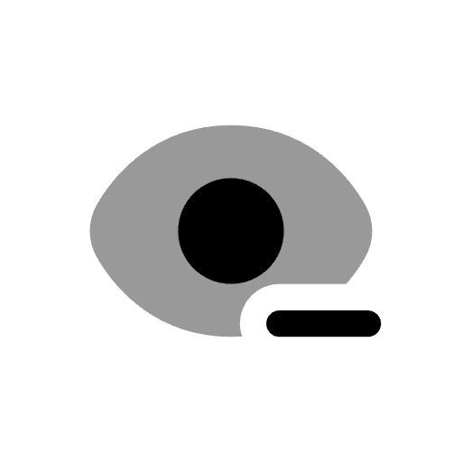

<div align="center">
    <br/>
    <br/>
    
    <h3>Hide Details</h3>
    <p>Redact sensitive details from clipboard images</p>
    <br/>
    <br/>
</div>

Hide Details is a Raycast extension that detects sensitive text and faces in clipboard images so you can redact them before sharing. Review what it found or copy a redacted image with a single command. All processing happens locally on your Mac using Apple Vision.

## Commands

| Command                | Description                                                                                   |
| ---------------------- | --------------------------------------------------------------------------------------------- |
| Redact Clipboard Image | Scan the clipboard image, review the detected details, and copy the redacted image.           |
| Redact and Copy        | Scan and redact the clipboard image immediately, then copy the result without opening a view. |

## How to use

1. Copy a screenshot or image to your clipboard.
2. Run **Redact Clipboard Image** in Raycast.
3. Check the redacted image preview and detections, then select **Copy Redacted Image** from any row.
4. Paste the result wherever you need it.

For a quicker workflow, assign a hotkey to **Redact and Copy** in Raycast. Copy an image, press the hotkey, then paste.

If you copy something else while **Redact and Copy** is processing, it preserves the newer clipboard and asks you to run the command again. Copying from the review view is an explicit action and replaces the current clipboard.

Use **Scan Current Clipboard Again** to retry with your saved preferences. Use **Scan Current Clipboard with Accurate OCR** for difficult text. These actions read the image currently on your clipboard and replace the previous preview. The Accurate OCR action applies to that scan without changing your saved Text Recognition preference.

## Review results

The **Redacted Image** row shows the output and the number of distinct masked regions. Each detection row shows the same image and offers **Copy Redacted Image**. One OCR line can match more than one category. These appear as separate detections but share one masked region.

The **OCR** and **Face** percentages describe recognition confidence. They do not measure whether every sensitive detail was found. Turn off **Show OCR Confidence** in extension preferences to hide the OCR percentages. **Custom word match** identifies a literal rule from Always Hide These Words.

A result with no detections can still be copied, but it has no added masks. Check the preview before sharing. If copying fails, the preview remains available so you can retry **Copy Redacted Image**.

## What it detects

- Email addresses and phone numbers.
- Card numbers that pass a Luhn checksum.
- Common secret formats, including Stripe keys, GitHub tokens, AWS access key IDs, Slack tokens, and JWT-shaped strings.
- IPv4-shaped addresses.
- Personal names and words you specify.
- Text matching your custom regex.
- Faces.

Text detections redact the full line recognized by OCR. Automatic detection can miss details, so check the resulting image before sharing it.

Card and phone detection checks numbers separately from neighboring numeric details. This includes cards beside expiry dates, phones beside ticket numbers, adjacent phone numbers, and phones beside IPv4 addresses. Other long numeric identifiers can resemble phone numbers and cause extra lines to be masked.

## Preferences

Text Recognition defaults to **Fast** for clear screenshots. Fast recognition can miss details in small or difficult text; choose **Accurate** for these images. Accurate recognition can take longer on its first run while macOS prepares its models.

| Preference              | Description                                                                                             | Default        |
| ----------------------- | ------------------------------------------------------------------------------------------------------- | -------------- |
| Text Recognition        | Choose Fast or Accurate OCR.                                                                            | Fast           |
| OCR Confidence          | Show OCR confidence percentages in the detection list.                                                  | On             |
| Redaction Style         | Choose Blackout, Pixelate, or Smooth Blur.                                                              | Blackout       |
| What to Hide            | Comma-separated categories: `email`, `phone`, `card`, `secret`, `ip`, `name`, `face`.                   | All categories |
| Always Hide These Words | Comma-separated names or strings to detect as names. Keep the `name` category enabled to use this list. | Empty          |
| Custom Regex            | Optional regex applied to each OCR line, independently of the built-in categories.                      | Empty          |
| Padding                 | Extra pixels around each detected region, from `0` to `1000`.                                           | `4`            |

Use Blackout when sensitive content must be unreadable. Blur and pixelation can retain visible information.

Blackout is the default when no style has been saved. An existing Pixelate or Smooth Blur preference stays selected until you change it in **Open Extension Preferences**.

Unknown category names and invalid padding stop processing with an error. Category names are case-insensitive. Padding accepts fractional values as well as whole pixels within the allowed range.

## Custom rules

Use **Always Hide These Words** for names or literal strings. For patterns such as invoice numbers, internal IDs, or file paths, set **Custom Regex** in the extension preferences.

Literal word matching is case-insensitive, ignores whitespace, and matches substrings within an OCR line. Entries shorter than two characters are ignored. Keep `name` in **What to Hide** to enable these rules.

Enter a pattern directly, without JavaScript-style `/` delimiters:

```regex
\bINV-\d{4,6}\b
```

Combine rules with `|`. Use `(?i)` for case-insensitive matching:

```regex
(?i)\bINV-\d{4,6}\b|confidential|client\s+id
```

The pattern uses [Apple's regular expression syntax](https://developer.apple.com/documentation/foundation/nsregularexpression). It runs against each original OCR line, including spaces. For example, `Project\s*Nebula` also matches a space introduced by OCR between those words. A match redacts the entire line and appears as **Custom Regex** in the detection list.

Custom Regex applies independently of **What to Hide**. Clear that category field to use only your regex. Leave Custom Regex empty to disable it. Matches that contain no characters are ignored. Invalid patterns or patterns that take too long stop redaction with an error, leaving the clipboard unchanged.

## Privacy

Images are processed on your Mac without uploads. Clipboard images are read directly into memory. The extension does not write unredacted clipboard images to disk.

Each scan owns a redacted output image in a private temporary directory. The immediate command removes it after copying or a copy failure. The review command removes it when the result is replaced or the view closes. Output files abandoned by a stopped process are removed after 24 hours on a later run. Live review results are preserved. Temporary files from older versions use a 24-hour cleanup threshold.

The output is a flattened PNG with no editable layers.

## Troubleshooting

| Issue                                       | What to do                                                                                                                                             |
| ------------------------------------------- | ------------------------------------------------------------------------------------------------------------------------------------------------------ |
| Clipboard has no image                      | Copy the image itself, then choose **Scan Current Clipboard Again**. A text-only clipboard cannot be redacted.                                         |
| Clipboard changed while scanning            | The scan or automatic copy stopped. Run the command again for the image currently on your clipboard.                                                   |
| Small or difficult text was missed          | Use **Scan Current Clipboard with Accurate OCR** and inspect the new preview. The first Accurate scan can take longer while macOS prepares its models. |
| Unknown category or invalid padding         | Open extension preferences. Use the category names listed above and a padding value from `0` to `1000`.                                                |
| Custom Regex is invalid or takes too long   | Correct or simplify the pattern in extension preferences, then scan again.                                                                             |
| Preview expired or output could not be read | Scan the current clipboard again to create a new result.                                                                                               |

## Development

Requires macOS 14 or newer, Raycast, Node.js 22.22.2 or newer, and the Xcode Command Line Tools.

Install the command line tools if needed:

```bash
xcode-select --install
```

Install dependencies and start development from the project directory:

```bash
npm ci
npm run dev
```

The development command compiles the Swift helper for Apple Silicon and Intel, signs the combined binary, and bundles it in `assets/hide-details`. Restart `npm run dev` after changing Swift code.

To validate and build the extension:

```bash
npm run lint
npm run typecheck
npm test
npm run build
```

Use `npm run build:swift` to rebuild only the native helper. Run `npm run publish` to compile the helper and start Raycast's publishing flow.

`npm test` rebuilds the universal Swift helper before running the regression suite. The tests cover mask pixels and crop direction, Fast and Accurate OCR, cards and phones beside other numbers, face detection, small text, preference validation, and scan cleanup. Native clipboard tests use an isolated pasteboard and check PNG/TIFF input, copied output, and protection against stale copies without replacing your clipboard.

## License

[MIT](./LICENSE)
