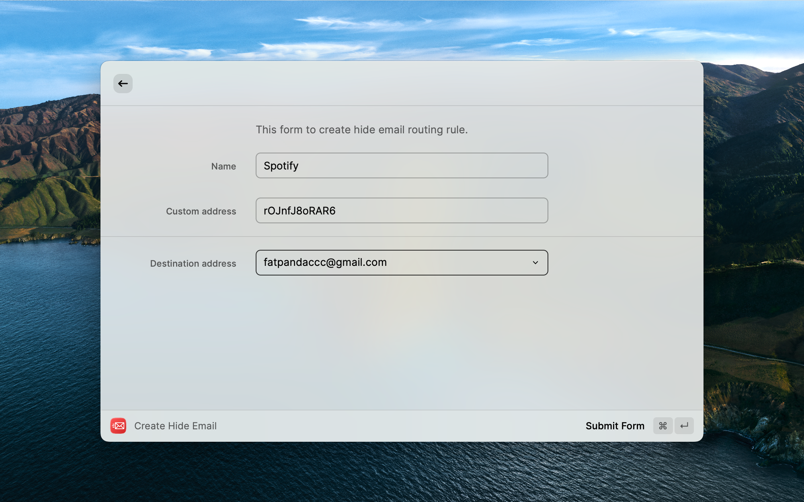

# Hide Email by Cloudflare

Hide email addresses by Cloudflare, operating on Raycast.

## Setup

You need to have a Cloudflare account and a domain with email protection enabled, then you need to fill in the following environment variables:

- Email: your Cloudflare email 
- Zone ID: your Cloudflare zone ID [[Guide](https://developers.cloudflare.com/fundamentals/get-started/basic-tasks/find-account-and-zone-ids/)]
- Account ID: your Cloudflare account ID [[Guide](https://developers.cloudflare.com/fundamentals/get-started/basic-tasks/find-account-and-zone-ids/)]
- API Token: your Cloudflare API token [[Guide](https://developers.cloudflare.com/fundamentals/api/get-started/create-token/)]