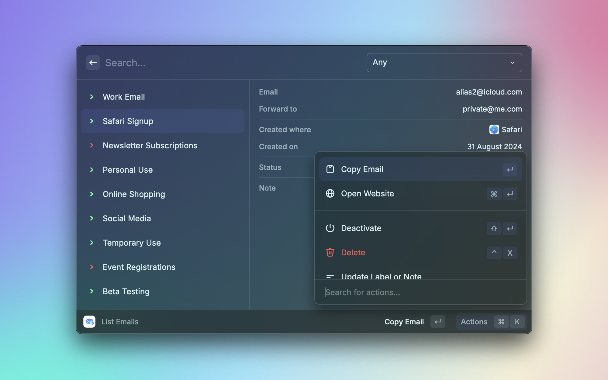
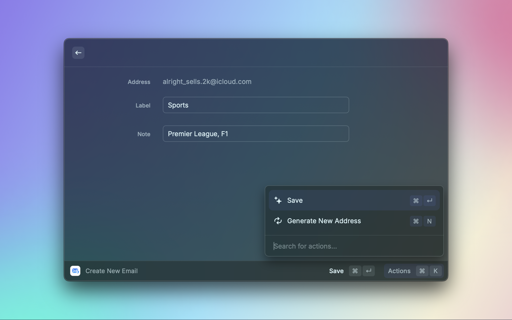
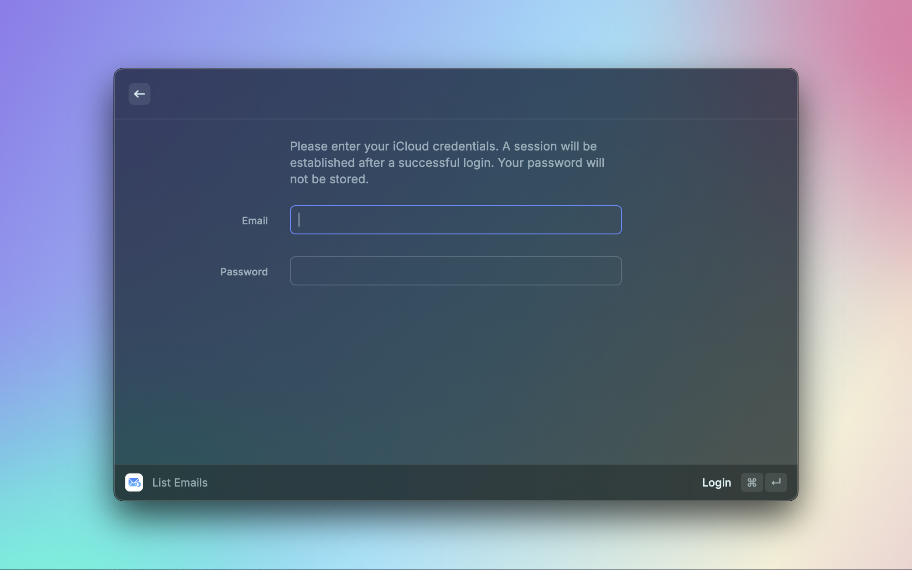

# Hide My Email

Tired of endlessly navigating through System Settings to create a new iCloud Hide My Email address? This extension might be exactly what you need!

## Commands

### List Emails

Provides an interface for managing all generated iCloud Hide My Email addresses.

The command has two configuration options:

- Sort list by creation date: If enabled, the email list is sorted on most recently created.
- Exit command after copying address: If enabled, the command will close upon copying an address from the list.

### Create New Email

A quick way to generate a new iCloud Hide My Email address.

## Screenshots

  
  

  

## Chinese Apple ID

To use the extension with a Chinese Apple ID, please enable the `Use Chinese Account` checkbox in the extension settings.

## Acknowledgments

The iCloud API is derived from the [pyiCloud](https://github.com/picklepete/pyicloud) module.
