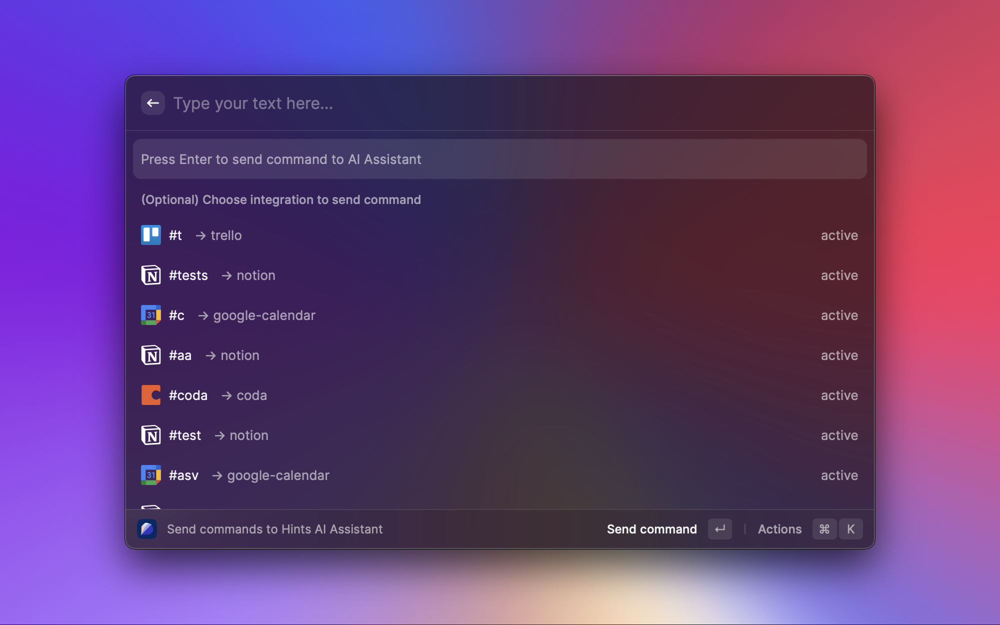

# Hints AI Assistant -> Raycast Extension 🥳

Quickly create, update and pull deals, tasks and notes via Raycast.

Currently we support Notion, Obsidian, HubSpot, Pipedrive, Clickup, Trello, Jira. Coda and Asana coming soon. For more information check our website [hints.so](http://hints.so) or join community [telegram](https://t.me/hints_chat), [discord](https://get.hints.so/hints-discord), [slack](https://get.hints.so/hints-slack)

## How to install Raycast extension

**Step 1.** **Get your Hints JWT token.** Sign in to [hints.so](http://i.hints.so) then select Tool that you want to manage via AI Assistant, choose Raycast as a source. You will see a prompt with a long piece of text. Copy this text to your clipboard.

Continue setup integration until it's published.

**Step 2.** **Configure Raycast.** When you use this extension for the first time, Raycast will ask you for your Hints JWT. Paste the text from Step 1 into the text input labeled "Your Hints Token", then select `Continue`.

**Step 3.** **That's it!** You're ready to start using the Hints extension for Raycast.
