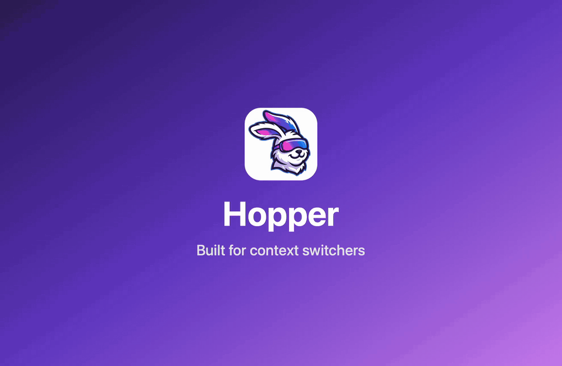

# Hopper

Jump to any app, tab, or agent on your Mac. [addhopper.com](https://addhopper.com)

Cmd+Tab only knows "most recent" and reshuffles every time you switch, so getting back to the app you were in three switches ago is guesswork. Hopper lets you step back through your recently used apps, and forward again, exactly like history in Safari or VS Code. And when what you want is a browser tab, a terminal tab, or a Claude session, search them all in one list and jump straight there. And when you have AI agents going in several places (Claude Code in a terminal and in the Claude app, Cursor, Codex, herdr), see which ones need you and jump to the one waiting longest.

## Commands

- **Back**: switch to the app you used before this one. Run it again to keep going back.
- **Forward**: retrace a Back step.
- **Toggle**: flip between your two most recent apps. Run it again to switch back.
- **History**: list running apps from most to least recently used and jump to any of them.
- **Search**: search everything open on your Mac and jump straight to it: browser tabs, terminal tabs, herdr workspaces, Claude and Muse chat sessions, Notion and Obsidian tabs, any app's windows, and AI agents (with their status). A **Recently Closed** section reopens browser tabs, Notion pages, Obsidian notes, and documents you've closed.
- **Search Current App**: the same, for the app you're in.
- **Agents**: the AI agents running on your Mac (Claude Code, Codex, Cursor, herdr, agent CLIs), grouped by status: **Needs You**, **Done**, **Working**, **Idle**. Jump to where one runs: its terminal pane, its herdr pane, or its session in the Claude app or Cursor.
- **Next Agent**: jump to the agent that has waited longest for you: one that needs your input or approval first, then one that finished a turn you haven't seen. Run it again for the next one.

## Setup

Hopper is meant to be used with hotkeys. Raycast extensions can't set hotkeys themselves, so record them in Raycast Settings → Extensions → Hopper. Recommended:

| Command        | Hotkey                   |
| -------------- | ------------------------ |
| Toggle         | `⌘⌘` (double tap)        |
| Search         | `⌃⌃` (double tap)        |
| History        | `⌃⌘` (press and release) |
| Back / Forward | `⌃⌘[` / `⌃⌘]`            |
| Agents         | `⌥⌘` (press and release) |
| Next Agent     | `⌥⌘]`                    |

Each level has a base: the base alone opens its list, `[` and `]` step back and forward. These avoid the tab-switching keys of browsers, terminals, and editors (`⇧⌘[` / `⇧⌘]`). Conflicts: `⌥⌘]` unfolds code in VS Code and Cursor, and `⌃⌃` is taken if macOS Dictation is set to "Press Control Key Twice".

Back, Forward, Toggle, and History need no permissions and no background process: they read the order macOS already keeps for Cmd+Tab. With Accessibility granted to Raycast (see below), they also switch like Cmd+Tab, so an app comes back to the window you left; without it, they switch like a Dock click.

Search and Search Current App ask for permissions the first time:

- **Automation**: macOS asks once per app ("Raycast wants to control Google Chrome"). Needed for browsers and terminals.
- **Accessibility**: for other apps' windows, for Claude and Muse sessions and Notion and Obsidian tabs, and to recognize Safari's private windows (without it, Safari tabs aren't listed). Grant it to Raycast in System Settings → Privacy & Security → Accessibility.

An app Hopper can't read shows under **Unavailable**, with a shortcut to the right settings pane.

Agents and Next Agent read the agents' own status files and local APIs, and need no permissions of their own; jumping into a terminal pane uses the same Automation permission as Search.

## How it works

- The first **Back** remembers your current app order and moves one step back.
- Pressing Back again goes further; **Forward** retraces.
- Switching apps any other way (click, Cmd+Tab) starts a fresh history, just like visiting a new page in a browser clears the forward history.
- Apps you quit are skipped.
- An app comes back to the window you left, like Cmd+Tab (needs Accessibility; otherwise it's like a Dock click, which in some apps shows their main window instead).
- In **History**, **Remove from History** (`⌃X`) hides an app (including the one you're in, once you leave it), for example one you closed all windows of but didn't quit. It comes back once you use it again.
- **Exclude from History** (`⌃⇧X`) hides an app for good. Excluded apps are listed at the bottom of History; **Include in History** brings one back.

### Search

| App                                            | Lists                                                                                                                                                                                                       |
| ---------------------------------------------- | ----------------------------------------------------------------------------------------------------------------------------------------------------------------------------------------------------------- |
| Chrome, Brave, Edge, Vivaldi, Chromium, Safari | Tabs (never incognito or private windows)                                                                                                                                                                   |
| cmux                                           | Workspaces, and each terminal of a workspace that has several                                                                                                                                               |
| Ghostty (1.3+)                                 | Tabs (with their splits, for agents)                                                                                                                                                                        |
| herdr                                          | Workspaces, and their tabs that have a name of their own, under the terminal running herdr                                                                                                                  |
| iTerm, Terminal                                | Tabs (and iTerm's split panes, for agents)                                                                                                                                                                  |
| Claude                                         | Code sessions (all projects, most recent first, even with the sidebar hidden); Chat and Cowork conversations from the sidebar, plus ones you've opened recently when the sidebar is hidden (opened by link) |
| Muse                                           | Main chat and side chats while the side chats panel is open; otherwise Muse's window                                                                                                                        |
| Notion                                         | Tabs of the front window with each page's parent pages (opened by Notion's link), then its other windows                                                                                                    |
| Obsidian                                       | Tabs of every open vault, in all its windows, with each note's folder                                                                                                                                       |
| Any other app                                  | Windows, and tabs if the window has a native tab bar                                                                                                                                                        |

Apps are ordered by recent use; within an app, active tabs come first. herdr isn't an app: its workspaces and tabs are listed under the terminal running herdr, and picking one switches herdr there and brings that terminal forward (in iTerm, cmux, and Terminal, the very tab and split running herdr). Search forgives typos ("caude" finds Claude) and matches app names first: typing an app's name lists that app's own tabs before other tabs that mention it. Picking an entry selects it in its app and brings the app to the front. **Copy URL** and **Copy Title** are in the action panel. Claude's Code sessions come from Claude's own session list and open with its deep link. Muse chats and Claude Chat conversations are read from the on-screen sidebar (Claude conversations you've opened open by link even with the sidebar hidden); Notion tabs are read from its tab bar, and their parent pages from Notion's local cache (full path on hover; searching a parent's name finds its pages). Obsidian tabs are read from each open vault's saved layout (`.obsidian/workspace.json`) and selected in its tab bar. An app update can change what Hopper finds; if nothing is found, the app's windows are listed instead. Incognito and private browser windows are never listed, cached, or jumped to.

**Recently Closed** lists browser tabs, Notion pages, Obsidian notes, and documents (TextEdit, Preview, Pages...) that were open the last time Search looked and are gone now, newest first, for a week (up to 100). **Reopen** opens the page in the same browser (Notion and Obsidian: a new tab) or the file in the same app; **Remove from Recently Closed** and **Clear Recently Closed** tidy it. Hopper only notices what it saw: a tab opened and closed between two uses of Search isn't there. Terminals, chats, and private windows are never recorded.

### Agents

| Agent                                                  | Where it runs                              | Status from                                                                                                                              |
| ------------------------------------------------------ | ------------------------------------------ | ---------------------------------------------------------------------------------------------------------------------------------------- |
| Claude Code                                            | Terminals, the Claude app's Code tab, IDEs | Claude Code's own list of running sessions (busy, waiting for approval or input, idle); the Claude app's record of what you've looked at |
| Codex                                                  | The Codex app (ChatGPT), terminals         | Codex's own thread list and log (working, idle; Codex doesn't record when it waits on you)                                               |
| Cursor                                                 | Cursor's agents                            | Cursor's own flags (waiting on you, generating, unread)                                                                                  |
| herdr                                                  | Any agent in a herdr pane                  | herdr's own detection, over its socket                                                                                                   |
| Gemini CLI, OpenCode, Amp, Aider, and other agent CLIs | Terminals                                  | Not readable: listed as Running                                                                                                          |

**Done** means an agent finished a turn since you last looked at it: in its own app (Claude records when you last opened a session), or by jumping to it from Hopper. Agents Hopper sees for the first time count as seen, so ones that were already sitting idle don't all show as done. **Needs You** is an agent stopped on a prompt: a permission request or a question.

Jumping goes to where the agent runs: the exact iTerm split, cmux terminal, or Terminal tab of a terminal agent; the pane in herdr (and the terminal running herdr); the session in the Claude app; the agent in Cursor's Agents window. In Ghostty, which doesn't report which terminal a process runs in, Hopper picks the terminal in the agent's folder if only one is (else brings Ghostty forward), and finds herdr's terminal exactly by having herdr briefly set its title. **Copy Resume Command** copies `claude --resume <id>` or `codex resume <id>`. Filter by project with the dropdown: an agent's project is the git repository it works in (worktrees count as their main repository). Search shows an agent's status next to the tab it runs in (a Claude Code session, a terminal or herdr tab), and lists each agent as a row of its own in that app's section, so searching an agent's name finds it.

## Support

Hopper is free and open source. If it saves you time, you can [sponsor its development on GitHub](https://github.com/sponsors/mattherwig).
