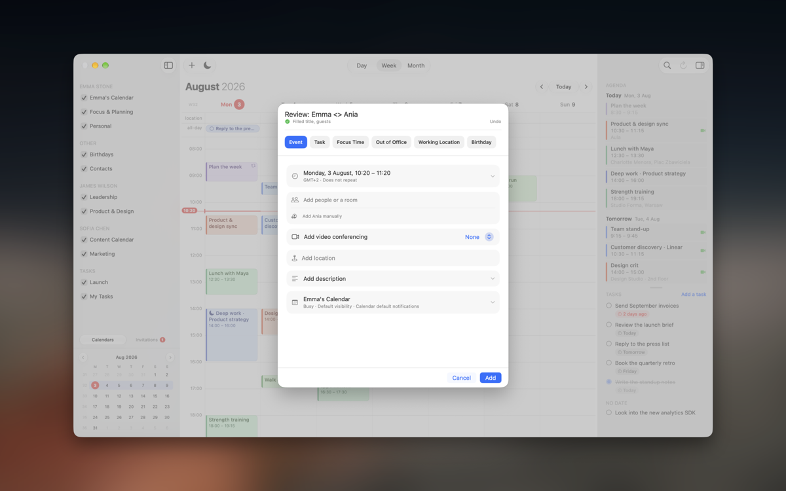
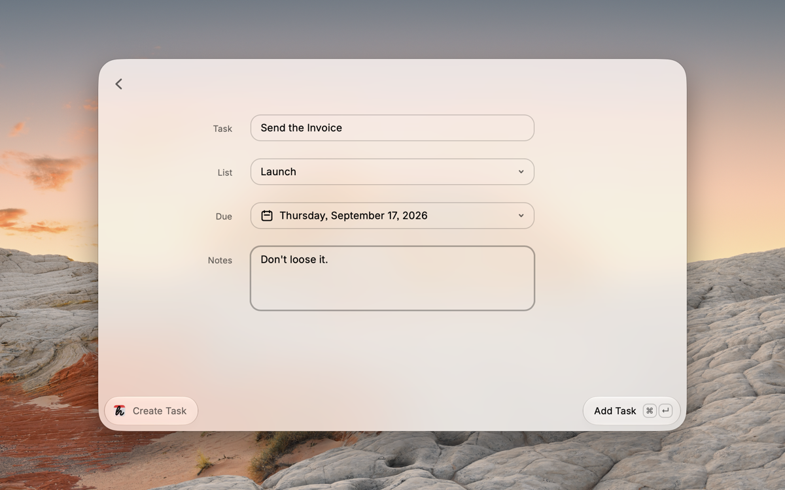
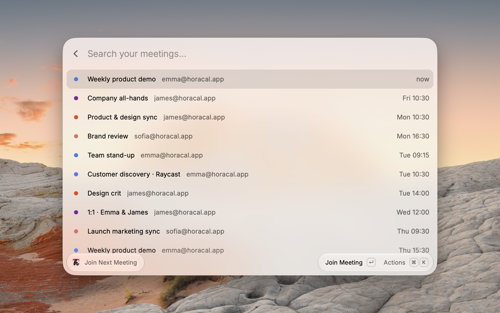

# hora Calendar in Raycast  

Put an event in your calendar by describing it, add a task, or jump into your next call — without leaving Raycast, and usually without hora ever coming forward.

**This is the official hora Calendar extension, built and maintained by the team that makes the app.**

- [Requires hora Calendar for Mac](#requires-hora-calendar-for-mac)
- [Installing](#installing)
- [Create Calendar Event](#create-calendar-event)
- [Create Meeting](#create-meeting)
- [Create Task](#create-task)
- [Join Next Meeting](#join-next-meeting)
- [Choosing a calendar](#choosing-a-calendar)
- [Preferences](#preferences)
- [Privacy](#privacy)
- [How it talks to hora](#how-it-talks-to-hora)
- [Contributing](#contributing)

## Requires hora Calendar for Mac

**Native Google Calendar for Mac. Create and join meetings without opening your browser.**

This extension is a front door, not the product. It drives [hora Calendar](https://horacal.app) — a native macOS client for Google Calendar with no Electron and no web views — which holds your calendars, your Google Tasks, your meeting rooms and your invitations.

**Recommended: Direct from hora.** Download the latest Raycast-compatible version from [horacal.app](https://horacal.app/download/direct/) or install it with Homebrew:

```bash
brew install --cask szamowski-dev/tap/hora
```

**Setapp** also has a Raycast-compatible build. The **Mac App Store update is pending**, so its current version does not support this extension yet.

The extension detects the supported Direct or Setapp build automatically; there is nothing to configure. You need **hora 1.1.5 or newer** — earlier versions cannot be scripted, and the extension will tell you how to update.

## Installing

1. Install the extension from the Raycast Store.
2. Install the recommended [Direct version](https://horacal.app/download/direct/) — or use Homebrew with `brew install --cask szamowski-dev/tap/hora`. Setapp works too; the Mac App Store update is still pending.
3. Sign in to your Google account.
4. Run any command. macOS asks once whether Raycast may control hora — say yes.

That is the whole setup. There is no API key, no token and no account to connect: the extension reaches hora on your own Mac.

If you dismissed the permission prompt, turn it back on under **System Settings › Privacy & Security › Automation › Raycast**. The extension offers to open that pane for you when it notices the permission is missing.

## Create Calendar Event

Type `create calendar event` and then describe it the way you would say it out loud — `lunch with Kuba on Thursday at 1pm`, `standup tomorrow 9:30`, `dentist next Friday`.

Press Enter and it is in your calendar. hora does not open, does not take focus, does not flash a window at you — all you get is a toast confirming the title and the time it landed on.

The sentence is parsed by hora itself, not by this extension, so you get exactly the result you would get by typing the same thing into the app.

## Create Meeting

`create meeting` takes the same kind of sentence, but instead of saving it, hora comes forward with its editor already filled in from what you typed. Nothing is saved until you save it.



Reach for this one when there is more to the event than a time — guests to invite, a room to book, a Meet or Zoom link to attach, a description to write. The parser does the first 80%, you do the rest.

## Create Task

`create task` opens a small form: the task, which of your Google Tasks lists it belongs to, when it is due, and a note.



The list dropdown is filled from the lists hora has actually synced, and it starts on the same default list hora uses when you add a task from its sidebar. Google Tasks records the day only, never a time of day, which is why there is a date picker and no clock.

## Join Next Meeting

`join next meeting` lists what is coming up that you can actually join — anything with a Google Meet, Zoom or Teams link.



Each row shows which account the meeting belongs to and how soon it starts: `in 20 min` while it is close, the time while it is still today, the weekday after that. Press Enter and the call opens in the right app, signed in as the right Google account — which matters if you keep work and personal accounts side by side. `⌘ ⇧ C` copies the link instead.

## Choosing a calendar

Create Calendar Event writes to the calendar set under **Default Calendar** in the extension's preferences. Leave it empty and events land on the primary calendar of your first connected account.

To put one event somewhere else, use **Create Meeting** and pick the calendar in hora's editor before saving.

## Preferences

| Preference | What it does |
| --- | --- |
| **Default Calendar** | The calendar Create Calendar Event writes to. Empty means the primary calendar of your first connected account. |
| **Close Raycast after adding** | Dismiss the Raycast window as soon as an event is sent. On by default. |

## Privacy

Nothing leaves your Mac.

The extension makes no network requests of its own. It has no server, no analytics and no account. Everything it does is an Apple event sent to hora, running on the same machine — the same mechanism Script Editor or Shortcuts would use.

Your calendar data is read from hora's local store and used only to draw the list you are looking at. It is never stored by the extension, never cached anywhere outside Raycast's own process, and never sent anywhere.

The only preference stored is the default calendar name you type in, which stays in Raycast's own preferences on your Mac.

## How it talks to hora

Everything goes through hora's AppleScript dictionary — no private APIs, no reading hora's files, nothing that breaks when hora updates. You can drive the same commands yourself:

```applescript
tell application id "szamowski.Hora"
    parse sentence "lunch with Kuba on Thursday at 1pm" with add immediately
    add task "send the invoice"
    upcoming events limited to 10 with meeting links
end tell
```

Every command answers with JSON. Open the full dictionary in Script Editor with **File › Open Dictionary…** and pick hora Calendar — there is more in there than this extension uses, including RSVPs and deleting events.

## Contributing

Fork [the repository](https://github.com/szamowski-dev/hora-raycast) and open a pull request describing what you changed. Issues and suggestions are welcome too.

```bash
npm install
npm run dev
```

You will need hora installed for anything to work.
