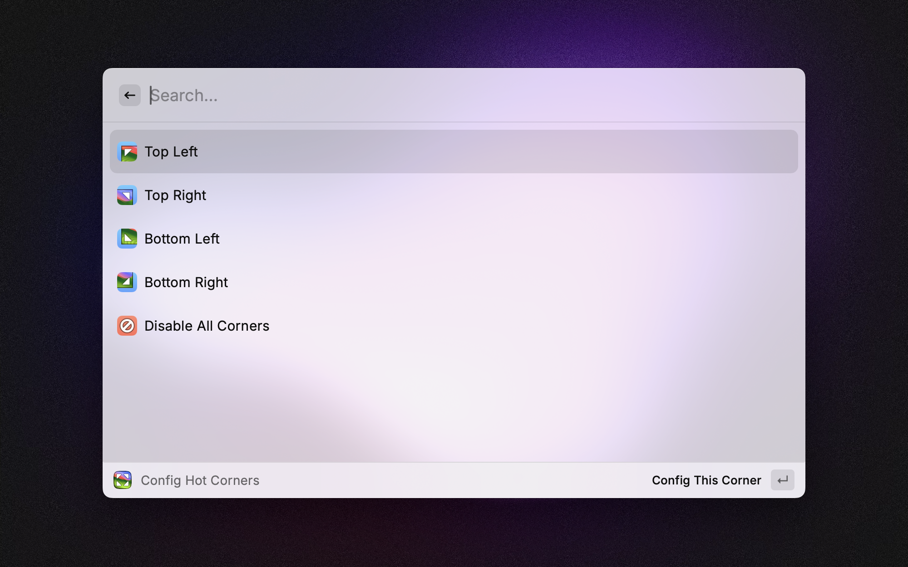
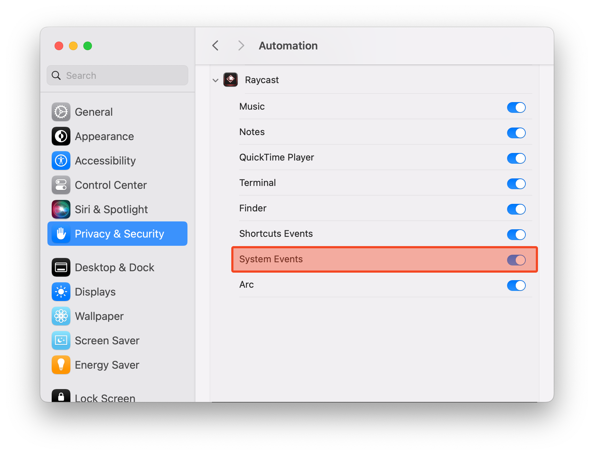

# HotCorner

A Raycast extension for quickly configuring macOS hot corners behaviors.

## Before using

HotCorner requires System Events permission to function properly.

Please navigate to macOS System Preferences -> Security & Privacy -> Privacy -> Automation -> Raycast, and enable the toggle for "System Events".

## Screen Blinking

Since restarting the "dock" process is required to apply changes, a brief screen blinking may occur. This is normal and poses no harm to your device.
