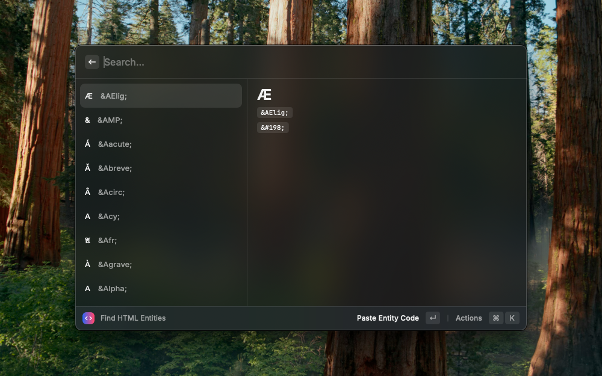

# HTML Entities

## Introduction

HTML entities are used to display reserved characters in HTML.  For example, the less than sign (<) is used to start a tag, so it cannot be used to display the less than sign.  To display the less than sign, we must use the HTML entity `&lt;` or the decimal equivalent `&#60;`.

## How to use

Search for the character you want to display.

When selected, you can copy the following:

- Unicode Character (<kbd>⏎</kbd>)
- HTML Code (<kbd>⌘</kbd> + <kbd>H</kbd>)
- HTML Entity (when available) (<kbd>⌘</kbd> + <kbd>E</kbd>)
- CSS Code (<kbd>⌘</kbd> + <kbd>S</kbd>)

