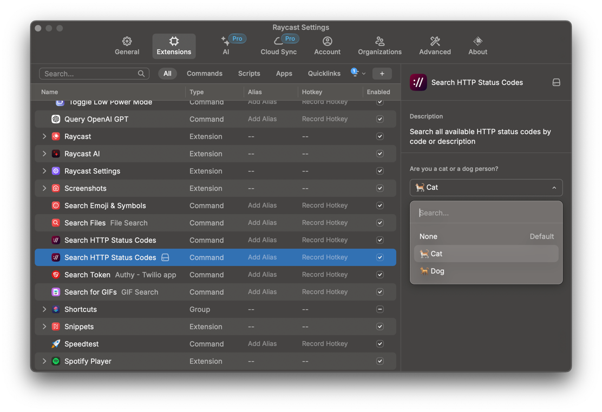

# HTTP Status Code

<h3 style="text-align: center">
  Navigate through all HTTP status codes, browse the documentation, and, last but not least, see funny and furry cat or dog images representing them.
</h3>

# Features

### Personalised for you

Customise the extension behaviour to reflect the type of person you are.

---

  Made with ♥

