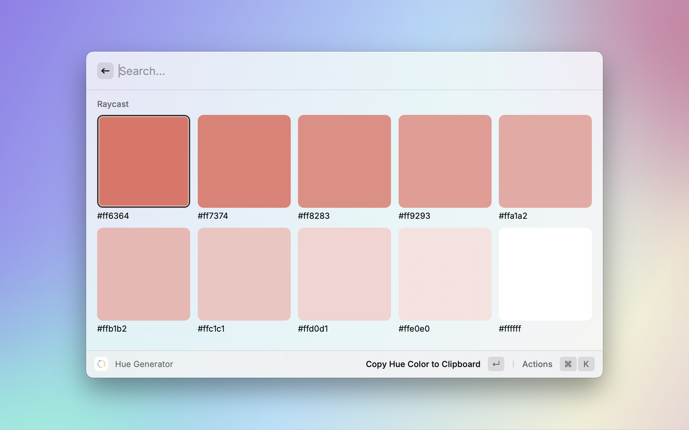
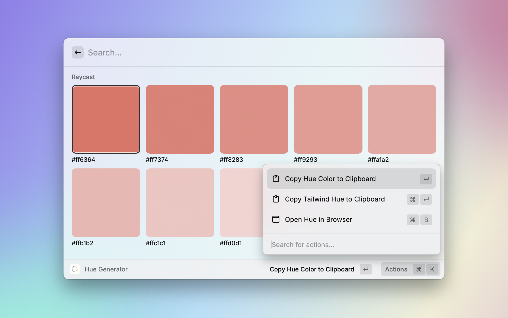

# Hue Palette Raycast Extension

This Raycast extension for [Hue Palette](https://www.hue-palette.com/) allows you to easily access and generate custom hue palettes for your design projects directly from Raycast. It also provides an option to export the palette as Tailwind CSS configuration code, streamlining your design-to-development workflow.

## Features

- Generate Custom Hue Palettes: Create and customize your hue palettes with a few keystrokes.
- Tailwind CSS Config Generator: Export your palette as Tailwind CSS configuration code, ready to be integrated into your projects.
- Instant Preview: View your palettes in real-time as you customize them.
- Quick Access: Seamlessly access and manage your palettes from within Raycast.

## Screenshots

