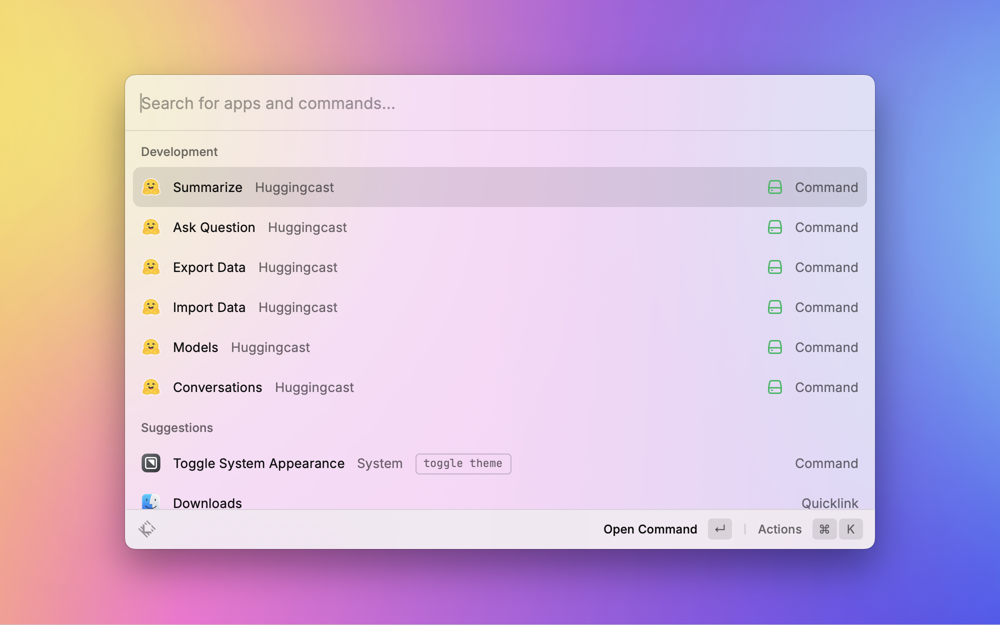
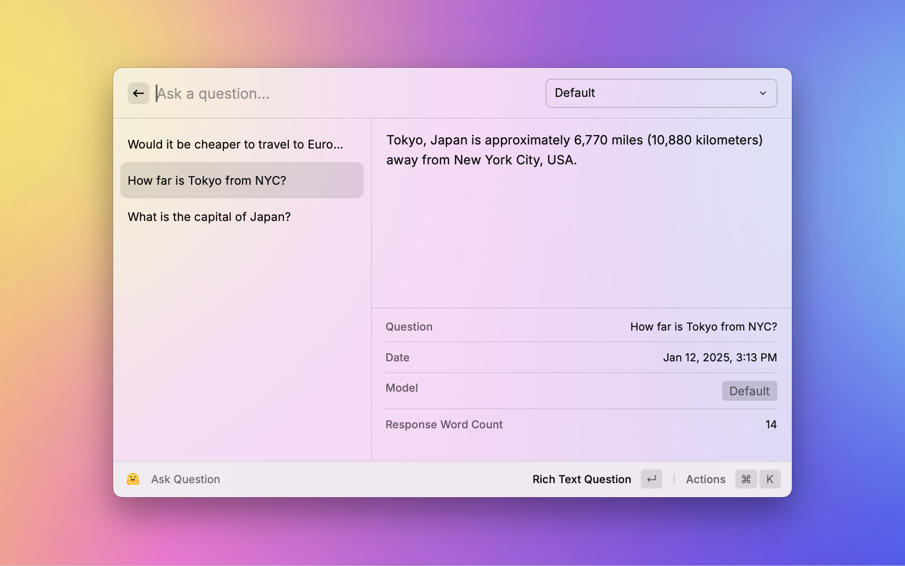
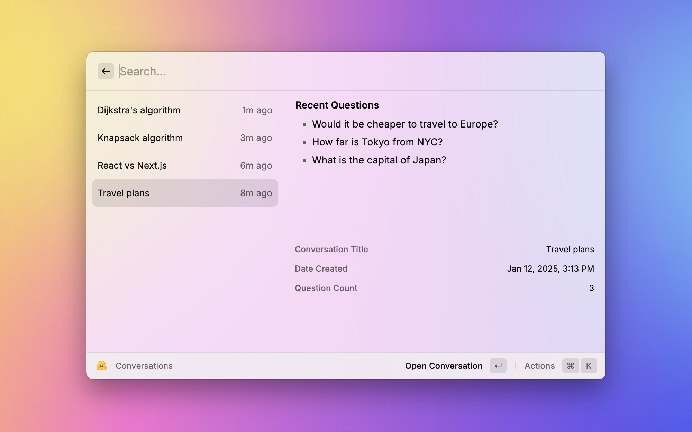
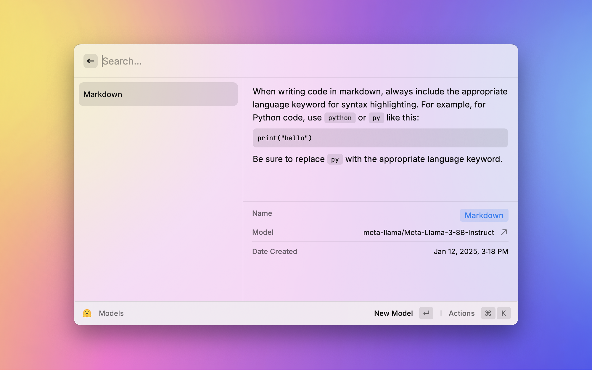
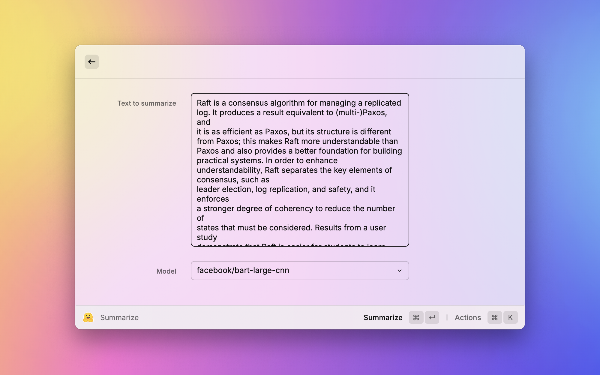

# Huggingcast

## Overview

The **Huggingcast** extension for Raycast allows users to interact with the Hugging Face Inference API seamlessly. With features like asking questions, summarizing text, tracking conversations, creating custom models, and exporting/importing data, this extension is a powerful tool for developers and AI enthusiasts. **All you need is a _free_ access token!**

## Features

- **Ask Questions**: Chat with Hugging Face models directly from Raycast.
- **Summarize**: Condense text into concise and informative summary.
- **Conversations**: View and manage your conversation history.
- **Custom Models**: Create and manage personalized AI models.
- **Data Import/Export**: Backup or transfer your data with JSON files.

## Getting Started

### Prerequisites

- A free [Hugging Face account](https://huggingface.co/join).
- A valid Hugging Face Inference API token.
- Raycast installed on your device.

### Installation

1. Download the Huggingcast extension from the Raycast Store.
2. Follow the setup instructions provided by Raycast.

### Configuring Your Access Token

To use the extension, you need to configure your Hugging Face API token:

1. Log in to your Hugging Face account.
2. Navigate to [Hugging Face Tokens](https://huggingface.co/settings/tokens).
3. Click **Create new token**
4. Enter a name (optional)
5. Select the checkbox **Make calls to the serverless Inference API** under **Inference**
6. Scroll down and click **Create token**
7. Copy your newly created access token.
8. Open the Huggingcast extension in Raycast.
9. Paste the token into the **Access Token** field in the preferences.

## Screenshots

## Dependencies

The extension requires the following packages:

- `@huggingface/inference`
- `@raycast/api`
- `@raycast/utils`
- `node-fetch`
- `uuid`

## Attibutions

This extension was made from scratch, but chat functionality was inspired by the [ChatGPT extension](https://www.raycast.com/abielzulio/chatgpt) by [Abiel Zulio M](https://www.raycast.com/abielzulio). While these extensions are similar, Huggingcast is designed to be **free** since it utilizes a variety of unpaid models from Hugging Face's [Inference API](https://huggingface.co/learn/cookbook/en/enterprise_cookbook_overview#inference-api-serverless).

Nonetheless, if you want access to the latest models with more powerful capabilities, it might be worth either subcribing to [Hugging Face Pro](https://huggingface.co/pricing) (more advanced/paid models will be supported in this extension ASAP), or to use Abiel's [ChatGPT extension](https://www.raycast.com/abielzulio/chatgpt)!

## License

This extension is licensed under the [MIT License](LICENSE).

## Author

Developed by **Ragnor Comerford** and extended by **William De Rocco**. For questions or issues, feel free to open a GitHub issue!

