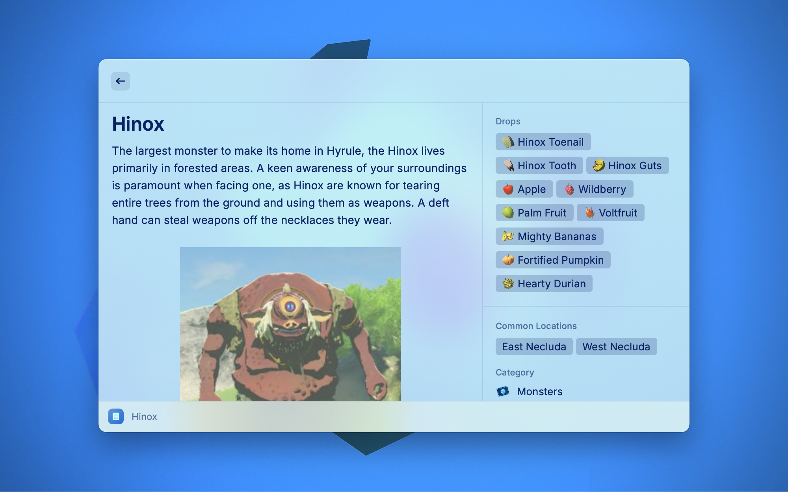
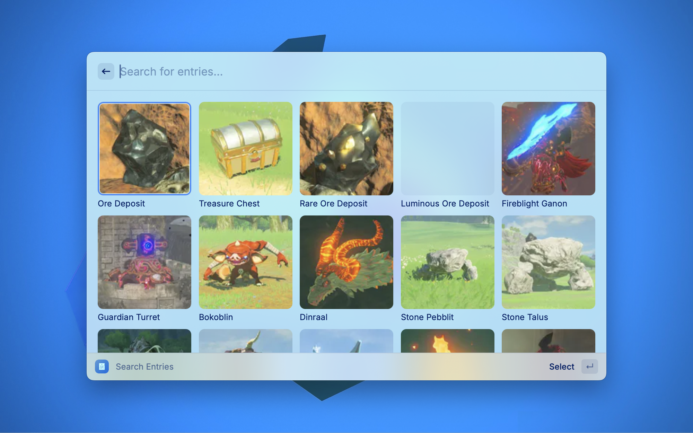

# Hyrule Compendium

This extension allows you to conveniently search and access information from the BotW Hyrule Compendium.

It uses the Hyrule Compendium API by [Aarav Borthakur](https://github.com/gadhagod).

You can find the API [here](https://gadhagod.github.io/Hyrule-Compendium-API/#/).

Available categories:
- Monsters
- Equipment
- Materials
- Creatures

The extension uses fuzzy search (fuse.js) to search for the entry you inputted, it doesent matter if you made a typo or didn't use the complete name, it still works!

All icons for `drops`, `category`, `hearts recovered`, and `special effects` are all taken from the [Zelda Wiki sprite sheet](https://zeldawiki.wiki/wiki/Category:Breath_of_the_Wild_Sprites).

P.S: This is my first extension so please provide any feedback!