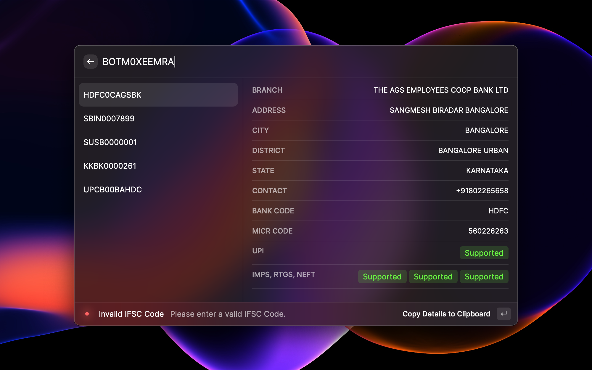

# IFSC Explorer

This extenstion let's you get bank's information by typing in its IFSC code. IFSC stands for Indian Financial System Codes which means only Indian banks are assigned these codes.

If your want to try out this extension, here are some IFSC codes for your quick reference -

- TGMB0000002
- UPCB00BAHDC
- SBIN0007899
- HDFC0CAGSBK
- BOTM0XEEMRA
- KKBK0000261
- SUSB0000001
- PUNB0244200

### Screenshot

Disclaimer - This extension only supports banks under Indian Financial System.
