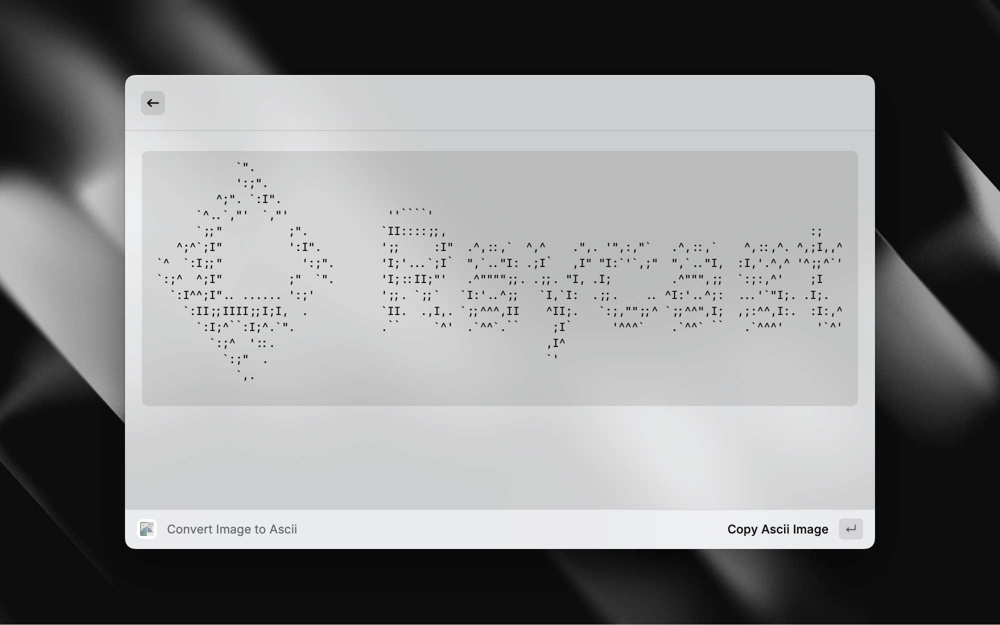

# 🖼️ Image to ASCII – Raycast Extension

Convert image into stunning ASCII art right from Raycast.

## 🚀 Features

- Converts local image files to ASCII art
- View generated ASCII directly in Raycast

## 🛠️ Usage

- Open Raycast
- Type `Convert Image to Ascii`
- Select your image file
- Enjoy your ASCII masterpiece
