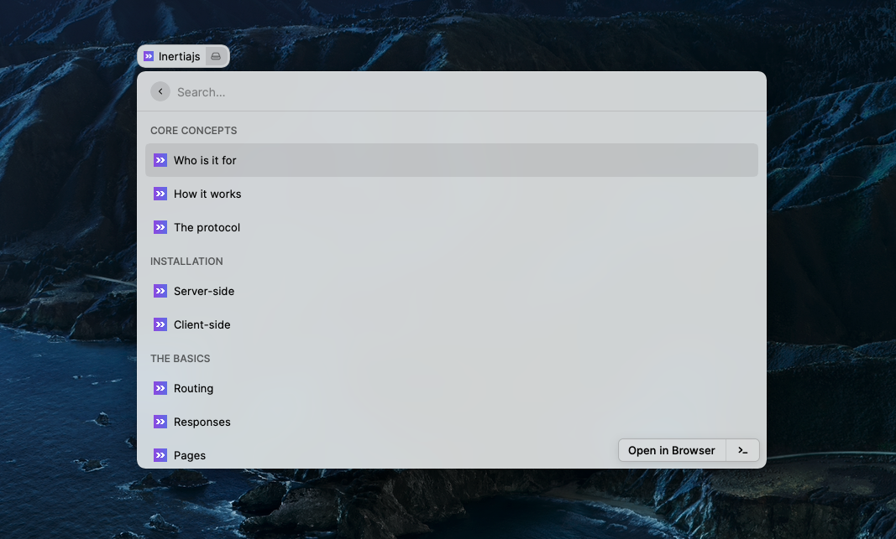

# InertiaJS Documentation

Easy access to InertiaJS documentation from raycast

---

## Adding new version

1. create file for the new version something similar to `src/documentation/v1.x.json`
2. add the newly created version to `src/inertiajs.tsx` documentation object
3. add newly created version number to command preferences data array
4. run `npm run build` to validate your work
5. don't forget to add your raycast username to `contributors` in `package.json`
