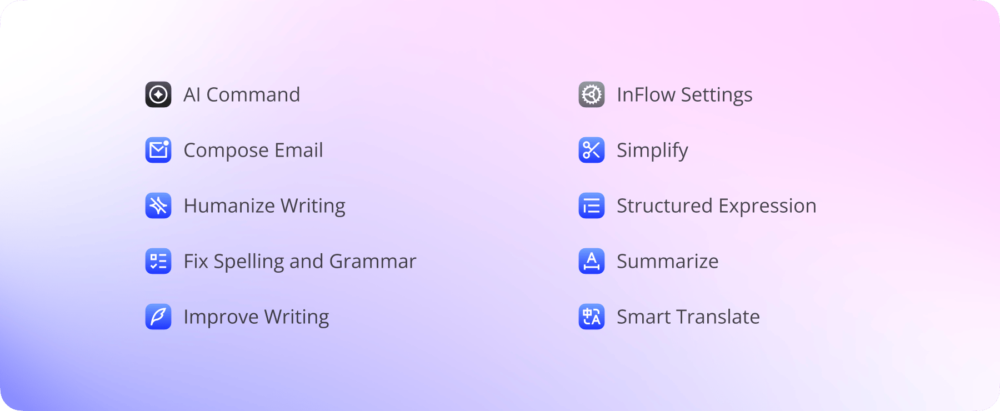
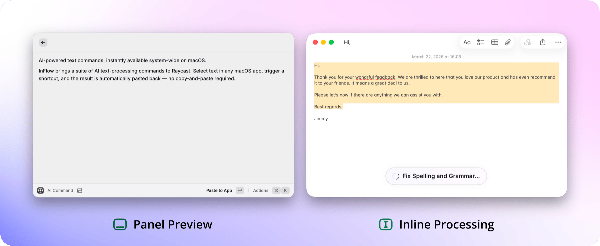

# InFlow

#### Transform selected text with AI — right where you write

InFlow is a Raycast extension that lets you transform selected text with AI — instantly and in place.

Select text in any macOS app, run a command, and the result is automatically written back or shown in a panel. No app switching. No copy and paste.

**Use it to:**

- Improve writing across emails, documents, chat, and notes
- Fixing grammar, rewriting, simplifying, structuring, summarizing, and translating existing content
- Executing one-off AI commands or asking questions about selected text
- Performing system-level text processing without breaking your current workflow

### Key Features

| Command                      | Description                                                                                                                                          |
| ---------------------------- | ---------------------------------------------------------------------------------------------------------------------------------------------------- |
| **AI Command**               | Input one-off custom instructions for selected text. You can also run preset commands, view history, and favorite common prompts in a unified panel. |
| **Fix Spelling and Grammar** | Correct typos, spelling, and grammar issues while preserving the original expression style without over-rewriting.                                   |
| **Improve Writing**          | Make expressions clearer, more professional, and more concise.                                                                                       |
| **Simplify**                 | Remove redundant content and retain the core meaning.                                                                                                |
| **Structured Expression**    | Reformat content using structures, paragraphs, or lists to make it easier to read and comprehend.                                                    |
| **Summarize**                | Extract key points and output a concise summary.                                                                                                     |
| **Humanize Writing**         | Remove the robotic AI tone to make the writing sound more natural and human-like.                                                                    |
| **Smart Translate**          | Automatically detect direction and smartly translate between your Default Language and Expression Language.                                          |
| **Compose Email**            | Draft or polish emails based on selected text, appropriately incorporating your Personal Context.                                                    |
| **InFlow Settings**          | Configure AI Providers, language preferences, output modes, Personal Context, and global Custom Instructions.                                        |

Note: All preset commands support modifying or customizing their prompts.

### Getting Started

**1. Initial Setup**

When running InFlow for the first time, you will enter the Onboarding flow. You need to configure the following:

1. Choose how editable text is handled: **Inline Processing** (automatically replaces editable text) or **Panel Preview** (displays results in a panel for manual replacement).
2. Set your **Default Language** (usually your native language) and **Expression Language** (the language you primarily use for communication).
3. Select an **AI Provider** (custom providers are recommended over Raycast AI).
4. Optionally fill in your **Personal Context** (useful for email signatures, etc.) and global **Custom Instructions**.

**2. Grant Necessary Permissions**

To automatically paste the processed results back into the active app, Raycast requires macOS Accessibility permissions. Without these permissions, InFlow may fail to perform inline replacement.

**3. Process Text in Any App**

1. Select text in any app that supports text selection (e.g., editors, browsers).
2. Open Raycast and run an InFlow command.
3. The result appears instantly in place (Inline Processing), or in a panel for review and copying (Panel Preview).

### How Results Are Applied

**Inline Processing**

Ideal for directly rewriting content in the current input field.

- Once complete, it attempts to directly overwrite the selected text.
- If the current area is detected as non-editable or automatic pasting fails, it will gracefully fall back to the Panel Preview.
- During command execution, triggering the same command again will cancel the current task.

**Panel Preview**

Ideal for long text, complex tasks, or when you want to review the result before pasting.

- Providers that support streaming will progressively display results in the Raycast panel.
- Copy the result or paste it back to the active app
- You can cancel the task during generation.
- If you prefer not to overwrite the original text directly, it is recommended to set this as your default mode.

### AI Command

`AI Command` is the central place to run custom instructions on selected text.

- Input targeted prompts for the currently selected text.
- Automatically records the history of custom prompts.
- Supports marking frequently used prompts as favorites.
- Supports copying, deleting, and clearing non-favorited history.

### InFlow Settings Overview

**Default Language**

Your primary language for reading and understanding content. Tasks like summarization and explanation will prioritize outputting in the Default Language. `Smart Translate` will also translate content that isn't in your Default Language into it.

**Expression Language**

Your frequently used writing or public communication language. For instance, `Compose Email` will prioritize using it, and `Smart Translate` will translate content from the Default Language into the Expression Language.

**AI Provider**

Currently supports Raycast AI, BigModel, DeepSeek, OpenAI, OpenRouter, Qwen, Z.ai, and Custom (any OpenAI API compatible service).

Additional Notes:

- Each Provider's configuration is saved independently. Switching won't overwrite the API Keys and model settings of other Providers.
- Raycast AI directly uses the model configured in `Raycast Settings -> AI -> AI Commands Model`.
- Raycast AI does not support streaming output.

**Personal Context**

Used to save your signature, identity, company, role, contact info, etc. InFlow will use this on demand for relevant scenarios like emails, self-introductions, or profile writing. It will not be inserted by default for standard rewriting, translating, or summarizing.

**Custom Instructions**

Global style preferences applied to all AI outputs. For example: keeping it concise, avoiding marketing tones, preferring bullet points for outputs, etc.

### Customizing Preset Prompts

Every preset command's prompt can be individually modified in `Raycast Settings -> Extensions -> InFlow` to override the default behavior and suit your workflow.

Available Placeholders:

- `{Default Language}`
- `{Expression Language}`

Examples:

- Force `Compose Email` to always output business emails in English.
- Make `Summarize` always output in Spanish.
- Instruct all outputs to avoid using emojis.

### Privacy & Data

- API Keys are encrypted and stored locally in Raycast.
- InFlow has no servers and does not collect your text content in any form.
- When using third-party Providers, selected text is sent to your chosen AI service.
- When using Raycast AI, please refer to Raycast AI's terms of service and subscription rules.

### License

MIT License

Crafted with heart by [Remix Design Studio](https://remixdesign.app).
