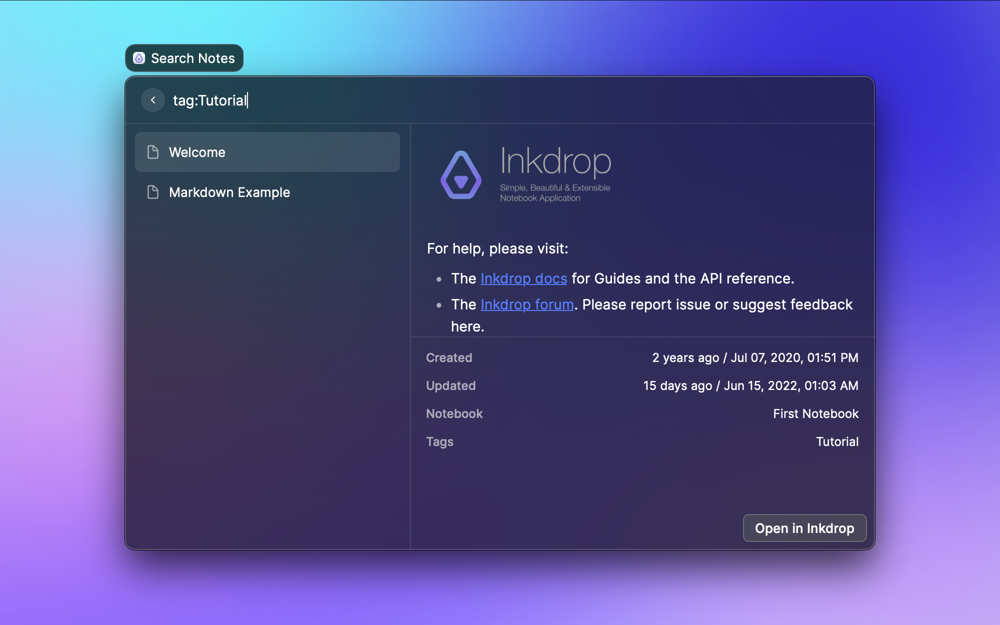
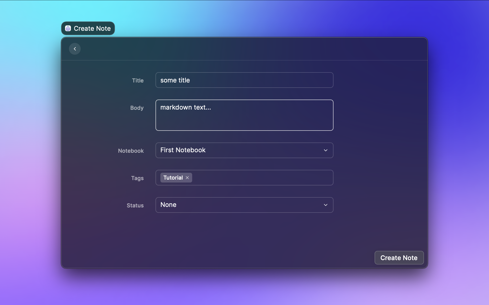

# Inkdrop for Raycast

This is a [Raycast](https://www.raycast.com/) extension for [Inkdrop](https://www.inkdrop.app/).

## How to use

### Inkdrop

This extension accesses your notes via HTTP locally.
You have to configure the app to open a HTTP endpoint.
See [the instruction on the documentation](https://beta.docs.inkdrop.app/manual/accessing-the-local-database/#accessing-via-http-advanced) for more detail.

### Raycast

Install extension from [Raycast Store](https://www.raycast.com/yaeda/inkdrop), then set Inkdrop's configuration.

## Features

### Search Notes

- Incremental Search
  - You can use the same keyword as the application.
  - Ref. [Searching Notes \| Inkdrop Documentation](https://docs.inkdrop.app/manual/searching-notes/#filter-notes-with-special-qualifiers)
- <kbd>Enter</kbd> will open the not in Inkdrop app

### Create Note

- <kbd>Command</kbd> + <kbd>Enter</kbd> will create note

## Preferences

### General Settings

- configuration of Inkdrops' local server（`address`, `port`, `username` and `password`)

## Credit

Inkdrop wordmark and logo are registered trademarks owned by Takuya Matsuyama.
