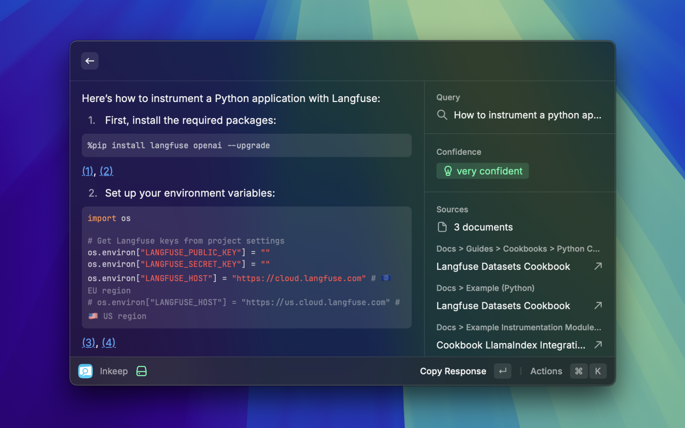

# Inkeep Raycast Extension

A Raycast extension for interacting with the Inkeep Completions API ([docs](https://docs.inkeep.com/ai-api/chat-completions-api)). This extension allows you to ask questions and get AI-powered answers from your knowledge base.

## Setup

1. Install the extension
2. Configure your Inkeep API key in the extension preferences
3. Optional: Configure model and API base URL

### API Key

To get an API key:

1. Log in to the Inkeep Dashboard
2. Navigate to the **Projects** section and select your project
3. Open the **Integrations** tab
4. Click **Create Integration** and choose **API** from the options
5. Enter a Name for your new API integration
6. Click on **Create**
7. Use the generated **API key** in the extension preferences
