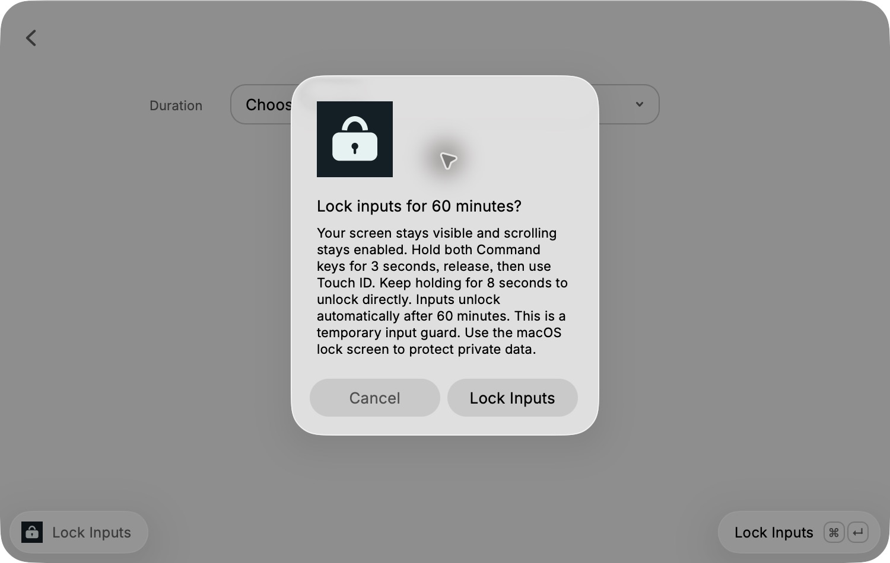

# Input Lock

A local Raycast MVP that blocks typing and clicks while keeping the current desktop visible and scrolling available. Hold both Command keys for 3 seconds, release them, then use Touch ID to unlock. Keep holding for 8 seconds to unlock without authentication if recovery is needed.

This is a temporary input guard. Anyone who knows the recovery gesture can unlock it. Use the macOS lock screen to protect private data.



## Use

Requires macOS 13 or later, Raycast, and an enrolled Touch ID fingerprint.

1. Run **Lock Inputs** in Raycast and confirm **Lock Inputs**. The helper starts the lock, the Raycast window closes, and the desktop stays visible.
2. To unlock, hold both Command keys for 3 seconds, release, and touch the sensor when macOS prompts. Holding both keys continuously for 8 seconds is the recovery route.

Assign a hotkey in Raycast Settings → Extensions → Input Lock → Lock Inputs.

The installed extension works with the development watcher stopped. It is ready for daily use as a temporary input guard on the Mac used for these checks. The user tested the scroll-enabled build and confirmed the lock works; physical typing and pointer blocking and Touch ID unlock were also confirmed. Use it directly from Raycast between sessions.

### Permissions

- **Accessibility:** allows the active event tap to suppress keyboard and pointer events.
- **Input Monitoring:** allows the helper to detect the unlock gesture.

On first use, macOS requests the required permissions. If either permission or Touch ID is unavailable, the command refuses to lock. Grant permissions in System Settings → Privacy & Security, then run the command again. macOS may attribute the helper's request to Raycast. Permission behavior on a fresh Store installation and after a Store update has not been verified.

## Build and run

Requires Node.js. The committed native helper supports command development without a Swift toolchain. Changes to `native/InputLock.swift` require Apple's Swift command-line tools and an explicit rebuild before running, packaging, or publishing. End users receive the native helper in the extension assets; there is no separate Mac application.

```sh
npm ci
npm run dev
```

If the selected Xcode installation has an unaccepted license while Command Line Tools are installed, use a per-command override:

```sh
DEVELOPER_DIR=/Library/Developer/CommandLineTools npm run build:native
```

The build script compiles `native/InputLock.swift` for arm64 and x86_64, combines both into `assets/input-lock`, and applies an ad-hoc code signature. It uses only Apple frameworks. The extension-owned runtime makes no network requests and contains no telemetry code. This is a source observation; it has no network sandbox. The executable is committed alongside its source and build script because Store CI builds the Raycast command directly.

```sh
npm run build
npm run lint
npx tsc --noEmit
node scripts/check-command.cjs
python3 scripts/check-native.py
./assets/input-lock --self-test
./assets/input-lock --probe
```

## Technical scope

The no-view Raycast command awaits one helper process for the entire lock session. The helper owns a session event tap, idle display and system sleep assertions, the unlock chord, and Touch ID authentication. JSON lines on stdout report `ready`, `preparing`, `locked`, `unlocking`, and `error` states. An OS file lock prevents nested lock sessions.

| Input or behavior | Implementation | Validation |
| --- | --- | --- |
| Built-in and external keyboard key events | Suppressed by `CGEventTap`; Command flags still feed the unlock detector | User confirmed local typing blocked and Touch ID restored input; external-device and full shortcut matrix pending |
| Trackpad taps and clicks | Session mouse events suppressed | Detailed physical coverage pending |
| Mouse buttons, drag, and movement | Session pointer events suppressed | User confirmed local pointer actions blocked; external-device coverage pending |
| Mouse wheel and two-finger scroll | Deliberately passed through | Scroll-enabled build tested by the user; omission verified in the installed helper's active tap mask |
| Multi-finger trackpad gestures and media keys | Outside the intercepted event mask | Unsupported by this MVP |
| Power button, lid close, system-reserved controls | macOS retains control | No complete input-blocking claim |
| Visible content and brightness | No overlay, cursor hiding, or brightness changes | Short local session verified; 15-minute check pending |
| Idle sleep | Display and system idle sleep assertions held during lock | Assertion creation and teardown verified |
| Touch ID unlock | Apple's biometric authentication policy | User confirmed physical unlock on 2026-09-28 |
| Recovery gesture | Both Command keys held for 8 seconds | Timing self-check passed; physical recovery check pending |

The helper releases its event tap and wake assertions on normal unlock, SIGTERM/SIGINT, parent-process exit, permission loss, a disabled event tap, display reconfiguration, sleep, or session resignation. A helper crash also removes its process-owned event tap and power assertions. Manual sleep and lid-close behavior are not overridden. As a last resort, terminating the `input-lock` process releases the guard.

Local checks verified SIGTERM cleanup, parent-process exit cleanup, release of both wake assertions, and refusal of a second lock process. Build, lint, TypeScript, and the Command-chord self-check passed.

A final launch through Raycast with the development watcher stopped created an enabled active tap with keyboard and pointer filtering and no scroll-wheel interception. Both idle sleep assertions were present during the session and absent after termination. The installed and packaged builds use the same command source and native helper. The final bundle is `dist/input-lock.rayext`. All test timers and development processes were stopped after validation.

On 2026-09-28, a Raycast launch reproduced a first-use gate that timed out without entering lock. That activation gate was removed. The corrected command emitted `locked`, then `unlocking`, then `ready` with `reason: touchID`. The user confirmed typing and pointer actions were blocked and restored after Touch ID. The command check covers direct activation, cancellation, helper lifetime, final status feedback, signal diagnostics, and trailing status records. The native check covers Command timing and clean failure when the output pipe closes.

Device hot-plugging, permission revocation, screen lock, user switching, and external-display recovery still need physical acceptance checks. UI automation can bypass the event tap, so synthetic typing is not evidence of physical input blocking.

## Store status

This MVP is installed locally and has been verified with the development watcher stopped. Store installation, review, and updates have not been verified, so the complete Store requirement remains open. Raycast's [binary dependency rules](https://developers.raycast.com/basics/prepare-an-extension-for-store#binary-dependencies-and-additional-configuration) require traceable sources and builds; its documented binary packaging route involves the Raycast team. The Swift source and build script make this helper reviewable, but do not establish Store approval.

The architecture follows Raycast's [command lifecycle](https://developers.raycast.com/information/lifecycle) and [asset packaging](https://developers.raycast.com/information/file-structure). [CleanLock](https://github.com/fromtimo/CleanLock) was inspected as a reference. This implementation does not copy its source or use its device seizure approach.

The POC established permissions, event-tap creation, wake assertions, and physical Touch ID unlock. The MVP adds Raycast activation, explicit confirmation, permission checks, recovery, and a universal helper build. Store delivery and the remaining physical acceptance matrix are the next release gate.
