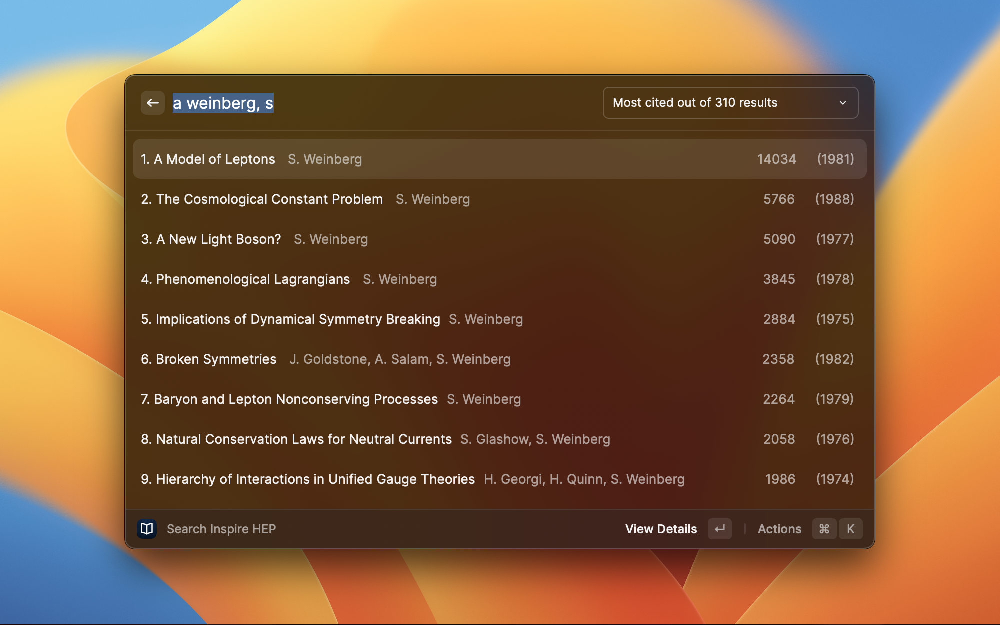
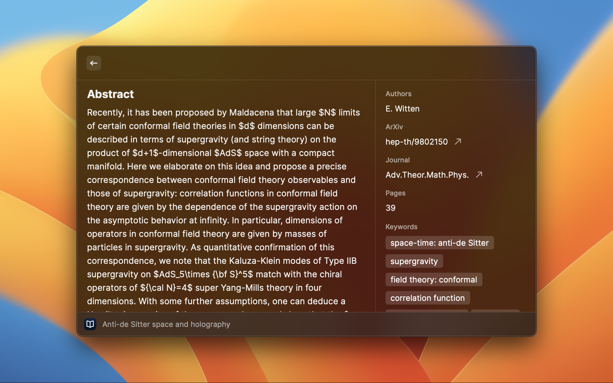

# Inspire Search Extension for Raycast

Search papers on [inspirehep.net](https://inspirehep.net) and browse results from [Raycast](https://www.raycast.com). This extension is optimized for rapid bibliographic research.

The main view shows the total number of results, which can be sorted in order of most recent, least recent, or most cited. It also shows the number of citations and year of publication for each result. 

The details view shows additional information such as abstract, book description, journal, publisher, number of pages, and keywords.

## Actions

For each result one can perform the following actions :

- **View Details:** (in list view only) show details view.
- **Return to List:** (in details view only) return to list view.
- **Open in Browser:** when available, download the preprint from [arxiv.org](https://arxiv.org) or KEK in pdf format. Otherwise, resolve the DOI or show the document page on [inspirehep.net](https://inspirehep.net).
- **Copy BibTex to Clipboard:** copy the bibtex code to the clipboard.
- **Add BibTex to Clipboard:** append the bibtex code to the clipboard content; helpful to copy the bibtex code for multiple results without leaving raycast.

Results can be navigated using the following actions:

- **Next Page:** shows the next 9 search results.
- **Previous Page:** shows the previous 9 search results. 
- **Show Citations:** show a list of documents that cite the selected result.
- **Show References:** show a list of documents included in the selected result's bibliography.
- **Go Back:** returns to the previous search after using "Show citations" or "Show References". 
## Preferences

In the extension preferences, it is possible to specify the default ordering of search results ("Most Recent", "Least Recent", or "Most Cited").