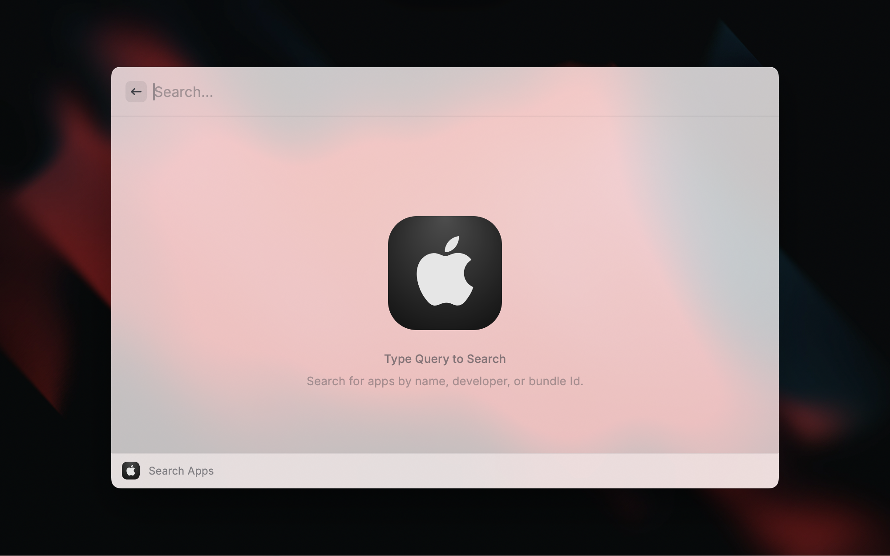

# iOS App Search

_Search, download, and view iOS apps from the App Store._

{ width="700" }
{ width="700" }
{ width="700" }
{ width="700" }
{ width="700" }
{ width="700" }

## Features

- **Search**: Quickly search for iOS apps by name, developer, or bundle ID
- **Rich App Details**: View comprehensive app information including ratings, screenshots, and metadata
- **Download**: Download IPA files directly to your computer
- **Copy Actions**: Easily copy app metadata like bundle ID, version, and App Store URLs
- **Raycast AI Tools**: Use AI commands to search, get details, and download iOS apps

## Requirements

### Homebrew

This extension requires [Homebrew](https://brew.sh), a package manager for macOS. You can install it via the following command:

```bash
/bin/bash -c "$(curl -fsSL https://raw.githubusercontent.com/Homebrew/install/HEAD/install.sh)"
```

### ipatool

Once you have Homebrew installed, install [ipatool](https://github.com/majd/ipatool), a command-line tool for interacting with Apple's App Store using this command:

```bash
brew install ipatool
```

The extension automatically detects `ipatool` installation in common locations:

- **Apple Silicon Macs**: `/opt/homebrew/bin/ipatool` (default Homebrew path)
- **Intel Macs**: `/usr/local/bin/ipatool` (default Homebrew path)
- **System installation**: `/usr/bin/ipatool`
- **User installations**: `~/.local/bin/ipatool`, `~/bin/ipatool`
- **PATH lookup**: Any location in your system PATH

If your installation is in a different location, you can specify the custom path in the extension preferences.

## How It Works

### App Search and Metadata

The extension uses a dual-source approach to provide comprehensive app information:

1. **ipatool**: Provides the core search functionality and app download capabilities
2. **iTunes API**: Enriches the search results with additional metadata such as:
   - High-resolution app icons and screenshots
   - Ratings and reviews information
   - Detailed app descriptions
   - Release dates and version history
   - Developer information and links

This combination ensures you get the most complete and up-to-date information about iOS apps.

### Screenshot Extraction with Shoebox JSON

The extension uses a sophisticated approach to extract high-resolution screenshots from the App Store by parsing Apple's "shoebox" JSON data embedded in App Store web pages.

#### How Shoebox Parsing Works

1. **JSON Extraction**: The extension searches for `<script type="fastboot/shoebox" id="shoebox-media-api-cache-apps">` elements in the App Store HTML
2. **Multi-layer JSON Parsing**: The shoebox contains nested JSON structures that require multi-step parsing:
   - Outer JSON object with app data keys
   - Inner JSON strings that need separate parsing
   - Deep path traversal to find screenshot data
3. **Path Navigation**: Screenshots are located at the path:

   ```javascript
   d[0].attributes.platformAttributes[platform].customAttributes.default.default.customScreenshotsByType
   ```

4. **Device Type Mapping**: The extension maps Apple's internal device identifiers to platform types:
   - `iphone_6_5`, `iphone_d74` → iPhone
   - `ipadpro_2018`, `ipad_pro_129` → iPad
   - `appletv`, `apple_tv` → AppleTV
   - `applewatch_2022`, `apple_watch` → AppleWatch
   - `applevision`, `visionpro` → VisionPro
   - `mac`, `macbook` → Mac
5. **URL Enhancement**: Screenshot URLs are automatically transformed to the highest resolution format

#### Graceful Fallback Behavior

The shoebox parsing helper is designed to handle changes in Apple's App Store structure gracefully:

- **Multiple Parsing Paths**: Checks both platform-specific and fallback attribute paths
- **Error Isolation**: JSON parsing errors don't crash the entire process
- **Partial Results**: Returns any successfully parsed screenshots even if some fail
- **Comprehensive Logging**: Detailed logging helps diagnose parsing issues
- **Fallback Values**: Uses sensible defaults when structure changes

#### Future Resilience

⚠️ **Important Note**: Apple may change the App Store's internal structure at any time. The extension's shoebox parsing logic is designed to be resilient to these changes, but future App Store updates could potentially affect screenshot extraction. The parsing logic includes multiple fallback mechanisms and extensive error handling to minimize disruption.

### Apple ID Authentication

This extension requires you to authenticate with your Apple ID in order to search and download apps from the App Store. The authentication process is handled securely through `ipatool`:

- Your Apple ID credentials are never stored within the Raycast extension
- Authentication is handled directly by ipatool, which securely stores credentials in your system's keychain
- **NEW**: Authentication can now be completed directly within the Raycast UI with dedicated forms for both standard login and two-factor authentication

## Configuration

### Concurrency Settings

The extension allows you to control download performance through configurable concurrency settings:

- **Max Concurrent Downloads**: Controls how many screenshot downloads can happen simultaneously (default: 5, range: 1-10)
  - Higher values = faster downloads but more system resources
  - Lower values = slower downloads but lighter system load
  - Recommended: 3-7 for most systems

### Timeout Settings

- **Download Timeout**: Sets the maximum time to wait for individual screenshot downloads (default: 90 seconds, minimum: 30 seconds)
  - Longer timeouts help with slow connections or large images
  - Shorter timeouts prevent hanging on failed downloads
  - The extension automatically retries failed downloads

### Platform Preferences

You can control which device platforms to include when downloading screenshots:

- **iPhone**: Enabled by default - includes iPhone screenshots in all sizes
- **iPad**: Enabled by default - includes iPad screenshots and iPad Pro variants
- **Mac**: Disabled by default - includes macOS app screenshots
- **Apple TV**: Disabled by default - includes tvOS app screenshots
- **Apple Watch**: Disabled by default - includes watchOS app screenshots
- **Vision Pro**: Disabled by default - includes visionOS app screenshots

**How Platform Preferences Affect Scraping**:

- Screenshots are always extracted from the App Store for all available platforms
- Platform preferences only control which screenshots are actually downloaded and saved
- Disabled platforms are skipped during download, saving time and storage space
- The scraping process provides detailed feedback about available vs. downloaded screenshots per platform
- Platform-specific progress tracking shows real-time download status for each enabled platform

## About App Downloads and Screenshots

Downloaded apps are saved as IPA files to your specified downloads directory (defaults to ~/Downloads). The files are automatically renamed to a user-friendly format: `{App Name} {Version}.ipa`.

Screenshots are downloaded at the highest resolution and saved to the downloads directory with platform-specific organization.

## Privacy

This extension:

- Does not collect or transmit any personal data
- Only communicates with Apple's servers via the `ipatool` CLI and iTunes API
- Stores no credentials within the extension itself

### Authentication Features

- Two-factor authentication is fully supported
- The extension automatically detects if you're already authenticated
- **NEW**: In-UI authentication forms provide a seamless experience without leaving Raycast
  - Dedicated login form for entering Apple ID credentials
  - Two-factor authentication form with automatic code detection
  - Real-time validation and error feedback
  - Secure credential handling with no storage in the extension

When you first attempt to search or download an app, you'll be prompted to authenticate if needed. The new in-UI forms make this process quick and intuitive. After successful authentication, you shouldn't have to re-authenticate for future operations.

### Reducing Keychain Access authentication

The Keychain item that controls `ipatool`'s session is created by `ipatool` itself (usually named `ipatool-auth.service`). macOS may prompt the first time Raycast (or `ipatool`) accesses this item. You can reduce or eliminate repeated prompts by adjusting the item's Access Control:

1. Open Keychain Access and search for `ipatool-auth.service`.
2. Double‑click the item → open the "Access Control" tab.
3. Choose one of the following:
   - Recommended: Keep "Confirm before allowing access" but add specific apps to "Always allow access by these applications":
     - Click the `+` button and add the actual `ipatool` binary.
       - On Apple Silicon (Homebrew): `/opt/homebrew/bin/ipatool` → then right‑click → "Show Original" to add the real binary under `/opt/homebrew/Cellar/ipatool/<version>/bin/ipatool` (avoid adding just the symlink).
       - On Intel (Homebrew): `/usr/local/bin/ipatool` → similarly add the original under `/usr/local/Cellar/ipatool/<version>/bin/ipatool`.
     - Optionally add `Raycast.app` if the flow originates in Raycast and you still see prompts.
   - Less secure: Select "Allow all applications to access this item" (not recommended).
4. Click "Save Changes".

Notes:

- The extension does not create or modify `ipatool-auth.service`; it is owned by `ipatool`.
- The extension may store your Apple ID password in a separate Keychain entry named `ios-apps-apple-password` (service), which is independent of `ipatool`'s item and does not change its ACL.
- There is no programmatic way in this extension to set the Keychain ACL default; macOS manages it for security.

## About Raycast AI Tools

This extension provides several AI tools that can be used with Raycast AI to enhance your workflow:

### Search iOS Apps

Search for iOS apps on the App Store by name or keyword.

```bash
Search @ios-apps Spotify
```

Options:

- `query`: The search query for finding iOS apps (required)
- `limit`: Maximum number of results to return (optional, default: 10, max: 20)

### Get iOS App Details

Get detailed information about an iOS app by name or search term.

```bash
Get @ios-apps details for "Airbnb"
```

### Get iOS App Version

Get the current version of an iOS app by name or search term.

```bash
Get @ios-apps What's the latest version of Airbnb?
```

Options:

- `query`: The name or search term for the iOS app (required)

### Download iOS App

Download an iOS app directly to your computer.

```bash
Download @ios-apps "Instagram"
```

Options:

- `query`: The name or search term for the iOS app (required)

The download tool will search for the app, retrieve its details, and download the IPA file to your specified download directory.

### App Downloads

Downloaded apps are saved as IPA files to your specified downloads directory (defaults to ~/Downloads). The files are automatically renamed to a user-friendly format: `{App Name} {Version}.ipa`.

## Troubleshooting

### Common Issues

- **Authentication Failures**: If you're having trouble authenticating, try running `ipatool auth login` directly in your terminal
- **Download Errors**: Make sure you have sufficient disk space and permissions to write to your downloads directory
- **Search Not Working**: Verify that ipatool is correctly installed and accessible from the path specified in preferences

## Credits

- [ipatool](https://github.com/majd/ipatool) by Majd Alfhaily
- [iTunes Search API](https://developer.apple.com/library/archive/documentation/AudioVideo/Conceptual/iTuneSearchAPI/index.html) by Apple
- [Windsurf](https://windsurf.com/)
- [Claude 4 Sonnet](https://claude.ai) by Anthropic
- [Warp](https://warp.dev)
