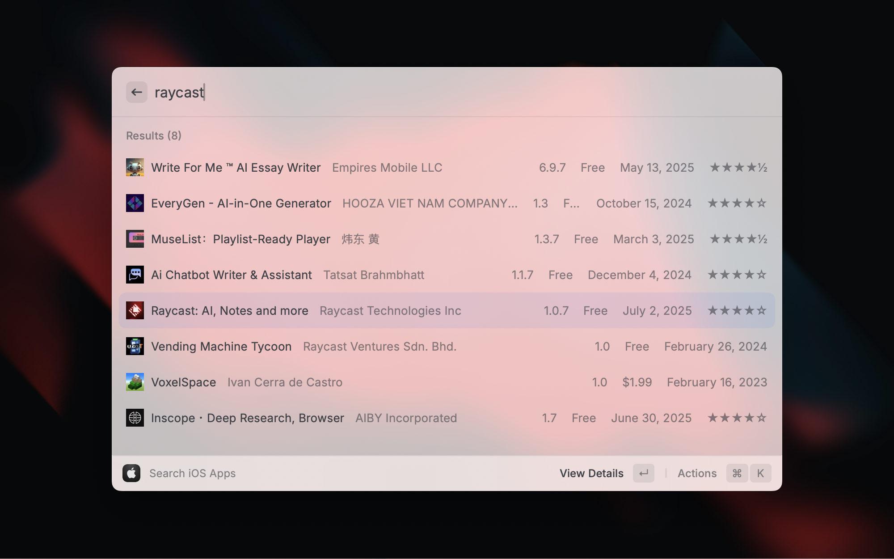
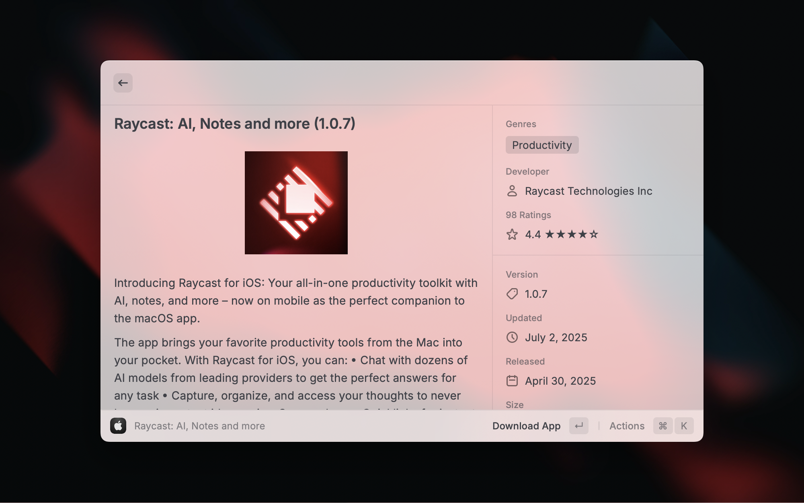
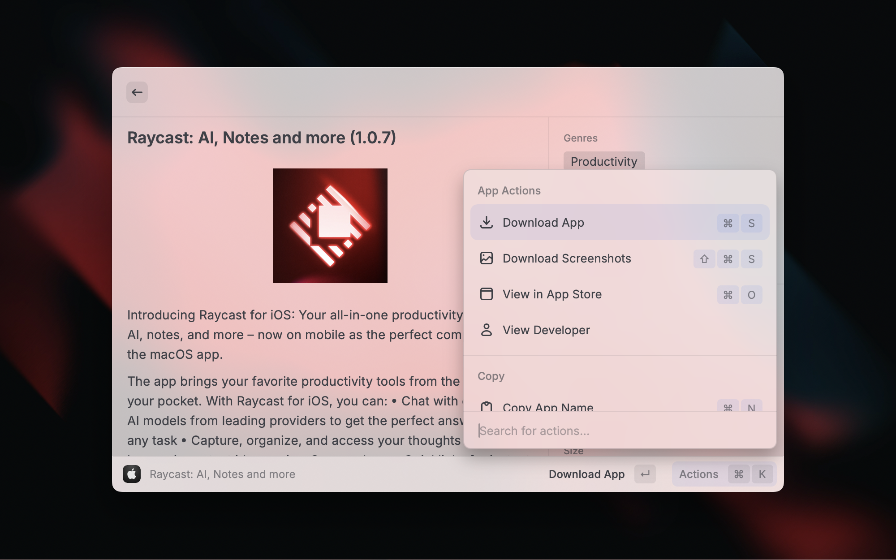

# iOS App Search

_Search, download, and view iOS apps from the App Store._

{ width="700" }
{ width="700" }
{ width="700" }
{ width="700" }

## Features

- **Search**: Quickly search for iOS apps by name, developer, or bundle ID
- **Rich App Details**: View comprehensive app information including ratings, screenshots, and metadata
- **Download**: Download IPA files directly to your computer
- **Copy Actions**: Easily copy app metadata like bundle ID, version, and App Store URLs
- **Raycast AI Tools**: Use AI commands to search, get details, and download iOS apps

## Requirements

### ipatool

This extension requires [ipatool](https://github.com/majd/ipatool), a command-line tool for interacting with Apple's App Store. You can install it via Homebrew:

```bash
brew install ipatool
```

By default, the extension looks for ipatool at `/opt/homebrew/bin/ipatool`. If your installation is in a different location, you can specify the path in the extension preferences.

## How It Works

### App Search and Metadata

The extension uses a dual-source approach to provide comprehensive app information:

1. **ipatool**: Provides the core search functionality and app download capabilities
2. **iTunes API**: Enriches the search results with additional metadata such as:
   - High-resolution app icons and screenshots
   - Ratings and reviews information
   - Detailed app descriptions
   - Release dates and version history
   - Developer information and links

This combination ensures you get the most complete and up-to-date information about iOS apps.

### Apple ID Authentication

To download apps from the App Store, you need to authenticate with your Apple ID. The extension handles this securely through ipatool:

- Your Apple ID credentials are never stored within the Raycast extension
- Authentication is handled directly by ipatool, which securely stores credentials in your system's keychain

## Raycast AI Tools

This extension provides several AI tools that can be used with Raycast AI to enhance your workflow:

### Search iOS Apps

Search for iOS apps on the App Store by name or keyword.

> Search iOS Apps "Spotify"

Options:

- `query`: The search query for finding iOS apps (required)
- `limit`: Maximum number of results to return (optional, default: 10, max: 20)

### Get iOS App Details

Get detailed information about an iOS app by name or search term.

> Get iOS App Details "Airbnb"

Options:

- `query`: The name or search term for the iOS app (required)

### Download iOS App

Download an iOS app directly to your computer.

> Download iOS App "Instagram"

Options:

- `query`: The name or search term for the iOS app (required)

The download tool will search for the app, retrieve its details, and download the IPA file to your specified download directory.

### Authentication Features

- Two-factor authentication is fully supported
- The extension automatically detects if you're already authenticated

When you first attempt to search or download an app, you'll be prompted to authenticate if needed. After successful authentication, your session will be remembered for future operations.

### App Downloads

Downloaded apps are saved as IPA files to your specified downloads directory (defaults to ~/Downloads). The files are automatically renamed to a user-friendly format: `{App Name} {Version}.ipa`.

## Privacy

This extension:

- Does not collect or transmit any personal data
- Only communicates with Apple's servers via the ipatool CLI and iTunes API
- Stores no credentials within the extension itself

## Troubleshooting

### Common Issues

- **Authentication Failures**: If you're having trouble authenticating, try running `ipatool auth login` directly in your terminal
- **Download Errors**: Make sure you have sufficient disk space and permissions to write to your downloads directory
- **Search Not Working**: Verify that ipatool is correctly installed and accessible from the path specified in preferences

## Credits

- [ipatool](https://github.com/majd/ipatool) by Majd Alfhaily
- [iTunes Search API](https://developer.apple.com/library/archive/documentation/AudioVideo/Conceptual/iTuneSearchAPI/index.html) by Apple
- [Windsurf](https://windsurf.com/)
- [Claude 3.7](https://claude.ai) by Anthropic
