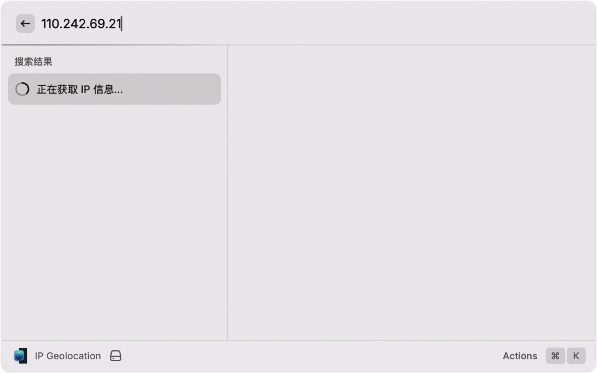
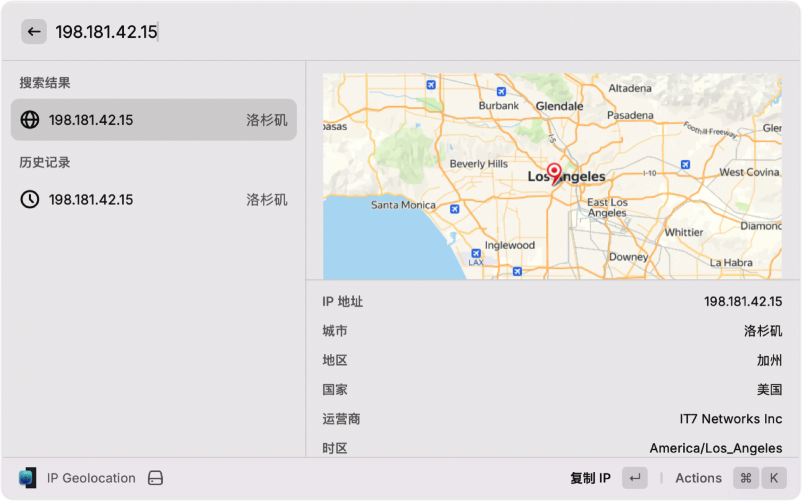

# IP Geolocation

Query IP address geolocation and display on map.

## Features

- **Auto Detection**: Automatically checks your current public IP address.
- **Search**: Enter any IP address to query its location.
- **Map View**: Visualizes the location on a map.
- **History**: Keeps track of your search history.
- **Multi-language**: Supports English and Simplified Chinese.
- **Details**: Shows ISP, Timezone, City, Region, Country, Latitude, Longitude.

## Usage

1. Run the command `IP Geolocation`.
2. Your current IP info will be displayed immediately.
3. Type an IP address to search for other locations.
4. Press `Enter` to view details and map.

## Preferences

- **Language**: You can force the display language to English or Simplified Chinese in the extension preferences.
