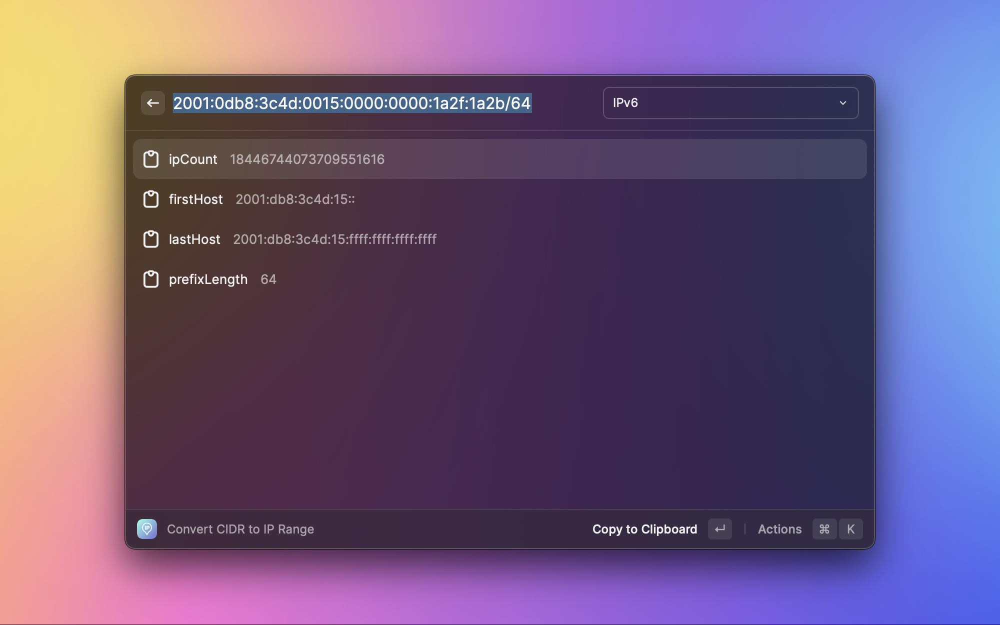
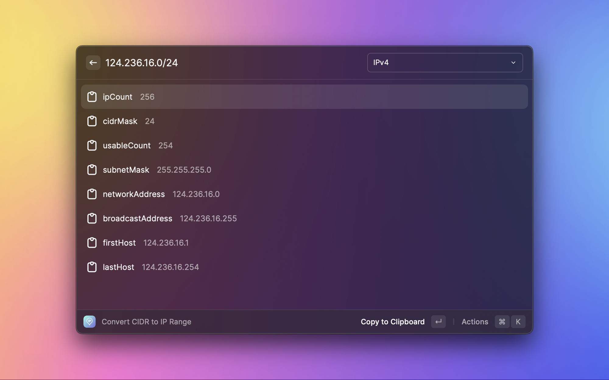
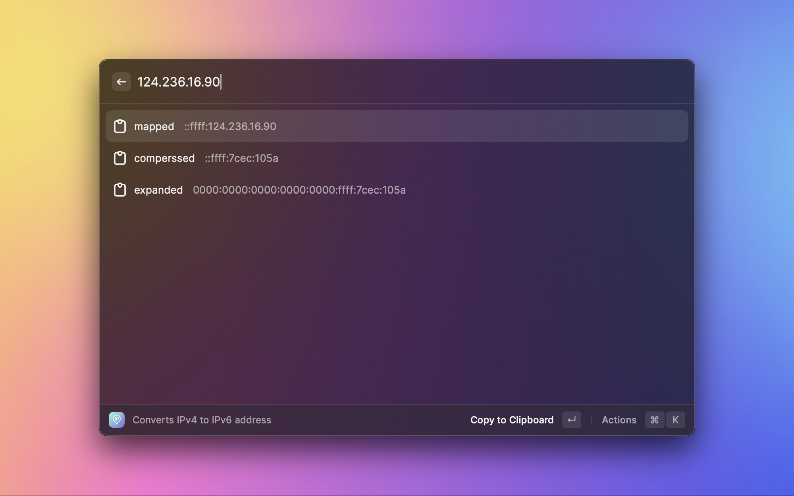
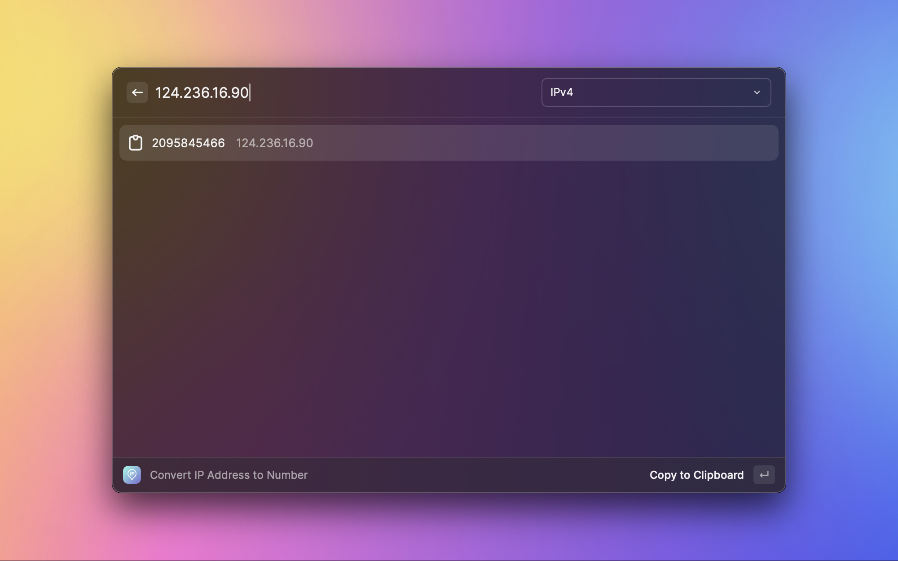
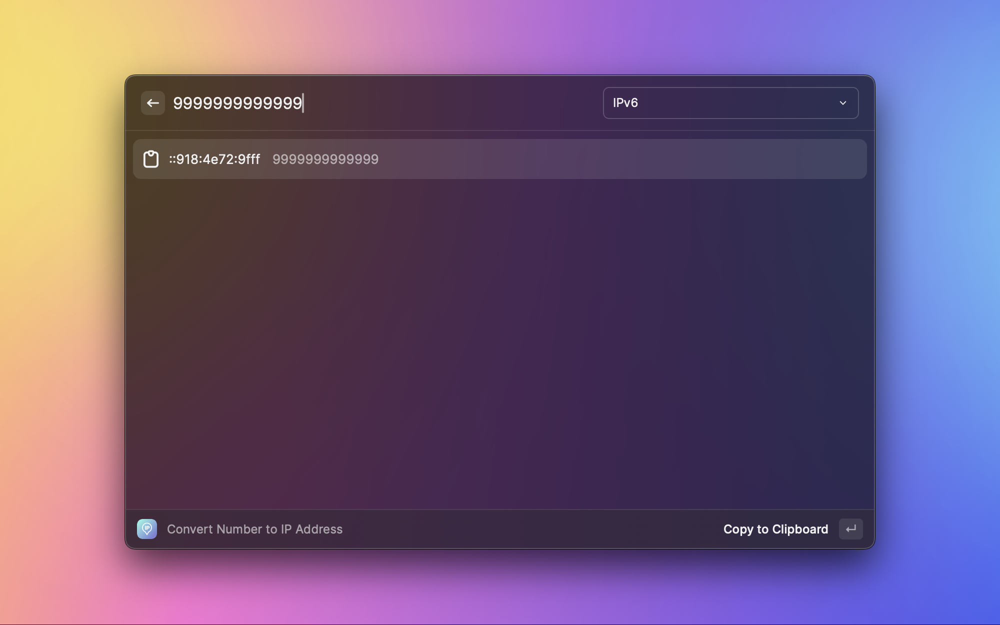
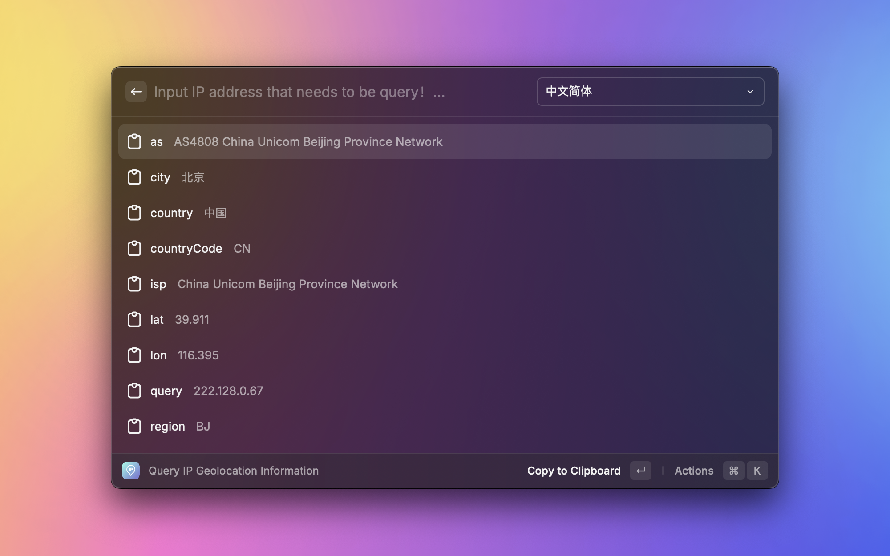

# ip-tools

This is an extension plugin for converting, validating, and calculating IP subnets.

More IP address processing operations can be accessed through the [ip-toolkit](https://github.com/meguoe/ip-toolkit) project！

## Convert CIDR to IPv6 Range

## Convert CIDR to IPv4 Range

## Converts IPv4 to IPv6 address

## Convert IP Address to Number

## Convert Number to IP Address

## Query IP Geolocation Information

