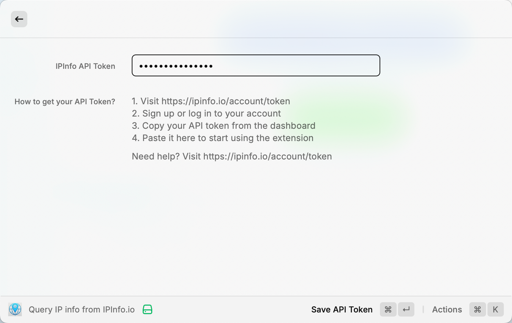
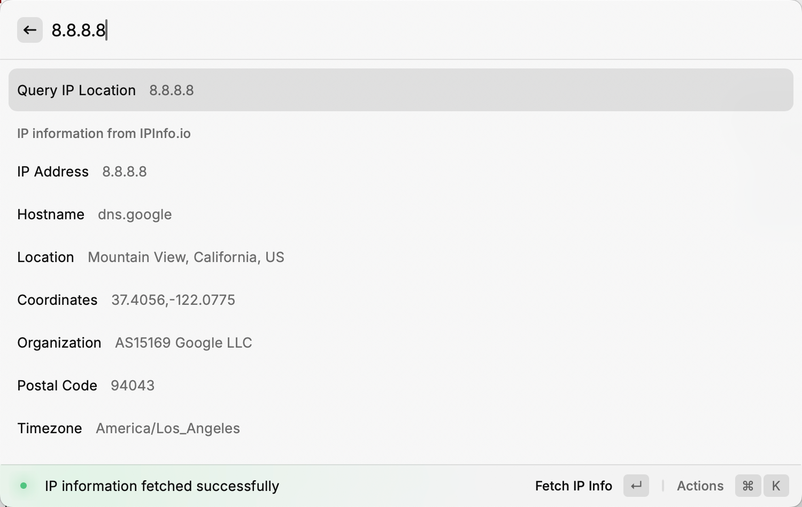

# IP Info Raycast Extension

<p align="center">
    
</p>

This is a Raycast extension for [ipinfo.io](https://ipinfo.io/). With this extension you can lookup detailed information about any IP address.

## 🔑 API Token Required

This extension requires an API token from ipinfo.io. You can get one by signing up at [ipinfo.io](https://ipinfo.io/).

> 📝 Get your API token at: https://ipinfo.io/account/token



## 🔧 Features

- Support for both IPv4 and IPv6 addresses
- Detailed information including location, organization, and timezone
- Easy API token management
- Quick IP lookup from Raycast command bar

## 📝 Usage

1. Install the extension
2. Set your ipinfo.io API token
3. Start typing an IP address to get instant information



## 🛠️ Commands

- **Query IP Address Location**: Lookup detailed information about any IP address
- **Set API Token**: Configure your ipinfo.io API token 

## 💡 Tips

How to run and test locally:

```bash
npm run build
npm run dev
```
